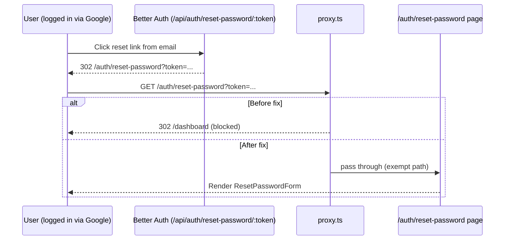

## Problem recap

`proxy.ts` currently sends any logged-in visitor of `/auth/*` to `/dashboard`:

```8:10:proxy.ts
if (sessionCookie && pathname.startsWith("/auth")) {
  return NextResponse.redirect(new URL("/dashboard", request.url));
}
```

But several flows require an authenticated user to land under `/auth/*`:

- **Set/Reset Password from email link** (the case you hit). Email link goes through `GET /api/auth/reset-password/:token`, which Better Auth always 302-redirects to `/auth/reset-password?token=...` regardless of session — then your proxy bounces the logged-in user to `/dashboard`.
- **Change Email verify**. [`features/auth/components/VerifyEmailChange.tsx`](features/auth/components/VerifyEmailChange.tsx) calls `POST /api/change-email/verify` from a _signed-in_ session and then runs `signOut()` only after success. If the proxy bounces the user away first, the verification call never fires.

## Auth pages audit

Reviewed every `/auth/*` page:

- Should still redirect when logged in (current behavior is correct):
  - `/auth/sign-in`, `/auth/sign-up`
  - `/auth/forgot-password`, `/auth/forgot-password/success`
  - `/auth/verify-email-info` (post-signup "check your inbox" screen)
- Must NOT redirect when logged in (need exemption):
  - `/auth/reset-password` — Set-password flow for Google-OAuth users (your reported case) and any logged-in user who clicks a reset link
  - `/auth/reset-password/success` — Follow-up screen after the reset
  - `/auth/change-email/verify` — Verification call must run while still authenticated; the component handles `signOut()` itself
  - `/auth/verify-email` — Edge case: a different account is logged in when the email-verify link is opened
  - `/auth/verify-success` — Same edge case as above
- `/auth/two-factor` does NOT need exemption: during the 2FA challenge Better Auth has only set a temporary 2FA cookie, so `getSessionCookie` returns `null` and the proxy already passes through.

## Proposed change

Single-file edit to [`proxy.ts`](proxy.ts):

```ts
import { NextRequest, NextResponse } from "next/server";
import { getSessionCookie } from "better-auth/cookies";

const AUTH_PATHS_EXEMPT_FROM_REDIRECT = new Set<string>([
  "/auth/reset-password",
  "/auth/reset-password/success",
  "/auth/verify-email",
  "/auth/verify-success",
  "/auth/change-email/verify",
]);

export async function proxy(request: NextRequest) {
  const sessionCookie = getSessionCookie(request);
  const { pathname } = request.nextUrl;

  const isAuthRoute = pathname.startsWith("/auth");
  const isExemptAuthRoute = AUTH_PATHS_EXEMPT_FROM_REDIRECT.has(pathname);

  if (sessionCookie && isAuthRoute && !isExemptAuthRoute) {
    return NextResponse.redirect(new URL("/dashboard", request.url));
  }

  if (!sessionCookie && pathname.startsWith("/dashboard")) {
    return NextResponse.redirect(new URL("/auth/sign-in", request.url));
  }

  return NextResponse.next();
}

export const config = {
  matcher: ["/auth/:path*", "/dashboard/:path*"],
};
```

Notes on the implementation choice:

- A `Set` of exact paths is used (not `startsWith`) to avoid accidental matches such as `/auth/verify-email` swallowing `/auth/verify-email-info`.
- The unauthenticated-dashboard guard is untouched.
- The proxy `matcher` is unchanged; `/api/auth/*` was already (correctly) not matched.

## Flow comparison



## Out of scope

- No changes to Better Auth config or any feature components.
- No new routes or env vars.
- No tests added (project has no existing test scaffold for the proxy).
