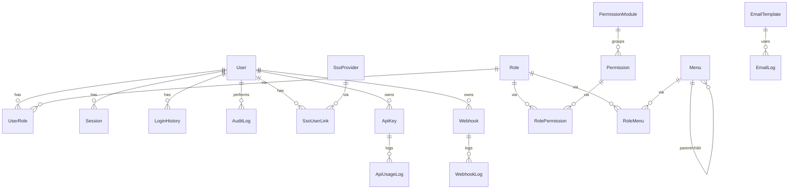

## Goal

Strengthen the existing Prisma schema with:

- 4 new models (PermissionModule, SsoUserLink, AuditLog, SystemSetting)
- Targeted field additions on existing models
- Tighter indexes and relations where useful

No changes to Better Auth core fields (`User.id`, `Session`, `Account`, `Verification`, `TwoFactor`) are made — only additive fields, to keep Better Auth compatibility intact.

---

## Current State (audit summary)

Already in [prisma/schema.prisma](prisma/schema.prisma):

- **Identity / Auth (Better Auth)**: `User`, `Session`, `Account`, `Verification`, `TwoFactor`, `EmailChangeRequest`
- **RBAC**: `Role`, `UserRole`, `Permission` (free-text `module`), `RolePermission` (with `granted` toggle), `Menu`, `RoleMenu` (CRUD flags)
- **Audit (login only)**: `LoginHistory` (status, failureReason, IP, UA, device, location)
- **Emails**: `EmailSetting` (multi-provider), `EmailTemplate` (HTML+text+variables), `EmailLog`
- **API**: `ApiKey` (prefix, hashedKey, scopes, lastUsed, revokedAt/By), `ApiUsageLog`
- **Webhook**: `Webhook` (retries, timeout), `WebhookLog` (`WebhookDeliveryStatus`, nextRetryAt)
- **SSO**: `SsoProvider` (OIDC/SAML/OAUTH2, autoProvision, defaultRoleId)

Gaps confirmed with the user:

- `Permission.module` is a free-text string — no normalized module table
- No mapping between `User` and external SSO identities
- No generic audit trail beyond login events
- No global key/value system settings table

---

## Target Data Model

---

## 1. New Models

### 1.1 `PermissionModule`

Normalize the free-text `Permission.module` into a managed table.

Fields:

- `id Uuid` (PK)
- `code String @unique` (e.g. `user_management`)
- `name String`
- `description String?`
- `icon String?`
- `sortOrder Int @default(0)`
- `isActive Boolean @default(true)`
- `isSystem Boolean @default(false)`
- `createdAt`, `updatedAt`
- Relation: `permissions Permission[]`
- Map: `permission_module`

### 1.2 `SsoUserLink`

Map external SSO identities to internal users.

Fields:

- `id Uuid` (PK)
- `userId String` → `User`
- `providerId Uuid` → `SsoProvider`
- `externalId String` (subject / NameID)
- `emailAtProvider String?`
- `displayName String?`
- `rawProfile String?` (JSON-as-string for portability)
- `lastLoginAt DateTime?`
- `createdAt`, `updatedAt`
- Constraints: `@@unique([providerId, externalId])`, `@@index([userId])`, `@@index([providerId])`
- Map: `sso_user_link`
- Add reverse relations on `User` and `SsoProvider`.

### 1.3 `AuditLog`

Generic entity-change audit (separate from `LoginHistory`).

Enum `AuditAction`: `CREATE | UPDATE | DELETE | LOGIN | LOGOUT | EXPORT | IMPORT | ASSIGN | REVOKE | OTHER`

Fields:

- `id Uuid` (PK)
- `actorId String?` → `User` (SetNull; nullable for system-actions)
- `action AuditAction`
- `entity String` (model/table name, e.g. `User`, `Role`)
- `entityId String?`
- `summary String?` (human-readable)
- `oldValues String?` (JSON stringified, to stay consistent with project convention)
- `newValues String?` (JSON stringified)
- `ipAddress String?`
- `userAgent String?`
- `createdAt`
- Indexes: `[actorId]`, `[entity]`, `[entity, entityId]`, `[action]`, `[createdAt]`
- Map: `audit_log`

### 1.4 `SystemSetting`

Global key/value configuration.

Enum `SystemSettingType`: `STRING | NUMBER | BOOLEAN | JSON | SECRET`

Fields:

- `id Uuid` (PK)
- `key String @unique` (e.g. `app.maintenance_mode`)
- `value String`
- `type SystemSettingType @default(STRING)`
- `category String?` (e.g. `email`, `security`, `branding`)
- `description String?`
- `isPublic Boolean @default(false)` (safe to expose to client)
- `isEditable Boolean @default(true)` (block edits on locked settings)
- `updatedBy String?`
- `createdAt`, `updatedAt`
- Indexes: `[category]`, `[isPublic]`
- Map: `system_setting`

---

## 2. Targeted Enhancements to Existing Models

### 2.1 `User` (additive only — Better Auth safe)

- Add `phoneNumber String?`
- Add `passwordChangedAt DateTime?` (for password policy expiry)
- Add `createdBy String?` (admin-provisioned users)
- Add `lockedUntil DateTime?` (failed-login lockout window)
- Add reverse relations: `ssoLinks SsoUserLink[]`, `auditLogs AuditLog[]`
- Add `@@index([username])`, `@@index([createdAt])` for search & sort

### 2.2 `Session` — force-logout audit

- Add `revokedAt DateTime?`
- Add `revokedBy String?`
- Add `revokedReason String?`
- Add `@@index([expiresAt])` (cleanup queries)

### 2.3 `UserRole` — optional expiry

- Add `expiresAt DateTime?` (time-bound role assignment)
- Add `@@index([expiresAt])`

### 2.4 `Permission` — link to `PermissionModule`

- Replace `module String` with `moduleId String? @db.Uuid` + relation `module PermissionModule? @relation(...)`
- Keep `Permission.code` unique
- Add `@@index([moduleId])`
- Migration note: produce a one-off SQL/data step that (1) creates rows in `permission_module` from the distinct existing `module` values, (2) backfills `moduleId`, (3) drops the old `module` column. This is the only **non-additive** change in the plan.

### 2.5 `LoginHistory` — minor

- Add `sessionId String?` (link the event to the resulting `Session` when status = SUCCESS, soft link only — no FK to avoid Better Auth coupling)
- Add `@@index([sessionId])`

### 2.6 `ApiKey` — small additions

- Add `description String?`
- Add `isActive Boolean @default(true)` (alongside `revokedAt` for soft disable without revoking)
- Add `@@index([expiresAt])`

### 2.7 `Webhook` — small additions

- Add `lastDeliveryStatus WebhookDeliveryStatus?`
- Add `lastDeliveryAt DateTime?`
- Add `failureCount Int @default(0)` (for circuit-breaker logic later)

### 2.8 `SsoProvider`

- Add reverse relation `userLinks SsoUserLink[]`
- Add `@@index([protocol])`

---

## 3. Files Touched

Only one file in this plan:

- [prisma/schema.prisma](prisma/schema.prisma) — add 4 models, 2 enums (`AuditAction`, `SystemSettingType`), and the additive field changes above.

Migration generation (`prisma migrate dev --name access-management-enhancements`) is out of scope for this plan step; the only data-migration concern flagged is `Permission.module` → `moduleId` (see 2.4).

---

## 4. Out of Scope (intentionally)

- Services, repositories, actions, components, table/form UI for any module
- Rate-limit tables, email queue, granular geolocation columns (`country`, `city`)
- Splitting `RoleMenu.canView/canCreate/canEdit/canDelete` into permission-driven access
- Seed data for default modules/permissions/roles
- Better Auth plugin config changes
