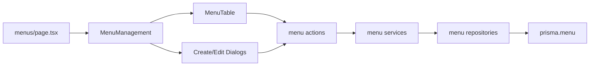

# Menu CRUD Page Plan

## Context

- Placeholder page: [`app/(protected)/dashboard/admin-page/menus/page.tsx`](<app/(protected)/dashboard/admin-page/menus/page.tsx>)
- Data model already exists in [`prisma/schema.prisma`](prisma/schema.prisma):

```239:257:prisma/schema.prisma
model Menu {
  id        String   @id @default(dbgenerated("gen_random_uuid()")) @db.Uuid
  code      String   @unique
  label     String
  path      String?
  icon      String?
  parentId  String?  @db.Uuid
  sortOrder Int      @default(0)
  isActive  Boolean  @default(true)
  createdAt DateTime @default(now())
  updatedAt DateTime @updatedAt
  parent    Menu?      @relation("MenuToMenu", fields: [parentId], references: [id], onDelete: SetNull)
  children  Menu[]     @relation("MenuToMenu")
  roleMenus RoleMenu[]
}
```

- This is **greenfield**: no `features/menus/`, no `components/data-table/`, no `@tanstack/react-table` / `@tanstack/react-form` in [`package.json`](package.json) yet.
- RBAC (`manage_menu`) is **deferred**; only basic session auth in actions (same pattern as [`features/auth/actions/request-email-change.action.ts`](features/auth/actions/request-email-change.action.ts)).

## Architecture



Data flow follows project rules: **Component/hook → Action → Service → Repository → Prisma**.

## Phase 1 — Dependencies and shared primitives

Install packages:

- `@tanstack/react-table`
- `@tanstack/react-form`
- `@tanstack/zod-form-adapter`

Create minimal reusable building blocks (only what Menu CRUD needs now):

| Folder                                             | Files                                                                                                                   |
| -------------------------------------------------- | ----------------------------------------------------------------------------------------------------------------------- |
| [`components/data-table/`](components/data-table/) | `DataTable.tsx`, `TableContainer.tsx`, `TablePagination.tsx`, `TableToolbar.tsx`, `TableEmpty.tsx`, `TableSkeleton.tsx` |
| [`components/form/`](components/form/)             | `TextField.tsx`, `SelectField.tsx`, `NumberField.tsx`, `SwitchField.tsx`                                                |

Use existing Shadcn primitives: [`components/ui/table.tsx`](components/ui/table.tsx), [`components/ui/field.tsx`](components/ui/field.tsx), `dialog`, `alert-dialog`, `badge`, `button`, `input`, `select`, `switch`.

Pagination defaults from [`config/app.config.ts`](config/app.config.ts): `defaultLimit: 25`, `maxLimit: 100`.

## Phase 2 — `features/menus/` module

### Schemas ([`features/menus/schemas/`](features/menus/schemas/))

- `menu-filter.schema.ts` — `search`, `page`, `pageSize`, `sortBy`, `sortOrder`, optional `isActive`
- `menu-create.schema.ts` — `code`, `label`, optional `path`/`icon`, optional `parentId`, `sortOrder`, `isActive`
- `menu-update.schema.ts` — same fields + `id`
- `menu-delete.schema.ts` — `id`

Validation highlights:

- `code`: required, trimmed, slug-like uniqueness candidate
- `label`: required
- `path`: optional URL/path string
- `icon`: optional string (Lucide icon name)
- `sortOrder`: integer >= 0

### Repositories ([`features/menus/repositories/`](features/menus/repositories/))

- `menu-list.repository.ts` — paginated list with search (`code`, `label`, `path`), optional `isActive` filter, sort, include `parent: { select: { id, label, code } }`
- `menu-get-by-id.repository.ts`
- `menu-create.repository.ts` / `menu-update.repository.ts` / `menu-delete.repository.ts`
- `menu-parent-options.repository.ts` — all menus for parent select (flat options)

### Services ([`features/menus/services/`](features/menus/services/))

Business rules:

- **Unique code** on create/update
- **Parent guard**: cannot set `parentId` to self; on update, cannot set parent to any descendant (load subtree IDs)
- **Delete**: allowed; DB `onDelete: SetNull` promotes children to root
- **Toggle status**: flip `isActive`

Services throw human-readable `Error` messages; no toast in service layer.

### Actions ([`features/menus/actions/`](features/menus/actions/))

All `"use server"`, validate with Zod, require authenticated session, call services:

- `menu-get-list.action.ts`
- `menu-create.action.ts`
- `menu-update.action.ts`
- `menu-delete.action.ts`
- `menu-toggle-status.action.ts`

### Lib + types ([`features/menus/lib/`](features/menus/lib/), [`features/menus/types/`](features/menus/types/))

- `menu-form-defaults.ts`, `menu-form-mapper.ts`
- Table row type with optional `parentLabel`
- Filter/pagination result types

### Table UI ([`features/menus/table/`](features/menus/table/))

Flat paginated table (your choice):

| Column     | Notes                       |
| ---------- | --------------------------- |
| Code       | sortable                    |
| Label      | sortable                    |
| Parent     | parent label or `—`         |
| Path       | truncate if long            |
| Icon       | optional badge/text         |
| Sort Order | sortable, default sort      |
| Status     | active/inactive badge       |
| Actions    | edit, toggle status, delete |

Files:

- `columns.tsx`
- `MenuTable.tsx` — toolbar (search, status filter, create), DataTable, pagination
- `MenuRowActions.tsx` — row actions with `toast.promise` + delete `AlertDialog`
- `MenuTableToolbar.tsx`

URL sync on list page: `?page=1&pageSize=25&search=&sortBy=sortOrder&sortOrder=asc&isActive=`

### Form UI ([`features/menus/components/`](features/menus/components/))

TanStack Form + Zod adapter + shared field wrappers:

- `MenuForm.tsx` — fields: code, label, path, icon, parent (select), sortOrder, isActive
- `MenuCreateDialog.tsx` — create flow
- `MenuEditDialog.tsx` — edit flow (loads menu by id)
- `MenuManagement.tsx` — composes table + dialogs; main export for page

Form submit uses `toast.promise` with standard messages (`Created successfully`, `Updated successfully`, etc.).

Parent select on edit excludes current menu id and its descendants.

### Public export

[`features/menus/index.ts`](features/menus/index.ts) exports `MenuManagement` and any needed types.

## Phase 3 — Wire the route

Update [`app/(protected)/dashboard/admin-page/menus/page.tsx`](<app/(protected)/dashboard/admin-page/menus/page.tsx>):

- Keep metadata as-is
- Parse `searchParams` (Next.js 16 async params)
- Server-fetch initial list via service (not repository directly)
- Render:

```tsx
<div className="mx-auto max-w-7xl px-4 py-8">
  <MenuManagement initialData={...} initialFilters={...} />
</div>
```

Match layout pattern from [`app/(protected)/dashboard/settings/page.tsx`](<app/(protected)/dashboard/settings/page.tsx>).

## Out of scope (follow-up)

- `manage_menu` permission enforcement and page guard
- `RoleMenu` assignment UI (belongs to role management feature)
- Dynamic sidebar generation from DB menus
- Menu seed data
- CSV import/export
- Bulk delete

## Verification

After implementation:

1. `pnpm typecheck`
2. `pnpm lint`
3. Manual smoke test at `/dashboard/admin-page/menus`:
   - Create root menu and child menu
   - Edit parent assignment
   - Toggle active/inactive
   - Delete parent (child becomes root)
   - Search/filter/pagination/sort via URL params
