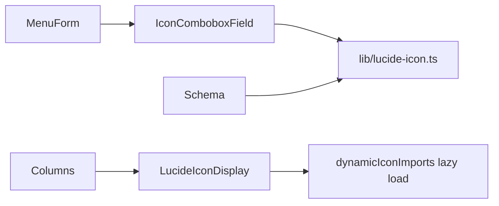

# Lucide Icon Select and Table Display

## Goal

- In [`features/menus/components/MenuForm.tsx`](features/menus/components/MenuForm.tsx), replace the Icon `TextField` with a searchable **select/combobox** backed by the **full Lucide catalog**.
- In [`features/menus/table/columns.tsx`](features/menus/table/columns.tsx), render the **actual SVG icon** (not just a text badge).

## Current state

- Form stores icon as nullable string (PascalCase), e.g. `LayoutDashboard`.
- Table shows `<Badge>{row.original.icon}</Badge>`.
- Shared form primitives exist in [`components/form/`](components/form/); searchable combobox UI exists in [`components/ui/combobox.tsx`](components/ui/combobox.tsx).
- `lucide-react@1.7.0` exposes `dynamicIconImports` with all icon keys in kebab-case.

## Approach

Use **lazy dynamic imports** per icon (via `dynamicIconImports`) instead of `import * as LucideIcons` so the full catalog can be searchable without shipping every icon in the client bundle.



## Phase 1 — Shared Lucide helpers

Create [`lib/lucide-icon.ts`](lib/lucide-icon.ts):

- Build sorted `LUCIDE_ICON_NAMES: string[]` from `Object.keys(dynamicIconImports)`, converting kebab-case → PascalCase (matches existing stored values like `LayoutDashboard`).
- Add helpers:
  - `isValidLucideIconName(name: string): boolean`
  - `pascalToKebab(name: string): string` (for dynamic import lookup)
- Add client component [`lib/lucide-icon-display.tsx`](lib/lucide-icon-display.tsx):
  - `LucideIconDisplay({ name, className?, showLabel? })`
  - Returns `—` when empty/invalid
  - Uses `React.lazy` + `Suspense` + `dynamicIconImports[kebab]` to render one icon at a time
  - Optional `title`/label for accessibility

## Phase 2 — Searchable form field

Create [`components/form/IconComboboxField.tsx`](components/form/IconComboboxField.tsx):

- TanStack Form wrapper (same pattern as [`components/form/SelectField.tsx`](components/form/SelectField.tsx))
- Uses Shadcn/Base UI [`Combobox`](components/ui/combobox.tsx)
- Behavior:
  - **Search-first UX**: filter `LUCIDE_ICON_NAMES` by query; show up to ~50 matches (avoid rendering 1500+ rows)
  - Each option shows **icon preview + name**
  - Trigger shows selected icon preview + name
  - Supports **clear / no icon** (`allowEmpty`, stores `null`)
  - Calls `field.handleChange(name | null)` on select

Update [`features/menus/components/MenuForm.tsx`](features/menus/components/MenuForm.tsx):

- Replace Icon `TextField` block with:

```tsx
<form.Field name="icon">
  {(field) => (
    <IconComboboxField
      field={field}
      label="Icon"
      description="Search and select a Lucide icon."
      allowEmpty
      emptyLabel="No icon"
    />
  )}
</form.Field>
```

## Phase 3 — Validation

Update [`features/menus/schemas/menu-create.schema.ts`](features/menus/schemas/menu-create.schema.ts):

- Keep `icon` as `string | null`
- Add refine using `isValidLucideIconName()` when value is non-null
- Error message: `"Invalid Lucide icon"`

This preserves existing DB shape and rejects invalid legacy/manual values on save.

## Phase 4 — Table icon rendering

Update [`features/menus/table/columns.tsx`](features/menus/table/columns.tsx) Icon column:

- Replace badge text with compact visual display:

```tsx
<LucideIconDisplay name={row.original.icon} className="size-4" />
```

- Keep `title={row.original.icon}` for hover/name access
- Empty icon still renders `—`

No backend/repository changes required (`icon` column already exists).

## Files touched

| File                                                                                           | Change                               |
| ---------------------------------------------------------------------------------------------- | ------------------------------------ |
| [`lib/lucide-icon.ts`](lib/lucide-icon.ts)                                                     | New — catalog + validation helpers   |
| [`lib/lucide-icon-display.tsx`](lib/lucide-icon-display.tsx)                                   | New — lazy icon renderer             |
| [`components/form/IconComboboxField.tsx`](components/form/IconComboboxField.tsx)               | New — searchable icon picker field   |
| [`features/menus/components/MenuForm.tsx`](features/menus/components/MenuForm.tsx)             | Swap TextField → IconComboboxField   |
| [`features/menus/schemas/menu-create.schema.ts`](features/menus/schemas/menu-create.schema.ts) | Validate icon against Lucide catalog |
| [`features/menus/table/columns.tsx`](features/menus/table/columns.tsx)                         | Render icon visually                 |

## Verification

1. `pnpm typecheck`
2. `pnpm eslint components/form/IconComboboxField.tsx lib/lucide-icon*.tsx features/menus/components/MenuForm.tsx features/menus/table/columns.tsx`
3. Manual test at `/dashboard/admin-page/menus`:
   - Open Create menu → search `LayoutDashboard`, select from list, see preview in trigger
   - Clear icon → saves as null
   - Save menu → table shows SVG icon in Icon column
   - Edit existing menu → previously saved icon pre-selected in combobox

## Notes

- Full catalog is searchable but **results are capped** for performance.
- Lazy imports keep bundle size reasonable while supporting any Lucide icon.
- No changes needed to [`app/(protected)/dashboard/admin-page/menus/page.tsx`](<app/(protected)/dashboard/admin-page/menus/page.tsx>) or [`MenuManagement.tsx`](features/menus/components/MenuManagement.tsx).
