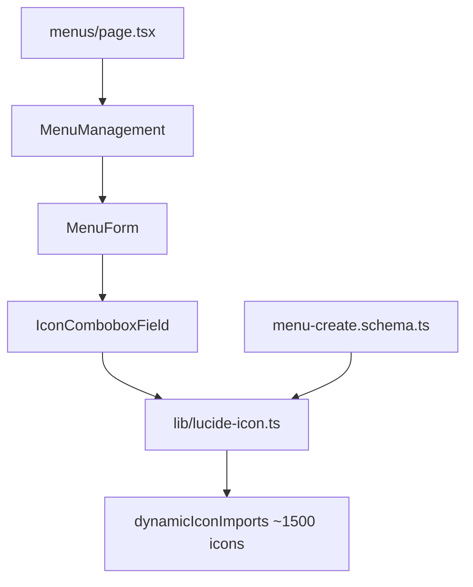

# Optimize Lucide Icon Loading

## Root cause

Opening `/dashboard/admin-page/menus` loads [`lib/lucide-icon.ts`](lib/lucide-icon.ts), which does this at module init:

```ts
import dynamicIconImports from "lucide-react/dynamicIconImports";
export const LUCIDE_ICON_NAMES = Object.keys(dynamicIconImports)...
```

That pulls in Lucide’s **entire icon import map** (~1,500 icons). It is imported by:

- Client: [`components/form/IconComboboxField.tsx`](components/form/IconComboboxField.tsx), [`lib/lucide-icon-display.tsx`](lib/lucide-icon-display.tsx)
- Server/actions: [`features/menus/schemas/menu-create.schema.ts`](features/menus/schemas/menu-create.schema.ts) via `isValidLucideIconName`

This explains the dev crash in your terminal (`JavaScript heap out of memory`).



## Recommended fix (your choice): curated list

For menu navigation, a curated set of ~50 common icons is the best trade-off:

- Tiny static string array (kilobytes, not megabytes)
- Fast searchable combobox
- Safe server validation without importing Lucide
- Table still renders real SVG icons via lazy per-icon import

## Implementation plan

### 1. Add curated icon constants (feature-owned)

Create [`features/menus/constants/menu-lucide-icons.ts`](features/menus/constants/menu-lucide-icons.ts):

- Export `MENU_LUCIDE_ICON_OPTIONS: readonly string[]` (PascalCase names)
- Include icons already used in the app/nav patterns where possible, e.g. `LayoutDashboard`, `Settings`, `Menu`, `Users`, `Shield`, `Mail`, `Key`, `Folder`, `FileText`, `Webhook`, etc.
- Export `MENU_LUCIDE_ICON_SET` for O(1) validation
- Export `isMenuLucideIconName(name: string): boolean`

No runtime logic beyond plain values (follows feature constants rules).

### 2. Split Lucide helpers into server-safe vs client-only

Replace monolithic [`lib/lucide-icon.ts`](lib/lucide-icon.ts) with:

| File                                                                   | Purpose                                                                                       | Imports Lucide?         |
| ---------------------------------------------------------------------- | --------------------------------------------------------------------------------------------- | ----------------------- |
| [`lib/lucide-icon-utils.ts`](lib/lucide-icon-utils.ts)                 | `pascalToKebab`, `kebabToPascal`, filter helper over a passed-in name list                    | No                      |
| [`lib/lucide-icon-loader.client.ts`](lib/lucide-icon-loader.client.ts) | `"use client"` — lazy load one icon via `import(\`lucide-react/dist/esm/icons/${kebab}.js\`)` | Yes, one icon at a time |
| Delete or slim [`lib/lucide-icon.ts`](lib/lucide-icon.ts)              | Remove `dynamicIconImports` entirely                                                          | —                       |

Update [`lib/lucide-icon-display.tsx`](lib/lucide-icon-display.tsx) to use the client loader only.

### 3. Point validation to curated set

Update [`features/menus/schemas/menu-create.schema.ts`](features/menus/schemas/menu-create.schema.ts):

- Replace `isValidLucideIconName` import from `@/lib/lucide-icon`
- Use `isMenuLucideIconName` from [`features/menus/constants/menu-lucide-icons.ts`](features/menus/constants/menu-lucide-icons.ts)
- Error message stays `"Invalid Lucide icon"`

This keeps server/actions free of Lucide bundles.

### 4. Update icon picker to curated list

Update [`components/form/IconComboboxField.tsx`](components/form/IconComboboxField.tsx):

- Accept `options: readonly string[]` prop (defaults to menu list when used from MenuForm)
- Filter/search over that small array only
- Keep search-first UX and 50-result cap
- Reduce dropdown cost: show **icon preview only for selected value**; list rows can show icon + name for up to 50 matches (safe now because list is small and loader is per-icon)

Update [`features/menus/components/MenuForm.tsx`](features/menus/components/MenuForm.tsx):

```tsx
<IconComboboxField
  field={field}
  options={MENU_LUCIDE_ICON_OPTIONS}
  ...
/>
```

### 5. Keep table icon rendering (already lightweight)

[`features/menus/table/columns.tsx`](features/menus/table/columns.tsx) continues using `LucideIconDisplay`; after loader fix, each row loads only its one icon lazily.

### 6. Handle existing DB values outside curated set

If a menu already stores an icon not in the curated list (from earlier full-catalog saves):

- Table: still attempt render via client loader; fallback to `—` or name text if import fails
- Edit form: if saved icon not in curated list, prepend it to combobox options so it remains selectable
- Save/update: schema will reject unknown icons unless they are in curated set (acceptable; user re-picks from list)

## Expected outcome

- Menus page client bundle drops sharply (no 1,500-icon import map)
- Dev server no longer OOM on `/dashboard/admin-page/menus`
- Icon picker remains searchable, but scoped to sensible menu icons
- Validation remains authoritative on server

## Verification

1. `pnpm typecheck`
2. `pnpm eslint` on changed files
3. Open `/dashboard/admin-page/menus` — page loads without memory crash
4. Create/edit menu — search `LayoutDashboard`, select icon, save
5. Table shows rendered icon in Icon column

## Why not full catalog here

Full Lucide catalog is fine for design tools, but for **menu admin** it adds large bundle/memory cost with little product value. Curated list is the correct fix for this feature; if you later need more icons, extend the constant array incrementally.
