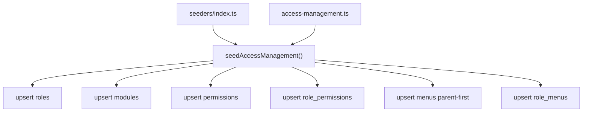

# Menu Seeder Plan

## Goal

Add idempotent menu + role-menu seeding to the existing access-management pipeline so `pnpm db:seed` provisions navigation data alongside roles, modules, and permissions.

## Current State

- [`prisma/seeders/data/access-management.ts`](prisma/seeders/data/access-management.ts) defines roles, modules, permissions, and `rolePermissions` only.
- [`prisma/seeders/seeds/access-management.seed.ts`](prisma/seeders/seeds/access-management.seed.ts) upserts those entities in dependency order.
- [`prisma/seeders/index.ts`](prisma/seeders/index.ts) calls only `seedAccessManagement()`.
- `Menu` and `RoleMenu` models exist in [`prisma/schema.prisma`](prisma/schema.prisma) (lines 239–275) but have no seed data yet.
- Only one admin route is implemented today ([`/dashboard/admin-page/menus`](<app/(protected)/dashboard/admin-page/menus/page.tsx>)); other seeded paths follow the same `/dashboard/admin-page/*` convention for future features.

## Architecture



Menus must be seeded **after roles** (RoleMenu FK) and use **parent-before-child** ordering because `parentId` is a self-relation.

## 1. Extend seed data — [`access-management.ts`](prisma/seeders/data/access-management.ts)

Add typed seed shapes:

```typescript
export type MenuSeed = {
  code: string;
  label: string;
  path: string | null;
  icon: string | null;
  parentCode: string | null;
  sortOrder: number;
};

export type RoleMenuSeed = {
  roleCode: string;
  menuCode: string;
  canView: boolean;
  canCreate: boolean;
  canEdit: boolean;
  canDelete: boolean;
};
```

Add `menus` array — full tree aligned with permission modules:

| code              | label            | path                                    | icon              | parent  |
| ----------------- | ---------------- | --------------------------------------- | ----------------- | ------- |
| `dashboard`       | Dashboard        | `/dashboard`                            | `LayoutDashboard` | —       |
| `settings`        | Account Settings | `/dashboard/settings`                   | `Settings`        | —       |
| `admin`           | Administration   | `null`                                  | `Shield`          | —       |
| `users`           | Users            | `/dashboard/admin-page/users`           | `Users`           | `admin` |
| `roles`           | Roles            | `/dashboard/admin-page/roles`           | `ShieldCheck`     | `admin` |
| `permissions`     | Permissions      | `/dashboard/admin-page/permissions`     | `Lock`            | `admin` |
| `menus`           | Menus            | `/dashboard/admin-page/menus`           | `Menu`            | `admin` |
| `email`           | Email            | `null`                                  | `Mail`            | `admin` |
| `email_settings`  | Email Settings   | `/dashboard/admin-page/email/settings`  | `Settings`        | `email` |
| `email_templates` | Email Templates  | `/dashboard/admin-page/email/templates` | `FileText`        | `email` |
| `email_logs`      | Email Logs       | `/dashboard/admin-page/email/logs`      | `History`         | `email` |
| `api_keys`        | API Keys         | `/dashboard/admin-page/api-keys`        | `Key`             | `admin` |
| `webhooks`        | Webhooks         | `/dashboard/admin-page/webhooks`        | `Webhook`         | `admin` |
| `system_settings` | System Settings  | `/dashboard/admin-page/system-settings` | `Server`          | `admin` |

Icons must be values from [`features/menus/constants/menu-lucide-icons.ts`](features/menus/constants/menu-lucide-icons.ts) (validated by menu form schema).

Add `roleMenus` — generated programmatically (same style as `rolePermissions`):

- **`super_admin`**: all menu codes; `canView: true` everywhere; `canCreate/canEdit/canDelete: true` on leaf admin pages (exclude group headers `admin`, `email`, and user nav items `dashboard`, `settings`).
- **`admin`**: same as super_admin **except** exclude `permissions` and `system_settings` (mirrors existing admin permission filter in [`access-management.ts`](prisma/seeders/data/access-management.ts) lines 142–145).
- **`user`**: only `dashboard` and `settings`; `canView: true`, all CRUD flags `false`.

## 2. Extend seed logic — [`access-management.seed.ts`](prisma/seeders/seeds/access-management.seed.ts)

Import `menus` and `roleMenus` from the data file.

### Step A — Upsert menus (parent-first)

Reuse the upsert-on-`code` pattern already used for roles/modules:

1. Build `menuIdByCode: Map<string, string>`.
2. Loop menus in array order (parents before children — `admin` and `email` before their children).
3. For each menu:
   - Resolve `parentId` from `menuIdByCode.get(menu.parentCode)` when `parentCode` is set.
   - `prisma.menu.upsert({ where: { code }, update: {}, create: { ... } })`.
   - Store returned `id` in the map.

If a `parentCode` is missing from the map, throw a clear error (fail fast on bad data).

### Step B — Upsert role menus

After menus exist and roles are already seeded:

1. Reuse / rebuild `roleIdByCode` (already fetched for role-permissions).
2. For each `roleMenus` entry:
   - Resolve `roleId` and `menuId`; skip if either is missing.
   - `prisma.roleMenu.upsert({ where: { roleId_menuId: { roleId, menuId } }, update: { canView, canCreate, canEdit, canDelete }, create: { ... } })`.

Using `update` with CRUD flags (not empty `{}`) keeps re-seeds idempotent while refreshing access flags if data changes.

### Step C — Summary logging

Extend the existing console summary:

```
Access management seed complete:
  roles:            3
  modules:          6
  permissions:      8
  role-permissions: 14
  menus:            14
  role-menus:       <count>
```

## 3. Entry point — no change needed

[`prisma/seeders/index.ts`](prisma/seeders/index.ts) already calls `seedAccessManagement()`; menu steps live inside that function after role-permission seeding.

## Verification

After implementation:

1. Run `pnpm db:seed`.
2. Confirm **14** `menu` rows and expected `role_menu` counts:
   - super_admin: 14 assignments
   - admin: 12 assignments (excludes `permissions`, `system_settings`)
   - user: 2 assignments (`dashboard`, `settings`)
   - **Total: 28** role_menu rows
3. Re-run seed — no duplicates, counts unchanged (idempotent).
4. Spot-check in Menu Management UI at `/dashboard/admin-page/menus` that seeded hierarchy appears correctly.

## Files Changed

| File                                                                                               | Change                                               |
| -------------------------------------------------------------------------------------------------- | ---------------------------------------------------- |
| [`prisma/seeders/data/access-management.ts`](prisma/seeders/data/access-management.ts)             | Add `MenuSeed`, `RoleMenuSeed`, `menus`, `roleMenus` |
| [`prisma/seeders/seeds/access-management.seed.ts`](prisma/seeders/seeds/access-management.seed.ts) | Add menu + role-menu upsert steps and logging        |

No schema migration required — models already exist.
