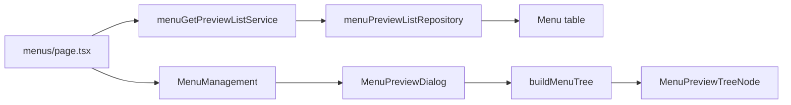

# Menu Hierarchy Preview Dialog

## Context

Menus use an **adjacency list** (`parentId` self-FK) with up to ~3 levels in seed data ([`prisma/seeders/data/access-management.ts`](d:\apps\albayyinah\prisma\seeders\data\access-management.ts)). The admin UI today is a **flat paginated table** ([`features/menus/table/MenuTable.tsx`](d:\apps\albayyinah\features\menus\table\MenuTable.tsx)) with a Parent column only—no tree/preview exists.

The page already fetches all menus for parent dropdowns via [`menuGetParentOptionsService`](d:\apps\albayyinah\features\menus\services\menu-get-by-id.service.ts), but that shape lacks `icon`, `path`, `sortOrder`, and `isActive` needed for a useful preview.

## Approach



1. **Fetch all menus once** on the server with fields needed for preview.
2. **Derive `parentOptions`** from that same list on the page (eliminates duplicate DB query).
3. **Build tree client-side** with a small typed helper in `lib/`.
4. **Render in a Shadcn Dialog** with collapsible branches, reusing existing icon/badge patterns from the table.

Preview shows **all menus** (active + inactive), regardless of table filters/pagination—filters are for management; preview reflects full nav structure. Inactive items get a secondary `Badge` (same as table columns).

## Files to Add

| File                                                                                                                                            | Purpose                                                                                                                                             |
| ----------------------------------------------------------------------------------------------------------------------------------------------- | --------------------------------------------------------------------------------------------------------------------------------------------------- |
| [`features/menus/repositories/menu-preview-list.repository.ts`](d:\apps\albayyinah\features\menus\repositories\menu-preview-list.repository.ts) | `findMany` all menus: `id`, `code`, `label`, `path`, `icon`, `parentId`, `sortOrder`, `isActive`; order by `sortOrder asc`, `label asc`             |
| [`features/menus/services/menu-get-preview-list.service.ts`](d:\apps\albayyinah\features\menus\services\menu-get-preview-list.service.ts)       | Thin pass-through to repository                                                                                                                     |
| [`features/menus/lib/menu-tree.ts`](d:\apps\albayyinah\features\menus\lib\menu-tree.ts)                                                         | `buildMenuTree(flatItems)` → nested `MenuTreeNode[]`; sort siblings by `sortOrder`, then `label`; orphan rows (missing parent) become roots         |
| [`features/menus/components/MenuPreviewDialog.tsx`](d:\apps\albayyinah\features\menus\components\MenuPreviewDialog.tsx)                         | Dialog shell: title, description, scrollable tree area, empty state                                                                                 |
| [`features/menus/components/MenuPreviewTree.tsx`](d:\apps\albayyinah\features\menus\components\MenuPreviewTree.tsx)                             | Recursive tree UI using [`Collapsible`](d:\apps\albayyinah\components\ui\collapsible.tsx); leaf nodes as simple rows; parent nodes default expanded |

### Types ([`features/menus/types/menu.type.ts`](d:\apps\albayyinah\features\menus\types\menu.type.ts))

```typescript
export type MenuPreviewItem = {
  id: string;
  code: string;
  label: string;
  path: string | null;
  icon: string | null;
  parentId: string | null;
  sortOrder: number;
  isActive: boolean;
};

export type MenuTreeNode = MenuPreviewItem & {
  children: MenuTreeNode[];
};
```

## Files to Modify

### [`app/(protected)/dashboard/admin-page/menus/page.tsx`](<d:\apps\albayyinah\app(protected)\dashboard\admin-page\menus\page.tsx>)

- Replace `menuGetParentOptionsService()` with `menuGetPreviewListService()`.
- Derive `parentOptions` by mapping preview items to `{ id, code, label, parentId }`.
- Pass `previewItems` to `MenuManagement`.

### [`features/menus/components/MenuManagement.tsx`](d:\apps\albayyinah\features\menus\components\MenuManagement.tsx)

- Accept `previewItems: MenuPreviewItem[]`.
- Add `isPreviewOpen` state.
- Pass `onPreview={() => setIsPreviewOpen(true)}` to `MenuTable`.
- Render `<MenuPreviewDialog open={...} items={previewItems} onOpenChange={...} />`.

### [`features/menus/table/MenuTable.tsx`](d:\apps\albayyinah\features\menus\table\MenuTable.tsx) + [`MenuTableToolbar.tsx`](d:\apps\albayyinah\features\menus\table\MenuTableToolbar.tsx)

- Add `onPreview` prop.
- Toolbar: secondary **Preview** button with `EyeIcon` (per table UI conventions), placed left of **Create menu**:

```tsx
<Button type="button" variant="outline" onClick={onPreview}>
  <EyeIcon className="size-4" />
  Preview
</Button>
```

### [`features/menus/index.ts`](d:\apps\albayyinah\features\menus\index.ts)

- Export `menuGetPreviewListService` and `MenuPreviewItem` type.

## Tree Node UI (per row)

Each node displays:

- **Icon** via existing [`LucideIconDisplay`](d:\apps\albayyinah\lib\lucide-icon-display.tsx)
- **Label** (primary text)
- **Code** (`font-mono text-xs text-muted-foreground`)
- **Path** or **Group** badge when `path === null` (container menus like `admin`, `email`)
- **Inactive** badge when `!isActive`
- **Chevron** + `Collapsible` for nodes with `children.length > 0`; indent children with `pl-4` / border-left guide

Empty state inside dialog: _"No menus yet"_ when `previewItems.length === 0`.

## Out of Scope

- Role-filtered preview (would need `RoleMenu` join)—can be a follow-up.
- Replacing static navbar with DB-driven menus.
- New server action for lazy fetch (not needed; dataset is small and page already loads all menus for parent select).

## Verification

- Open `/dashboard/admin-page/menus`, click **Preview**.
- Confirm tree matches seed hierarchy: `dashboard`, `settings`, `admin` → children including nested `email` group.
- Group nodes (`path: null`) show **Group** badge; leaf nodes show path.
- Inactive menus visible with **Inactive** badge.
- Create/edit parent dropdown still works (derived from same preview fetch).
