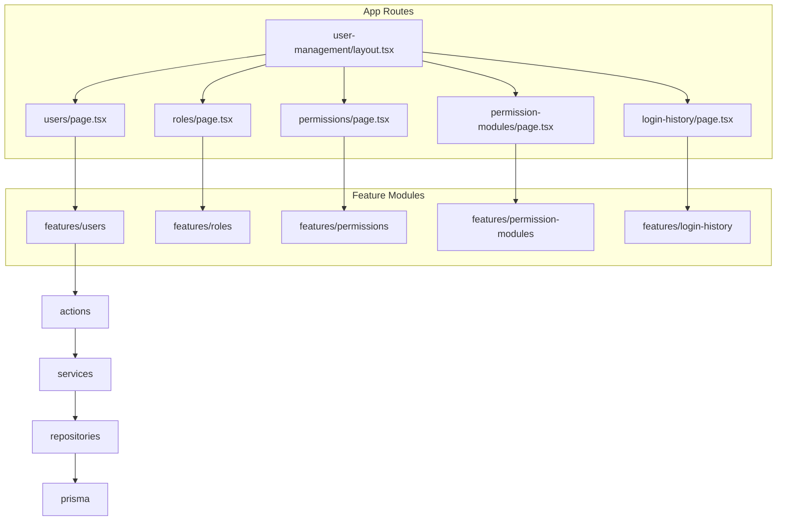

# User Management CRUD Plan

## Architecture

Nested routes with a shared layout (per your choice), mirroring the ERD module tree and the proven [menus feature](d:\apps\albayyinah\features\menus\):



**Data flow (same as menus):** thin server `page.tsx` → service (SSR list) → client `*Management` orchestrator → server actions (mutations) → service → repository → Prisma.

**Auth pattern:** reuse menus' `requireSessionUserId()` in every action (session check via Better Auth). No RBAC middleware exists today; permission checks can be added later using seeded codes (`manage_user`, `manage_role`, `manage_permission`).

---

## Route & Layout Structure

| Route                                    | Feature                       | CRUD scope                           |
| ---------------------------------------- | ----------------------------- | ------------------------------------ |
| `/dashboard/admin-page/user-management`  | hub                           | redirect to `users`                  |
| `.../user-management/users`              | `features/users`              | full CRUD + role assignment + status |
| `.../user-management/roles`              | `features/roles`              | full CRUD + permission assignment    |
| `.../user-management/permissions`        | `features/permissions`        | full CRUD (module link)              |
| `.../user-management/permission-modules` | `features/permission-modules` | full CRUD                            |
| `.../user-management/login-history`      | `features/login-history`      | **read-only** list + filters         |

**New/updated app files:**

- [`app/(protected)/dashboard/admin-page/user-management/layout.tsx`](<app/(protected)/dashboard/admin-page/user-management/layout.tsx>) — sub-nav tabs/links for the 5 sections
- [`app/(protected)/dashboard/admin-page/user-management/page.tsx`](<app/(protected)/dashboard/admin-page/user-management/page.tsx>) — `redirect("/dashboard/admin-page/user-management/users")`
- Five child `page.tsx` files (one per entity), each modeled on [`menus/page.tsx`](<app/(protected)/dashboard/admin-page/menus/page.tsx>): parse URL filters, fetch via service, render `*Management`

**Shared nav component:** `features/user-management/components/UserManagementNav.tsx` (exported from `features/user-management/index.ts`)

---

## Prisma Models (reference)

From [`prisma/schema.prisma`](prisma/schema.prisma):

| Model              | Key fields                                                       | Business rules                                                       |
| ------------------ | ---------------------------------------------------------------- | -------------------------------------------------------------------- |
| `User`             | name, email, username, phoneNumber, status, roles via `UserRole` | Create credentials via Better Auth; protect `isSystem`-linked flows  |
| `Role`             | code, name, description, isActive, isSystem                      | Block delete/edit of `isSystem` roles                                |
| `Permission`       | code, name, moduleId, isSystem                                   | Block delete of `isSystem`; validate module exists                   |
| `PermissionModule` | code, name, icon, sortOrder, isActive, isSystem                  | Block delete if permissions exist (or cascade policy: reject delete) |
| `LoginHistory`     | email, status, ipAddress, userAgent, failureReason, userId       | **No admin create/update/delete** — populated by auth hooks          |

---

## Feature Modules (each follows menus folder layout)

Each feature gets: `actions/`, `services/`, `repositories/`, `schemas/`, `types/`, `table/`, `components/`, `lib/`, `index.ts`.

### 1. Users — `features/users/`

**Table columns:** name, email, username, status (badge), roles (summary), lastLoginAt, createdAt, actions.

**Form fields (create/edit):**

- Create: name, email, password, username, phoneNumber, status, roleIds (multi-select)
- Edit: same minus password (separate "send reset password" action optional in row menu); roleIds; status toggle

**Create flow (critical):**

```typescript
// user-create.service.ts (conceptual)
await auth.api.signUpEmail({ body: { name, email, password } }); // server-side Better Auth
await userUpdateRepository({ id, username, phoneNumber, status, createdBy });
await userRoleAssignRepository({ userId, roleIds, assignedBy });
```

**Row actions:** edit, toggle status (ACTIVE/INACTIVE), ban (BANNED), delete (with confirm; revoke sessions on deactivate/ban).

**Repositories:** list (search email/name/username, filter status, paginate), get-by-id with roles, update profile fields, assign/replace roles, delete user (Better Auth `deleteUser` + cascade).

**Schemas:** `user-create.schema.ts`, `user-update.schema.ts`, `user-delete.schema.ts`, `user-filter.schema.ts`, `user-role-assign.schema.ts`.

---

### 2. Roles — `features/roles/`

**Table columns:** code, name, description, isActive, isSystem, user count (optional), actions.

**Form fields:** code, name, description, isActive, permissionIds (grouped by module in edit/create dialog).

**Business rules:**

- Unique `code` (lowercase `[a-z0-9_]+` like menus)
- `isSystem === true` → disable delete, restrict code changes
- On save, upsert `RolePermission` rows for selected permissions

**Row actions:** edit, toggle isActive, delete (blocked for system roles).

---

### 3. Permissions — `features/permissions/`

**Table columns:** code, name, module (name), isSystem, createdAt, actions.

**Form fields:** code, name, description, moduleId (select from active modules).

**Business rules:** unique code; block delete for `isSystem`; module must exist.

---

### 4. Permission Modules — `features/permission-modules/`

**Table columns:** code, name, sortOrder, isActive, isSystem, permission count, actions.

**Form fields:** code, name, description, icon (optional text/Lucide like menus), sortOrder, isActive.

**Business rules:** unique code; block delete when child permissions exist; block delete for `isSystem`.

---

### 5. Login History — `features/login-history/` (read-only)

**Table columns:** createdAt, email, status (SUCCESS/FAILED badge), user (name if linked), ipAddress, failureReason, userAgent (truncated).

**Filters:** search (email), status, date range (optional phase-1: status + search only), paginated sort by `createdAt desc`.

**No create/edit/delete dialogs.** Optional row action: view detail drawer.

**Prerequisite — record login events in [`lib/auth.ts`](lib/auth.ts):**

Add Better Auth hooks (e.g. `databaseHooks.session.create` for success, failed sign-in handler) to:

- insert `LoginHistory` row
- update `User.lastLoginAt` / `User.lastLoginIp` on success

Without this, the login-history page will be empty until manually seeded.

---

## UI Conventions (match menus)

- TanStack Table via [`components/data-table/DataTable.tsx`](components/data-table/DataTable.tsx)
- TanStack Form + shared fields from `components/form/`
- Create/Edit in Shadcn `Dialog`
- Delete/toggle via `AlertDialog` + `toast.promise` (per toast rules)
- URL-synced filters via `lib/*-filter-url.ts` + `router.push` + `router.refresh()`
- Toolbar: debounced search, status filter, reset, create button

Reference implementations to copy structure from:

- [`features/menus/components/MenuManagement.tsx`](features/menus/components/MenuManagement.tsx)
- [`features/menus/table/MenuTable.tsx`](features/menus/table/MenuTable.tsx)
- [`features/menus/actions/menu-create.action.ts`](features/menus/actions/menu-create.action.ts)

---

## Seed & Menu Path Updates

Update [`prisma/seeders/data/access-management.ts`](prisma/seeders/data/access-management.ts) menu paths to nested routes:

| Old seed path                       | New path                                            |
| ----------------------------------- | --------------------------------------------------- |
| `/dashboard/admin-page/users`       | `/dashboard/admin-page/user-management/users`       |
| `/dashboard/admin-page/roles`       | `/dashboard/admin-page/user-management/roles`       |
| `/dashboard/admin-page/permissions` | `/dashboard/admin-page/user-management/permissions` |

Add new menu entries for **Permission Modules** and **Login History** under the `admin` parent (or a `user_management` group if you prefer grouping in sidebar later).

Re-run access-management seed after path changes (manual step for dev environment).

---

## Shared Utilities

Extract duplicated auth helper to avoid 5 copies:

- `lib/require-session.ts` — `requireSessionUserId()` used by all feature actions (refactor menus actions optionally in same pass)

Role/permission option loaders:

- `features/roles/services/role-options.service.ts` — for user form role multi-select
- `features/permission-modules/services/permission-module-options.service.ts` — for permission form module select
- `features/permissions/services/permission-options.service.ts` — grouped by module for role form

---

## Implementation Order

Build in dependency order to unblock forms that reference other entities:

1. **Shared layout + login history auth hooks** (layout shell + data pipeline for audit)
2. **Permission Modules** (no upstream deps)
3. **Permissions** (needs module options)
4. **Roles** (needs permission options)
5. **Users** (needs role options; most complex — Better Auth integration)
6. **Login History page** (read-only; depends on auth hooks from step 1)
7. **Seed menu path updates**

---

## Out of Scope (follow-up)

- RBAC enforcement (`requirePermission`) on actions — schema/seed ready, not wired anywhere yet
- Better Auth `admin` plugin (ban/impersonate) — can replace manual status/session logic later
- CSV import/export for users/roles
- Dynamic sidebar driven by `Menu` + `RoleMenu` (menus CRUD exists; nav wiring is separate)
- Password reset email trigger from user row (PRD mentions it; can add as row action after core CRUD)

---

## File Volume Estimate

~120–140 new files across 5 features + layout + auth hooks + seed updates. Each CRUD entity mirrors menus (~20–25 files); login-history is smaller (~12 files).
