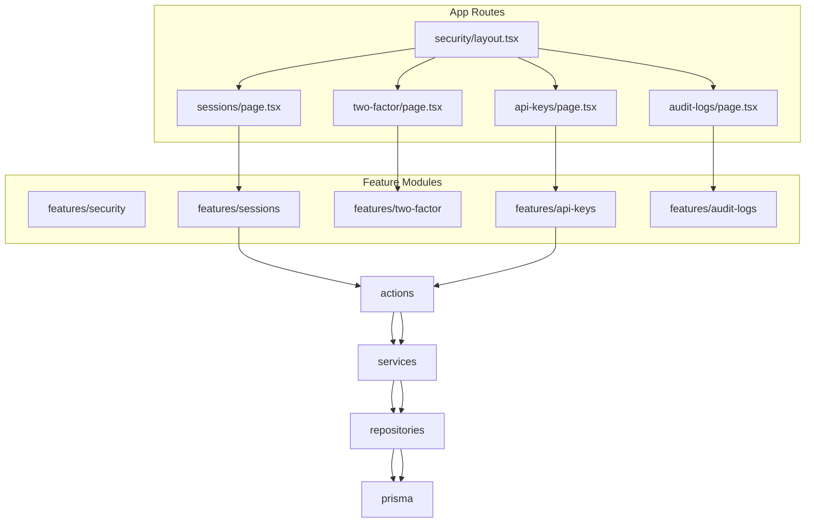

# Security CRUD Pages

## Goal

Implement the **Security** admin section defined in [docs/explanation/erd/01-20260612-erd.md](docs/explanation/erd/01-20260612-erd.md) with four nested routes, following the same patterns as [user-management](<app/(protected)/dashboard/admin-page/user-management/layout.tsx>) and [login-history](features/login-history).

## Architecture



**Data flow:** thin server `page.tsx` → parse URL filters → service (SSR list) → client `*Management` → server actions → service → repository → Prisma.

**Auth:** reuse [`lib/require-session.ts`](lib/require-session.ts) in all actions (same as users/menus). RBAC enforcement remains out of scope.

---

## Route and Layout

Rename folder [`app/(protected)/dashboard/admin-page/Security`](<app/(protected)/dashboard/admin-page/Security>) → `security` (lowercase, consistent with `user-management` URLs).

| Route                            | Feature               | Admin scope                                                            |
| -------------------------------- | --------------------- | ---------------------------------------------------------------------- |
| `/dashboard/admin-page/security` | hub                   | redirect → `sessions`                                                  |
| `.../security/sessions`          | `features/sessions`   | **Read + Revoke** (no create/edit)                                     |
| `.../security/two-factor`        | `features/two-factor` | **Read + Disable** (no create/edit; users enable via account settings) |
| `.../security/api-keys`          | `features/api-keys`   | **Full CRUD** + revoke                                                 |
| `.../security/audit-logs`        | `features/audit-logs` | **Read-only** list + detail (like login-history)                       |

**New app files:**

- [`app/(protected)/dashboard/admin-page/security/layout.tsx`](<app/(protected)/dashboard/admin-page/security/layout.tsx>) — title, description, sub-nav
- [`app/(protected)/dashboard/admin-page/security/page.tsx`](<app/(protected)/dashboard/admin-page/security/page.tsx>) — redirect to sessions
- Four child `page.tsx` files modeled on [`user-management/login-history/page.tsx`](<app/(protected)/dashboard/admin-page/user-management/login-history/page.tsx>)

**Shared nav:** `features/security/components/SecurityNav.tsx` (mirror [`UserManagementNav.tsx`](features/user-management/components/UserManagementNav.tsx))

---

## Prisma Models (reference)

From [`prisma/schema.prisma`](prisma/schema.prisma):

| Model       | Key fields                                                                 | Admin behavior                                                                                                          |
| ----------- | -------------------------------------------------------------------------- | ----------------------------------------------------------------------------------------------------------------------- |
| `Session`   | userId, ipAddress, userAgent, expiresAt, revokedAt/By/Reason               | List active/non-expired sessions; revoke sets `revokedAt`/`revokedBy` then deletes row (Better Auth token invalidation) |
| `TwoFactor` | userId, verified, secret (never expose), backupCodes (never expose)        | List with user join; disable deletes record + sets `User.twoFactorEnabled = false`                                      |
| `ApiKey`    | userId, name, prefix, hashedKey, scopes, isActive, expiresAt, revokedAt/By | Create generates raw key once; update metadata; revoke soft-deletes via `revokedAt`                                     |
| `AuditLog`  | actorId, action, entity, entityId, old/newValues, ipAddress                | Read-only; populated by server-side recorder                                                                            |

**Integration decision:** Do **not** install Better Auth `@better-auth/api-key` or `admin` plugins — the project already has a custom `ApiKey` model and existing session revoke patterns via Prisma ([`user-status.repository.ts`](features/users/repositories/user-status.repository.ts)). Admin plugin only lists sessions **per user**, not globally.

---

## Feature Modules

Each feature gets: `actions/`, `services/`, `repositories/`, `schemas/`, `types/`, `table/`, `components/`, `lib/`, `index.ts`.

### 1. Sessions — `features/sessions/`

**Table columns:** user (name/email), ipAddress, userAgent (truncated), createdAt, updatedAt, expiresAt, revokedAt, actions.

**Filters (URL-synced):** search (user email/name), status (`active` / `expired` / `revoked` / `all`), sort by `createdAt` / `expiresAt`, pagination.

**Row actions:**

- View detail dialog (full userAgent, timestamps, revoke reason if any)
- Revoke session (AlertDialog + `toast.promise`)

**Revoke flow:**

```typescript
// session-revoke.service.ts (conceptual)
await prisma.session.update({ data: { revokedAt, revokedBy, revokedReason } });
await prisma.session.delete({ where: { id } }); // invalidate Better Auth token
await recordAuditLog({ action: "REVOKE", entity: "session", entityId: id, ... });
```

**Bulk action (optional but useful):** revoke all sessions for a user from row menu or filter by userId.

**No create/edit dialogs** — sessions are created by auth only.

---

### 2. Two Factor — `features/two-factor/`

**Table columns:** user (name/email), `User.twoFactorEnabled`, verified, createdAt (if available via user), actions.

**Filters:** search (email/name), status (`enabled` / `disabled` / `all`).

**Row actions:**

- View detail (user info, verified status only — **never render secret/backupCodes**)
- Disable 2FA (confirm + password not required for admin; sets audit log)

**Disable flow:**

```typescript
await prisma.$transaction([
  prisma.twoFactor.deleteMany({ where: { userId } }),
  prisma.user.update({ where: { id: userId }, data: { twoFactorEnabled: false } }),
]);
await recordAuditLog({ action: "REVOKE", entity: "twoFactor", entityId: userId, ... });
```

**No create/edit** — users enable via existing [`TwoFactorSettings.tsx`](features/auth/components/TwoFactorSettings.tsx).

---

### 3. API Keys — `features/api-keys/`

**Table columns:** name, prefix, user (name/email), scopes, isActive, lastUsedAt, expiresAt, revokedAt, createdAt, actions.

**Create form (TanStack Form + Dialog):**

- userId (select from new `userOptionsService` in `features/users`)
- name, description (optional)
- scopes (optional text/JSON string matching schema)
- expiresAt (optional date)

**Create flow:**

- Generate raw key: `{prefix}_{randomBytes}` (prefix from name slug or `abn_`)
- Hash with SHA-256 (same pattern as [`email-change-token.ts`](features/auth/lib/email-change-token.ts))
- Store `prefix`, `hashedKey`; return raw key **once** in success dialog (copy-to-clipboard)

**Edit form:** name, description, scopes, expiresAt, isActive (cannot change hashedKey)

**Row actions:** edit, revoke (sets `revokedAt`/`revokedBy`, `isActive: false`), delete (hard delete if not revoked, or blocked when active)

**Shared dependency:** add [`features/users/services/user-options.service.ts`](features/users/services/user-options.service.ts) — `{ id, name, email }[]` for create form select.

---

### 4. Audit Logs — `features/audit-logs/` (read-only)

Mirror [`features/login-history`](features/login-history) structure.

**Table columns:** createdAt, actor (name/email), action (badge), entity, entityId, summary (truncated), ipAddress.

**Filters:** search (summary/entity/entityId), action (`AuditAction` enum / `all`), entity, date sort, pagination.

**Row action:** detail dialog showing formatted `oldValues` / `newValues` JSON.

**No create/edit/delete from UI.**

**Prerequisite — audit writer:** add [`lib/audit-log-recorder.ts`](lib/audit-log-recorder.ts):

```typescript
export async function recordAuditLog(input: {
  actorId?: string;
  action: AuditAction;
  entity: string;
  entityId?: string;
  summary?: string;
  oldValues?: unknown;
  newValues?: unknown;
  ipAddress?: string;
  userAgent?: string;
}) {
  /* prisma.auditLog.create */
}
```

Wire recorder into **security mutations first** (session revoke, 2FA disable, API key create/update/revoke/delete). Broader wiring into users/roles/menus can be a follow-up.

Until recorder is wired, the page will show empty state — acceptable with clear messaging.

---

## UI Conventions

Match existing admin tables:

- TanStack Table via [`components/data-table/DataTable.tsx`](components/data-table/DataTable.tsx)
- URL-synced filters via `lib/*-filter-url.ts` + `router.push` + `router.refresh()`
- Toolbar: debounced search, filters, reset, create button (API keys only)
- Row actions: `AlertDialog` + `toast.promise` per [toast rules](.cursor/rules/toast-integration-system.mdc)
- Detail dialogs for read-heavy entities (sessions, 2FA, audit logs)

Reference implementations:

- Read-only: [`LoginHistoryManagement.tsx`](features/login-history/components/LoginHistoryManagement.tsx)
- Full CRUD: [`UserManagement.tsx`](features/users/components/UserManagement.tsx) + [`MenuManagement.tsx`](features/menus/components/MenuManagement.tsx)

---

## Seed and Menu Updates

Update [`prisma/seeders/data/access-management.ts`](prisma/seeders/data/access-management.ts):

1. Add `security` menu group under `admin` (path: `null`, icon: `Shield`)
2. Add child menus:
   - `sessions` → `/dashboard/admin-page/security/sessions`
   - `two_factor` → `/dashboard/admin-page/security/two-factor`
   - `api_keys` → `/dashboard/admin-page/security/api-keys` (move from `/dashboard/admin-page/api-keys`)
   - `audit_logs` → `/dashboard/admin-page/security/audit-logs`
3. Optionally add `security_management` permission module + `manage_security` permission (not wired to actions yet)

Re-run access-management seed in dev after changes.

---

## Implementation Order

1. **Security layout + nav + route shells** (redirect hub)
2. **Audit log recorder** (`lib/audit-log-recorder.ts`) — unblocks mutation logging
3. **Sessions** (simplest revoke workflow, validates layout)
4. **Two Factor** (similar list + single action)
5. **API Keys** (most complex — forms, key generation, one-time display)
6. **Audit Logs** (read-only; benefits from recorder from step 2)
7. **User options service** (needed for API key create; can land with step 5)
8. **Seed menu path updates**

---

## Out of Scope (follow-up)

- Better Auth `admin` plugin (ban/impersonate) — not required for this scope
- `@better-auth/api-key` plugin — conflicts with existing Prisma schema
- RBAC `requirePermission("manage_security")` on actions
- CSV import/export
- `ApiUsageLog` admin page
- Wiring audit recorder into all existing user-management mutations

---

## File Volume Estimate

~90–110 new files across 4 features + security nav + layout + audit recorder + seed updates. Audit logs and sessions are smaller (~12–15 files each); API keys mirrors users/menus (~22–25 files).
