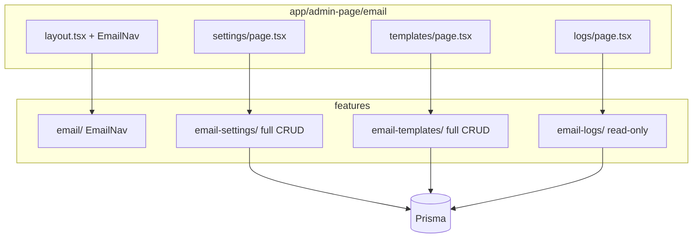

# Email Admin CRUD Pages

## Current state

- Prisma models are ready in [`prisma/schema.prisma`](prisma/schema.prisma): `EmailSetting`, `EmailTemplate`, `EmailLog`, `EmailProvider`, `EmailStatus`
- Seeder menus and permission already point to:
  - `/dashboard/admin-page/email/settings`
  - `/dashboard/admin-page/email/templates`
  - `/dashboard/admin-page/email/logs`
- Only a placeholder exists at [`app/(protected)/dashboard/admin-page/email/page.tsx`](<app/(protected)/dashboard/admin-page/email/page.tsx>)
- No `features/email*` modules yet; [`lib/email.ts`](lib/email.ts) is a standalone Resend helper (out of scope for this task)

## Target architecture



Mirror the **Security** section pattern:

- Shell: [`app/(protected)/dashboard/admin-page/security/layout.tsx`](<app/(protected)/dashboard/admin-page/security/layout.tsx>) + [`features/security/components/SecurityNav.tsx`](features/security/components/SecurityNav.tsx)
- Thin server pages: [`app/(protected)/dashboard/admin-page/security/audit-logs/page.tsx`](<app/(protected)/dashboard/admin-page/security/audit-logs/page.tsx>)

---

## 1. Route shell

Create under [`app/(protected)/dashboard/admin-page/email/`](<app/(protected)/dashboard/admin-page/email/>):

| File                 | Responsibility                                     |
| -------------------- | -------------------------------------------------- |
| `layout.tsx`         | Section title, description, `<EmailNav />`         |
| `page.tsx`           | Redirect to `/dashboard/admin-page/email/settings` |
| `settings/page.tsx`  | Server fetch + `<EmailSettingManagement />`        |
| `templates/page.tsx` | Server fetch + `<EmailTemplateManagement />`       |
| `logs/page.tsx`      | Server fetch + `<EmailLogManagement />`            |

Replace the current placeholder `page.tsx` with the redirect pattern used by security/user-management.

---

## 2. Feature modules (3 siblings + nav wrapper)

Follow the codebase convention of **one feature folder per concern** (like `audit-logs`, `api-keys`).

### `features/email/` (nav only)

- `components/EmailNav.tsx` — tabs: Settings, Templates, Logs
- `index.ts` — export `EmailNav`

### `features/email-settings/` (full CRUD)

**Reference:** [`features/api-keys/`](features/api-keys/) + [`features/permission-modules/`](features/permission-modules/) for status/default toggles

**Layers:**

```
actions/
  email-setting-create.action.ts
  email-setting-update.action.ts
  email-setting-delete.action.ts      # includes getById, toggleActive, setDefault
services/
  email-setting-create.service.ts
  email-setting-get-list.service.ts
  email-setting-get-by-id.service.ts
  email-setting-update.service.ts
  email-setting-delete.service.ts
  email-setting-toggle-status.service.ts
  email-setting-set-default.service.ts
repositories/
  email-setting-*.repository.ts
schemas/
  email-setting-create.schema.ts
  email-setting-update.schema.ts
  email-setting-filter.schema.ts      # parseEmailSettingFilter()
  email-setting-delete.schema.ts
types/
  email-setting.type.ts
lib/
  email-setting-filter-url.ts
  email-setting-form-defaults.ts
  email-setting-form-mapper.ts
components/
  EmailSettingManagement.tsx
  EmailSettingForm.tsx
  EmailSettingCreateDialog.tsx
  EmailSettingEditDialog.tsx
table/
  columns.tsx
  EmailSettingTable.tsx
  EmailSettingTableToolbar.tsx
  EmailSettingRowActions.tsx
index.ts
```

**Table columns:** name, provider, fromEmail, isActive, isDefault, updatedAt, actions

**Form fields (provider-conditional UI):**

- Always: name, provider (`EmailProvider` enum), fromEmail, fromName, replyTo, isActive
- SMTP: host, port, username, password, useTls
- API providers (SENDGRID, MAILGUN, SES, RESEND, POSTMARK): apiKey
- On edit: password/apiKey optional (blank = keep existing); never return secrets in list/get responses

**Business rules (services):**

- Only one `isDefault = true` at a time — unset others in a transaction when setting default
- Prevent delete of the only default active config (or auto-promote another default)
- Validate required fields per provider in Zod schema (`superRefine`)

**Row actions:** edit, toggle active, set default, delete (with confirm + `toast.promise`)

### `features/email-templates/` (full CRUD)

**Reference:** [`features/menus/`](features/menus/) + [`features/permission-modules/`](features/permission-modules/) for `isSystem` guard

**Same layer stack** as settings (actions → services → repositories → schemas → table → components).

**Table columns:** code, name, subject, isActive, isSystem, updatedAt, actions

**Form fields:** code (unique, immutable on edit), name, subject, bodyHtml, bodyText, variables (helper text for placeholders), description, isActive

**Business rules:**

- `isSystem` templates: allow edit of content fields, block delete (and optionally block code change)
- `code` unique constraint enforced server-side

**Shared primitive to add:** [`components/form/TextareaField.tsx`](components/form/TextareaField.tsx) wrapping existing [`components/ui/textarea.tsx`](components/ui/textarea.tsx) — needed for HTML/plain body fields (no TextareaField exists today)

### `features/email-logs/` (read-only)

**Reference:** [`features/audit-logs/`](features/audit-logs/)

**Layers (no actions/):**

```
repositories/email-log-list.repository.ts
services/email-log-get-list.service.ts
schemas/email-log-filter.schema.ts
types/email-log.type.ts
lib/email-log-filter-url.ts
components/EmailLogManagement.tsx
components/EmailLogDetailDialog.tsx
table/columns.tsx, EmailLogTable.tsx, EmailLogTableToolbar.tsx
index.ts
```

**Table columns:** createdAt, toEmail, subject, status (badge), template name, sentAt, attempts

**Filters (URL-synced):** search (toEmail/subject), status, page, pageSize, sortBy, sortOrder

**Detail dialog:** full metadata — cc/bcc, bodyHtml preview, error, attempts, sentAt, linked template

**No create/edit/delete UI** (user confirmed read-only)

---

## 3. Cross-cutting conventions

Apply existing project rules consistently:

- **Data flow:** `page.tsx` → service → client `*Management` → action → service → repository → Prisma
- **Tables:** TanStack Table via shared `components/data-table/` primitives
- **Forms:** TanStack Form + shared field wrappers; `toast.promise` on all mutations
- **URL state:** filter/pagination/sort via `parseXFilter()` + `buildXListUrl()` (300–500ms debounce on search)
- **Auth:** `requireSessionUserId()` in all server actions
- **Permissions:** gate UI actions with `manage_email` where the app already checks permissions for admin CRUD (follow menus/users pattern if a shared helper exists)

---

## 4. Optional seed data (recommended)

Add a small seeder file (e.g. `prisma/seeders/data/email.ts`) with:

- One default SMTP `EmailSetting` stub (inactive, no real secrets)
- System templates for auth flows: `email_verification`, `password_reset`, `email_change` with placeholder HTML and `isSystem: true`

This gives usable admin screens immediately after seed. Skip if you prefer empty tables on first load.

---

## 5. Out of scope (follow-up)

- Rewiring [`lib/email.ts`](lib/email.ts) to read active `EmailSetting` from DB and write `EmailLog` rows on send
- CSV import/export for templates
- Test-connection action for SMTP/API providers

---

## File count estimate

- Routes: 5 files (layout, redirect, 3 pages)
- `features/email`: 2 files
- `features/email-settings`: ~25 files
- `features/email-templates`: ~25 files
- `features/email-logs`: ~11 files
- Shared: 1 new `TextareaField.tsx`
- Optional seeder: 1–2 files

Total: ~70 files, mostly following copy-adapt from `api-keys`, `menus`, and `audit-logs`.
