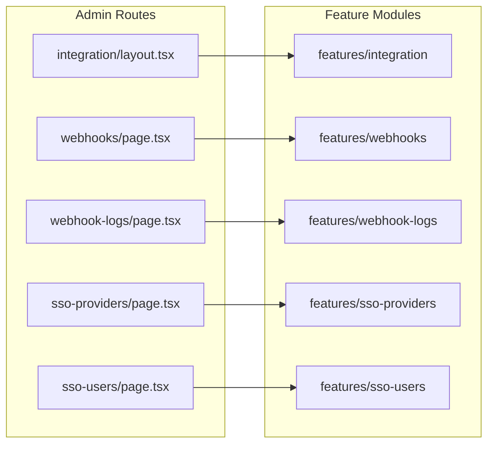

# Integration CRUD (Webhooks, SSO Providers, SSO Users)

## Current state

- [`app/(protected)/dashboard/admin-page/integration/page.tsx`](<app/(protected)/dashboard/admin-page/integration/page.tsx>) is a stub.
- Prisma models already exist: `Webhook`, `WebhookLog`, `SsoProvider`, `SsoUserLink` in [`prisma/schema.prisma`](prisma/schema.prisma) (lines 446–555).
- No feature modules or routes exist yet for these entities.
- Access seeds define `webhook_management` permission and a **standalone** menu at `/dashboard/admin-page/webhooks` in [`prisma/seeders/data/access-management.ts`](prisma/seeders/data/access-management.ts)—this will be reorganized under Integration.

## Target routing

Mirror the Email section pattern ([`app/(protected)/dashboard/admin-page/email/`](<app/(protected)/dashboard/admin-page/email/>)):

```
/dashboard/admin-page/integration              → redirect to .../webhooks
/dashboard/admin-page/integration/webhooks     → Webhook CRUD
/dashboard/admin-page/integration/webhook-logs → WebhookLog read-only
/dashboard/admin-page/integration/sso-providers → SsoProvider CRUD
/dashboard/admin-page/integration/sso-users    → SsoUserLink CRUD
```



## Reference implementations to copy

| New feature   | Primary template                                       | Secondary template                                                      |
| ------------- | ------------------------------------------------------ | ----------------------------------------------------------------------- |
| Webhooks CRUD | [`features/email-settings/`](features/email-settings/) | [`features/api-keys/`](features/api-keys/) for optional `userId` select |
| Webhook Logs  | [`features/email-logs/`](features/email-logs/)         | read-only list + detail dialog                                          |
| SSO Providers | [`features/email-settings/`](features/email-settings/) | conditional fields by `SsoProtocol` enum                                |
| SSO Users     | [`features/api-keys/`](features/api-keys/)             | dual selects: `userOptionsService`, provider options                    |

Standard data flow (unchanged project convention):

`page.tsx → parseFilter → getListService → *Management → Table/Dialogs → action → service → repository → Prisma`

---

## 1. Integration shell (nav-only feature)

**New files**

- [`features/integration/components/IntegrationNav.tsx`](features/integration/components/IntegrationNav.tsx) — client tab nav (copy [`EmailNav.tsx`](features/email/components/EmailNav.tsx) pattern)
- [`features/integration/index.ts`](features/integration/index.ts)

**Route files**

- [`app/(protected)/dashboard/admin-page/integration/layout.tsx`](<app/(protected)/dashboard/admin-page/integration/layout.tsx>) — section header + `IntegrationNav`
- Update [`integration/page.tsx`](<app/(protected)/dashboard/admin-page/integration/page.tsx>) — `redirect("/dashboard/admin-page/integration/webhooks")`
- Four thin child pages under `integration/webhooks`, `integration/webhook-logs`, `integration/sso-providers`, `integration/sso-users`

---

## 2. Webhooks CRUD (`features/webhooks/`)

Full layer stack matching [`email-settings`](features/email-settings/):

| Layer        | Files                                                                                                          |
| ------------ | -------------------------------------------------------------------------------------------------------------- |
| schemas      | `webhook-filter.schema.ts`, `webhook-create.schema.ts`, `webhook-update.schema.ts`, `webhook-delete.schema.ts` |
| types        | `webhook.type.ts` (table row, list result, form values, detail with `hasSecret`)                               |
| repositories | list, get-by-id, create, update, delete, toggle-status                                                         |
| services     | get-list, get-by-id, create, update, delete, toggle-status                                                     |
| actions      | create, update, delete, toggle-status, get-by-id (for edit preload)                                            |
| lib          | `webhook-filter-url.ts`, `webhook-form-defaults.ts`, `webhook-form-mapper.ts`                                  |
| table        | `columns.tsx`, `WebhookTable.tsx`, `WebhookTableToolbar.tsx`, `WebhookRowActions.tsx`                          |
| components   | `WebhookManagement.tsx`, `WebhookForm.tsx`, `WebhookCreateDialog.tsx`, `WebhookEditDialog.tsx`                 |

**Form fields** (from `Webhook` model)

- `name`, `url` (required URL), `events` (textarea; validate as JSON array of strings or comma-separated → stored string)
- `secret` (optional on update; blank = keep existing, like email password)
- `description`, `headers` (optional JSON string with schema validation)
- `userId` (optional; `SelectField` with `userOptionsService()`)
- `isActive`, `maxRetries`, `timeoutMs`

**Table columns**

- name, url (truncated), events summary, status badge, last delivery status/at, failure count, createdAt, row actions

**Row actions**

- Edit, Toggle active/inactive, Delete (confirm + `toast.promise`)

**URL-synced filters**

- search, page, pageSize, sortBy, sortOrder, status (`all` / `active` / `inactive`)

---

## 3. Webhook Logs read-only (`features/webhook-logs/`)

Follow [`features/email-logs/`](features/email-logs/) (no `actions/`):

| Layer        | Files                                                              |
| ------------ | ------------------------------------------------------------------ |
| schemas      | `webhook-log-filter.schema.ts`                                     |
| types        | `webhook-log.type.ts`                                              |
| repositories | list, get-by-id                                                    |
| services     | get-list, get-by-id                                                |
| lib          | `webhook-log-filter-url.ts`                                        |
| table        | `columns.tsx`, `WebhookLogTable.tsx`, `WebhookLogTableToolbar.tsx` |
| components   | `WebhookLogManagement.tsx`, `WebhookLogDetailDialog.tsx`           |

**Filters**

- search (event, error), webhookId (optional select/filter), status, date range optional if pattern exists elsewhere, pagination + sort

**Detail dialog**

- event, payload, request/response headers, status, attempts, error, timestamps

---

## 4. SSO Providers CRUD (`features/sso-providers/`)

Same full stack as webhooks.

**Form fields** (from `SsoProvider` model)

- `code` (unique, required), `name`, `protocol` (`OIDC` | `SAML` | `OAUTH2`)
- Protocol-dependent URLs: `issuerUrl`, `authUrl`, `tokenUrl`, `userinfoUrl`, `callbackUrl`
- `clientId`, `clientSecret` (optional on update; `hasClientSecret` flag on edit)
- `scopes`, `metadata` (JSON textarea), `isActive`, `autoProvision`
- `defaultRoleId` (optional; `roleOptionsService()` from [`features/roles`](features/roles/))

**Service rules**

- Enforce unique `code` on create/update
- `superRefine` in schema: require issuer/auth/token URLs based on selected protocol

**Row actions**

- Edit, Toggle active, Delete

---

## 5. SSO Users CRUD (`features/sso-users/`)

Maps to `SsoUserLink` model (external SSO identity linked to app user).

**Form fields**

- `userId` (required; user select)
- `providerId` (required; provider select from new `ssoProviderOptionsService()`)
- `externalId` (required)
- `emailAtProvider`, `displayName` (optional)
- `rawProfile` (optional JSON textarea)

**Service rules**

- Enforce `@@unique([providerId, externalId])` with friendly error on conflict
- On delete: standard cascade-safe delete of link only

**Table columns**

- user name/email, provider name/code, externalId, emailAtProvider, lastLoginAt, createdAt, row actions

**Page data loading**

```tsx
const [initialData, userOptions, providerOptions] = await Promise.all([
  ssoUserLinkGetListService(filters),
  userOptionsService(),
  ssoProviderOptionsService(),
]);
```

---

## 6. Access management seeds

Update [`prisma/seeders/data/access-management.ts`](prisma/seeders/data/access-management.ts):

**New permission module**

- `sso_management` — "SSO Management"

**New permissions**

- `manage_sso_provider`
- `manage_sso_user`

**Menu restructure**

- Add group menu `integration` (parent: `admin`, icon: `Link`, path: `null`)
- Move `webhooks` under `integration`; update path to `/dashboard/admin-page/integration/webhooks`
- Add `webhook_logs` → `/dashboard/admin-page/integration/webhook-logs`
- Add `sso_providers` → `/dashboard/admin-page/integration/sso-providers`
- Add `sso_users` → `/dashboard/admin-page/integration/sso-users`
- Add `"integration"` to `menuGroupCodes` set (line ~348)

**Icons** (already in [`menu-lucide-icons.ts`](features/menus/constants/menu-lucide-icons.ts)): `Webhook`, `Link`, `History`, `Shield` or `Key` for SSO provider

Re-run seed after migration: `npx prisma db seed`

---

## 7. Shared UI / conventions (must follow)

- TanStack Table via [`components/data-table/DataTable.tsx`](components/data-table/DataTable.tsx)
- TanStack Form via shared [`components/form/*`](components/form/)
- All mutations use `toast.promise` per [toast rules](.cursor/rules/toast-integration-system.mdc)
- Server actions call `requireSessionUserId()` (same as existing admin actions)
- No schema migration needed—models already exist; run `prisma generate` only if client is stale

---

## Implementation order

1. Integration shell (layout, nav, redirects, empty pages)
2. Webhooks CRUD (largest form; unblocks webhook-logs filter options)
3. Webhook Logs read-only
4. SSO Providers CRUD (+ `ssoProviderOptionsService` for SSO Users)
5. SSO Users CRUD
6. Access-management seed updates + re-seed

---

## Out of scope

- Webhook delivery engine / retry worker (only admin CRUD + log viewing)
- Better Auth SSO plugin wiring (admin config only; runtime SSO login is separate)
- Moving API keys under Integration (stays under Security)
