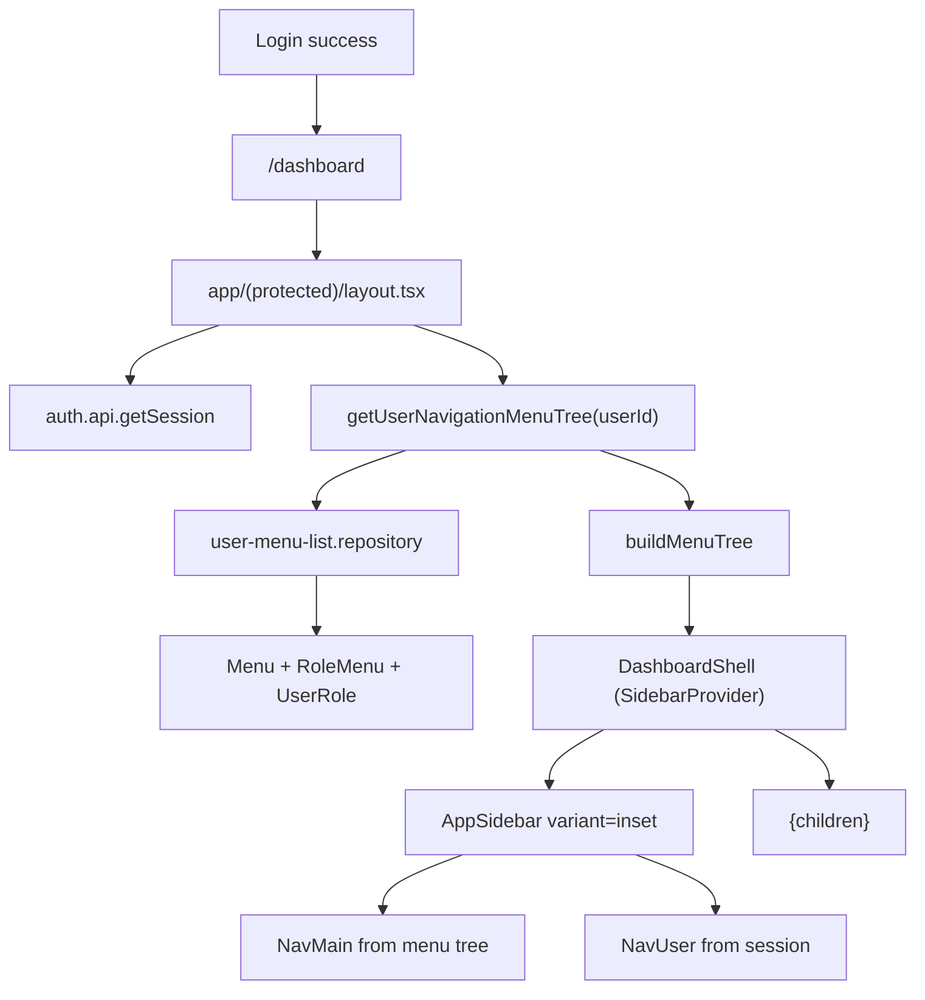

# Sidebar-08 + Prisma Menu Integration

## Current State

- Post-login redirect already lands on `/dashboard` ([`features/auth/components/SignInForm.tsx`](features/auth/components/SignInForm.tsx)).
- Authenticated pages use [`app/(protected)/layout.tsx`](<app/(protected)/layout.tsx>) with a top `Navbar` only — no sidebar wired up yet.
- Shadcn sidebar primitives already exist at [`components/ui/sidebar.tsx`](components/ui/sidebar.tsx) but are unused.
- Prisma already models RBAC navigation:
  - [`Menu`](prisma/schema.prisma) — hierarchical nav (`parentId`, `path`, `icon`, `sortOrder`, `isActive`)
  - [`RoleMenu`](prisma/schema.prisma) — per-role access (`canView`, `canCreate`, `canEdit`, `canDelete`)
  - [`UserRole`](prisma/schema.prisma) — links users to roles
- Menu CRUD + preview tree already exist in [`features/menus/`](features/menus/) (including [`buildMenuTree`](features/menus/lib/menu-tree.ts) and [`LucideIconDisplay`](lib/lucide-icon-display.tsx)), but nothing reads menus for app navigation yet.
- Seeded menu tree in [`prisma/seeders/data/access-management.ts`](prisma/seeders/data/access-management.ts) matches existing dashboard routes.

## Target Architecture



## Implementation Plan

### 1. Install sidebar-08 block

Run:

```bash
pnpm dlx shadcn@latest add sidebar-08
```

This scaffolds (into `components/`):

- `app-sidebar.tsx`
- `nav-main.tsx`
- `nav-projects.tsx`
- `nav-secondary.tsx`
- `nav-user.tsx`

**Adaptations after install:**

| Generated piece     | Action                                                                                                                             |
| ------------------- | ---------------------------------------------------------------------------------------------------------------------------------- |
| `nav-projects.tsx`  | Remove from `AppSidebar` — no Prisma equivalent                                                                                    |
| `nav-secondary.tsx` | Omit for v1 (or keep 1–2 static utility links later)                                                                               |
| `nav-user.tsx`      | Wire to Better Auth session + `signOut()` (reuse patterns from [`components/navbar/UserMenu.tsx`](components/navbar/UserMenu.tsx)) |
| `app-sidebar.tsx`   | Replace hardcoded `data` with props: `menuTree`, `user`, `appName`                                                                 |
| `nav-main.tsx`      | Extend to support **recursive menu trees** (seed has 3 levels: Administration → Security → Sessions)                               |

### 2. Add navigation feature (role-aware menu loading)

Create `features/navigation/` following project architecture:

**Repository** — [`features/navigation/repositories/user-menu-list.repository.ts`](features/navigation/repositories/user-menu-list.repository.ts)

Query menus visible to the current user:

```ts
prisma.menu.findMany({
  where: {
    isActive: true,
    roleMenus: {
      some: {
        canView: true,
        role: {
          userRoles: {
            some: {
              userId,
              OR: [{ expiresAt: null }, { expiresAt: { gt: new Date() } }],
            },
          },
        },
      },
    },
  },
  select: { id, code, label, path, icon, parentId, sortOrder, isActive },
  orderBy: [{ sortOrder: "asc" }, { label: "asc" }],
});
```

**Service** — [`features/navigation/services/user-menu-get-tree.service.ts`](features/navigation/services/user-menu-get-tree.service.ts)

- Call repository
- Reuse [`buildMenuTree`](features/menus/lib/menu-tree.ts) (compatible shape with `MenuPreviewItem`)
- Return `NavigationMenuTreeNode[]`

**Mapper** — [`features/navigation/lib/navigation-menu-mapper.ts`](features/navigation/lib/navigation-menu-mapper.ts)

- Convert tree nodes into sidebar nav item props
- Leaf nodes (`path` set) → links
- Group nodes (`path` null) → collapsible sections
- Icons: pass `icon` string into nav components and render via existing [`LucideIconDisplay`](lib/lucide-icon-display.tsx)

**Types** — [`features/navigation/types/navigation.type.ts`](features/navigation/types/navigation.type.ts)

### 3. Build dashboard shell components

Add shared shell components (adapted from sidebar-08 page example):

- [`components/dashboard-shell.tsx`](components/dashboard-shell.tsx) — client wrapper with `SidebarProvider`, `AppSidebar`, `SidebarInset`
- [`components/dashboard-header.tsx`](components/dashboard-header.tsx) — `SidebarTrigger` + breadcrumb area (v1: simple page title from pathname; can enhance later using menu tree lookup)

Update [`app/(protected)/layout.tsx`](<app/(protected)/layout.tsx>):

- Remove `Navbar`
- Server-fetch session via `auth.api.getSession`
- Server-fetch menu tree via `getUserNavigationMenuTree(userId)`
- Render `DashboardShell` around `{children}`

### 4. Customize sidebar components for real data

**`AppSidebar`**

- `variant="inset"` (sidebar-08 style)
- Header: app branding from [`config/app.config.ts`](config/app.config.ts) (`Master Hub`)
- Content: `<NavMain items={menuTree} />`
- Footer: `<NavUser user={sessionUser} />`

**`NavMain`**

- Accept recursive `NavigationMenuItem[]`
- Use `Link` from `next/link` (not `<a href="#">`)
- Highlight active route via `usePathname()`
- Auto-expand group containing the active path
- Support nested groups (Security/Email/Integration under Administration)

**`NavUser`**

- Show `name`, `email`, `image`
- Actions: Account Settings (`/dashboard/settings`), Sign out (`signOut()` → `/auth/sign-in`)
- Remove demo items (Upgrade/Billing/Notifications)

### 5. Remove redundant horizontal admin navigation

Per your preference, simplify admin section layouts by removing tab bars and keeping only page content wrappers:

- [`app/(protected)/dashboard/admin-page/user-management/layout.tsx`](<app/(protected)/dashboard/admin-page/user-management/layout.tsx>)
- [`app/(protected)/dashboard/admin-page/security/layout.tsx`](<app/(protected)/dashboard/admin-page/security/layout.tsx>)
- [`app/(protected)/dashboard/admin-page/email/layout.tsx`](<app/(protected)/dashboard/admin-page/email/layout.tsx>)
- [`app/(protected)/dashboard/admin-page/integration/layout.tsx`](<app/(protected)/dashboard/admin-page/integration/layout.tsx>)

Keep section titles/descriptions optional (compact header only) so pages remain readable without duplicate nav.

### 6. Page content spacing cleanup

- Remove `max-w-7xl` constraints from admin layouts where the new full-width sidebar shell should breathe
- Ensure dashboard pages render inside `SidebarInset` content area with consistent `p-4` padding

## Role-Based Behavior (from existing seed)

| Role          | Sidebar shows                            |
| ------------- | ---------------------------------------- |
| `super_admin` | Full menu tree                           |
| `admin`       | All except Permissions + System Settings |
| `user`        | Dashboard + Account Settings only        |

No schema or seeder changes required — integration uses existing `Menu` / `RoleMenu` / `UserRole` data.

## Files Touched (summary)

**New**

- `features/navigation/**` (repository, service, types, mapper, `index.ts`)
- `components/dashboard-shell.tsx`
- `components/dashboard-header.tsx`
- shadcn block files from `sidebar-08` install

**Modified**

- [`app/(protected)/layout.tsx`](<app/(protected)/layout.tsx>)
- `components/app-sidebar.tsx`, `nav-main.tsx`, `nav-user.tsx` (post-install customization)
- 4 admin nested layouts (remove horizontal nav imports)

**Unchanged**

- Auth/login flow and `/dashboard` redirect
- Public [`Navbar`](components/navbar/Navbar.tsx) for unauthenticated pages
- Menu admin CRUD in [`features/menus/`](features/menus/)

## Verification Checklist

1. Run `pnpm dlx shadcn@latest add sidebar-08` successfully
2. Sign in as seeded `super_admin` → full Administration tree visible in inset sidebar
3. Sign in as `user` → only Dashboard + Account Settings
4. Click nested items (e.g. Administration → Security → Sessions) navigates correctly
5. Sign out from sidebar footer works and returns to `/auth/sign-in`
6. Admin pages no longer show duplicate horizontal tab navigation
7. `pnpm build` passes with no type errors

## Notes / Non-goals

- `system_settings` menu path exists in seed but route is not implemented yet — link may 404 until that page is built (pre-existing gap)
- Dynamic breadcrumbs from menu ancestry can be a follow-up enhancement
- Route-level authorization (blocking direct URL access) is separate from sidebar visibility and not in this scope
