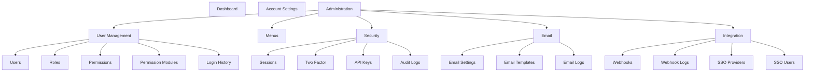

# Update Menu Seeder to Match Latest Routes

## Current vs Target

Leaf menu paths in [`prisma/seeders/data/access-management.ts`](prisma/seeders/data/access-management.ts) already match implemented routes. The gaps are **hierarchy** and **stale seed behavior**:

| Issue           | Current                                                              | Target                                                                                        |
| --------------- | -------------------------------------------------------------------- | --------------------------------------------------------------------------------------------- |
| User Management | 5 items flat under `admin`                                           | New `user_management` group under `admin` (matches `/dashboard/admin-page/user-management/*`) |
| System Settings | Menu entry → `/dashboard/admin-page/system-settings` (no page)       | **Remove** until route exists                                                                 |
| Re-seed         | `upsert` uses `update: {}` — existing DB rows keep old paths/parents | Sync `label`, `path`, `icon`, `parentId`, `sortOrder` on update                               |

### Target sidebar tree



This mirrors the route layout under `app/(protected)/dashboard/admin-page/` and the removed horizontal nav definitions in [`features/user-management/components/UserManagementNav.tsx`](features/user-management/components/UserManagementNav.tsx), [`features/security/components/SecurityNav.tsx`](features/security/components/SecurityNav.tsx), etc.

## File Changes

### 1. [`prisma/seeders/data/access-management.ts`](prisma/seeders/data/access-management.ts)

**Add** `user_management` group entry under `admin`:

```ts
{
  code: "user_management",
  label: "User Management",
  path: null,
  icon: "Users",
  parentCode: "admin",
  sortOrder: 1,
}
```

**Reparent** these items from `parentCode: "admin"` → `parentCode: "user_management"` (paths unchanged):

- `users` → `/dashboard/admin-page/user-management/users`
- `roles` → `/dashboard/admin-page/user-management/roles`
- `permissions` → `/dashboard/admin-page/user-management/permissions`
- `permission_modules` → `/dashboard/admin-page/user-management/permission-modules`
- `login_history` → `/dashboard/admin-page/user-management/login-history`

**Reorder** remaining `admin` children:

| sortOrder | code                      |
| --------- | ------------------------- |
| 1         | `user_management` (group) |
| 2         | `menus`                   |
| 3         | `security` (group)        |
| 4         | `email` (group)           |
| 5         | `integration` (group)     |

**Remove** the `system_settings` menu entry entirely.

**Update helper sets** at bottom of file:

```ts
const menuGroupCodes = new Set([
  "admin",
  "user_management",
  "email",
  "security",
  "integration",
]);

const adminExcludedMenuCodes = new Set(["permissions"]); // remove system_settings
```

`roleMenus` will auto-adjust because it derives from `allMenuCodes`.

### 2. [`prisma/seeders/seeds/access-management.seed.ts`](prisma/seeders/seeds/access-management.seed.ts)

Change menu upsert from no-op update to field sync so existing databases pick up hierarchy/path fixes:

```ts
const record = await prisma.menu.upsert({
  where: { code: menu.code },
  update: {
    label: menu.label,
    path: menu.path,
    icon: menu.icon,
    parentId,
    sortOrder: menu.sortOrder,
    isActive: true,
  },
  create: {
    /* unchanged */
  },
});
```

**Optional cleanup** (recommended): after seeding, deactivate or delete `system_settings` menu if it exists in DB from a prior seed, since it is no longer in the seed data. Simplest approach:

```ts
await prisma.menu.updateMany({
  where: { code: "system_settings" },
  data: { isActive: false },
});
```

This avoids orphaned sidebar links without a destructive delete.

## Verification

After changes, re-run the seeder:

```bash
pnpm prisma db seed
```

Then verify as `super_admin`:

1. Sidebar shows **Administration → User Management → Users/Roles/...** (4-level nesting works via [`components/nav-main.tsx`](components/nav-main.tsx))
2. All leaf links navigate to existing pages (no 404s)
3. **System Settings** no longer appears in sidebar
4. `admin` role still excludes **Permissions** menu (unchanged rule)
5. `user` role still sees only **Dashboard** + **Account Settings**

## Out of Scope

- Creating the `/dashboard/admin-page/system-settings` page (removed per your preference)
- Route-level authorization guards (sidebar visibility only)
- Deleting unused `*Nav.tsx` horizontal nav components (already unused in layouts)
