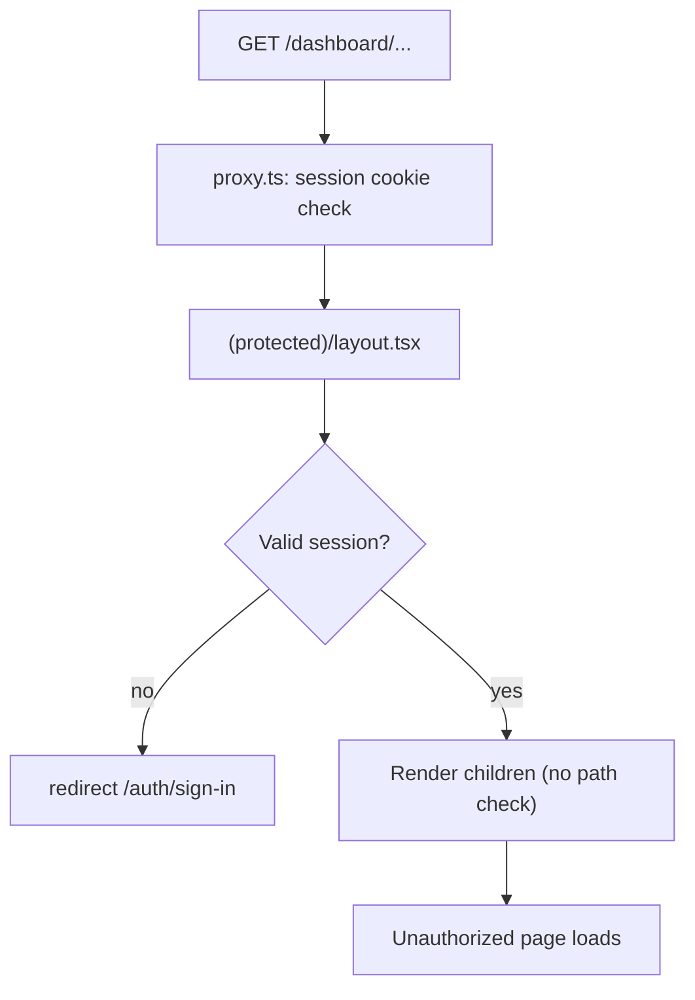
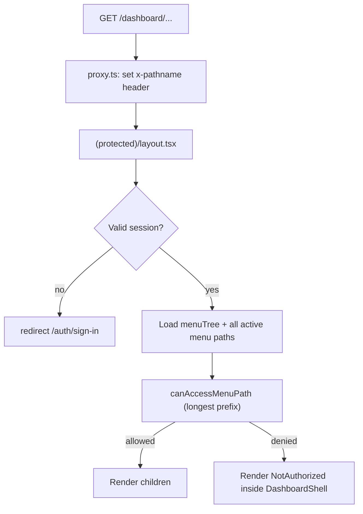

# Route-Level RBAC Authorization

## Current state

**Implemented today:**

- Sidebar menus filtered via [`userMenuListRepository`](features/navigation/repositories/user-menu-list.repository.ts) (`RoleMenu.canView` + active roles)
- Authentication enforced in [`proxy.ts`](proxy.ts) (session cookie) and [`app/(protected)/layout.tsx`](<app/(protected)/layout.tsx>) (Better Auth session)

**Gap:**

- [`app/(protected)/layout.tsx`](<app/(protected)/layout.tsx>) always renders `{children}` for any authenticated user
- A `user`-role account can type `/dashboard/admin-page/user-management/users` and load the page
- No 403 UI exists (only [`app/not-found.tsx`](app/not-found.tsx) for 404)



## Target architecture

Reuse **menu `path` + `RoleMenu.canView`** as the single source of truth so navigation and route access stay aligned. No separate static route→permission map.



### Critical path-matching rule

A naive `pathname.startsWith("/dashboard")` check would authorize **all** dashboard URLs because every user has the `/dashboard` menu.

Use **longest-prefix match against all active menu paths**:

1. Collect all active menu `path` values from DB (non-null).
2. Collect the current user's allowed paths from their filtered menu tree.
3. Find menu paths where `pathname === path` or `pathname.startsWith(path + "/")`.
4. Pick the **longest** matching path.
5. Allow only if that path is in the user's allowed set.
6. If **no** menu path matches → allow (covers redirect hubs like `/dashboard/admin-page/user-management` and future unmapped authenticated pages).

**Example:** `user` role (allowed: `/dashboard`, `/dashboard/settings`) visits `/dashboard/admin-page/user-management/users`:

- Matches `/dashboard` and `/dashboard/admin-page/user-management/users`
- Longest match → `users` path → not in allowed set → **403**

## Implementation steps

### 1. Authorization helpers (feature-owned under navigation)

Add under [`features/navigation/`](features/navigation/):

| File                                                                                                               | Responsibility                                                                                                                     |
| ------------------------------------------------------------------------------------------------------------------ | ---------------------------------------------------------------------------------------------------------------------------------- |
| [`lib/collect-navigation-paths.ts`](features/navigation/lib/collect-navigation-paths.ts)                           | Walk `NavigationMenuTreeNode[]`, return all non-null `path` values                                                                 |
| [`lib/can-access-menu-path.ts`](features/navigation/lib/can-access-menu-path.ts)                                   | Pure `canAccessMenuPath(pathname, allowedPaths, allMenuPaths)` with path normalization (strip trailing slash; pathname-only input) |
| [`repositories/menu-active-paths.repository.ts`](features/navigation/repositories/menu-active-paths.repository.ts) | `prisma.menu.findMany` where `isActive: true` and `path != null`, select `path` only                                               |
| [`services/menu-active-paths.service.ts`](features/navigation/services/menu-active-paths.service.ts)               | Thin wrapper over repository                                                                                                       |
| [`services/user-can-access-path.service.ts`](features/navigation/services/user-can-access-path.service.ts)         | Orchestrate: load allowed paths from menu tree + all paths from DB, run matcher                                                    |

**Core matcher signature:**

```ts
export function canAccessMenuPath(
  pathname: string,
  allowedPaths: string[],
  allMenuPaths: string[],
): boolean;
```

**Layout flow (avoid duplicate user-menu query):**

```ts
const menuTree = await getUserNavigationMenuTree(session.user.id);
const allowedPaths = collectNavigationPaths(menuTree);
const allMenuPaths = await getActiveMenuPaths();
const canAccess = canAccessMenuPath(pathname, allowedPaths, allMenuPaths);
```

Export new helpers from [`features/navigation/index.ts`](features/navigation/index.ts).

### 2. Forward pathname from proxy

Update [`proxy.ts`](proxy.ts) to inject the request path for server layout reads:

```ts
const requestHeaders = new Headers(request.headers);
requestHeaders.set("x-pathname", pathname);
return NextResponse.next({ request: { headers: requestHeaders } });
```

Apply on **all** `NextResponse.next()` returns (authenticated and unauthenticated paths under the matcher) so the layout always receives the current path.

Read in layout:

```ts
const pathname = (await headers()).get("x-pathname") ?? "/dashboard";
```

### 3. Central guard in protected layout

Update [`app/(protected)/layout.tsx`](<app/(protected)/layout.tsx>):

1. After session check, resolve `pathname` from `x-pathname`
2. Load `menuTree` (already done today)
3. Run `canAccessMenuPath`
4. If denied: still render `DashboardShell` (sidebar/header stay consistent) but swap `children` for `<NotAuthorized />`
5. If allowed: render `children` as today

No per-page authorization boilerplate needed for current or future menu-backed routes.

### 4. Not Authorized UI

Create [`components/not-authorized.tsx`](components/not-authorized.tsx) — shared, domain-agnostic presentational component:

- Lucide `ShieldX` or `Lock` icon
- **403 – Access Denied**
- Message: "You are not authorized to access this page."
- Primary `Button` linking to `/dashboard` (Shadcn + Tailwind, dashboard tone — not the marketing 404 style in [`app/not-found.tsx`](app/not-found.tsx))

### 5. Verification (manual)

| Role            | Allowed URLs                         | Denied URL (direct access)                                |
| --------------- | ------------------------------------ | --------------------------------------------------------- |
| `user`          | `/dashboard`, `/dashboard/settings`  | `/dashboard/admin-page/user-management/users` → 403       |
| `admin`         | All admin menus except `permissions` | `/dashboard/admin-page/user-management/permissions` → 403 |
| `super_admin`   | All menu-backed routes               | None denied                                               |
| Unauthenticated | —                                    | `/dashboard/*` → redirect to sign-in (unchanged)          |

Also confirm redirect hub pages (no menu `path`) still work, e.g. `/dashboard/admin-page/user-management` → redirects to `/users`.

## Out of scope (this task)

- **Server action permission enforcement** (`RolePermission` runtime checks) — follow-up; route guard alone does not block API mutations via actions
- **Section tab filtering** in hardcoded navs ([`UserManagementNav`](features/user-management/components/UserManagementNav.tsx), etc.) — unauthorized tabs will hit 403 on click; tab hiding is a follow-up
- **`canCreate` / `canEdit` / `canDelete`** on `RoleMenu` — unused today
- Next.js experimental `forbidden()` / `forbidden.tsx` (`authInterrupts`) — unnecessary; layout swap is simpler and avoids layout-boundary issues

## Files to create

- `features/navigation/lib/collect-navigation-paths.ts`
- `features/navigation/lib/can-access-menu-path.ts`
- `features/navigation/repositories/menu-active-paths.repository.ts`
- `features/navigation/services/menu-active-paths.service.ts`
- `features/navigation/services/user-can-access-path.service.ts`
- `components/not-authorized.tsx`

## Files to modify

- [`proxy.ts`](proxy.ts) — forward `x-pathname`
- [`app/(protected)/layout.tsx`](<app/(protected)/layout.tsx>) — central route guard
- [`features/navigation/index.ts`](features/navigation/index.ts) — export new public API
