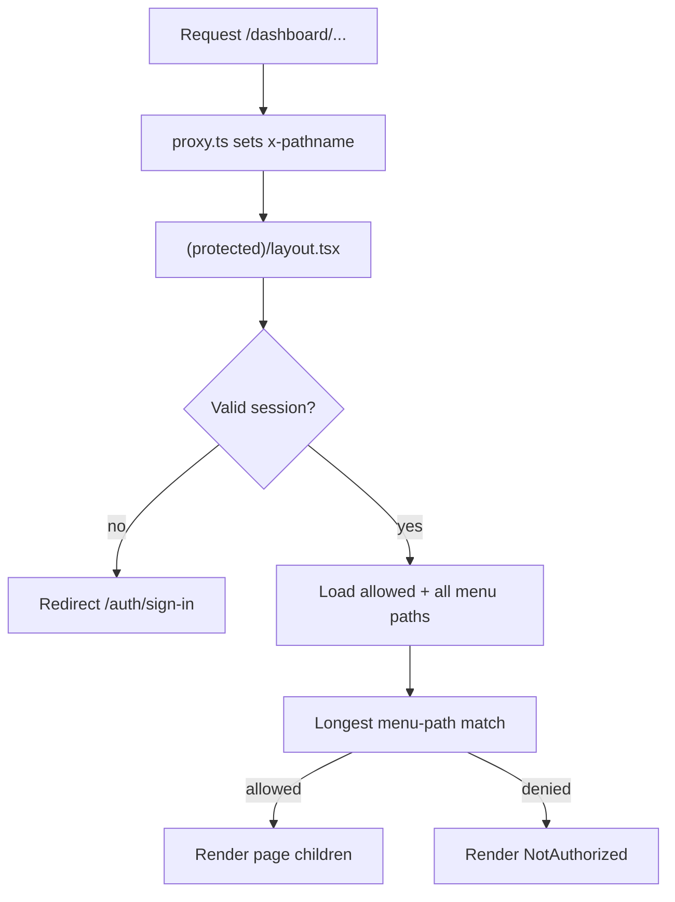

# Route-Level RBAC Authorization

## Current gap

- Sidebar menus are filtered server-side via [`userMenuListRepository`](features/navigation/repositories/user-menu-list.repository.ts) (`RoleMenu.canView`).
- [`app/(protected)/layout.tsx`](<app/(protected)/layout.tsx>) only checks authentication, then renders any `/dashboard/*` page.
- [`proxy.ts`](proxy.ts) only checks session cookie presence — no role/path authorization.
- No 403 / Not Authorized page exists (only [`app/not-found.tsx`](app/not-found.tsx) for 404).

## Approach

Reuse **menu path + `canView`** as the single source of truth so navigation and route access stay aligned. Do **not** introduce a separate static route→permission map or rely on experimental Next.js `forbidden()` / `authInterrupts`.



### Path matching rule (critical)

Because almost every user has `/dashboard`, a naive `pathname.startsWith(allowedPath)` check would authorize **all** dashboard URLs.

Use **longest-prefix match against all active menu paths**:

1. Collect all active menu `path` values (non-null).
2. Collect the current user’s allowed paths (`canView`).
3. Find menu paths where `pathname === path` or `pathname.startsWith(path + "/")`.
4. Pick the **longest** matching path.
5. Allow only if that path is in the user’s allowed set.
6. If no menu path matches → allow (covers thin redirect hubs and future unmapped authenticated pages).

Example: user with only `/dashboard` + `/dashboard/settings` visiting `/dashboard/admin-page/user-management/users` matches the longer `users` menu path → denied.

## Implementation

### 1. Authorization helpers (feature-owned under navigation)

Add under [`features/navigation/`](features/navigation/):

- **Repository** — `menu-active-paths.repository.ts`: return all active non-null menu paths.
- **Lib** — `can-access-menu-path.ts`: pure `canAccessMenuPath(pathname, allowedPaths, allMenuPaths)` + path normalization (strip trailing slash; ignore query via pathname-only input).
- **Service** — `user-can-access-path.service.ts`: load allowed paths (reuse [`userMenuListRepository`](features/navigation/repositories/user-menu-list.repository.ts)) + all paths, run matcher.
- **Helper** — extend or add `collectNavigationPaths(tree)` if useful to derive allowed paths from the already-loaded menu tree in the layout (avoids a duplicate user-menu query).

Preferred layout flow to avoid double-fetching user menus:

```ts
const menuTree = await getUserNavigationMenuTree(session.user.id);
const allowedPaths = collectNavigationPaths(menuTree);
const allMenuPaths = await getActiveMenuPaths();
const canAccess = canAccessMenuPath(pathname, allowedPaths, allMenuPaths);
```

### 2. Pass pathname from proxy

Update [`proxy.ts`](proxy.ts) to forward the request path into headers for the server layout:

```ts
const requestHeaders = new Headers(request.headers);
requestHeaders.set("x-pathname", pathname);
return NextResponse.next({ request: { headers: requestHeaders } });
```

Read it in the protected layout with `headers().get("x-pathname")`.

### 3. Enforce in protected layout (central guard)

Update [`app/(protected)/layout.tsx`](<app/(protected)/layout.tsx>):

- After session + menu tree load, resolve pathname and run `canAccessMenuPath`.
- If denied, still render `DashboardShell` (sidebar stays consistent) but replace `children` with the Not Authorized UI.
- No per-page authorization boilerplate.

### 4. Not Authorized UI

Create a reusable presentational component, e.g. [`components/not-authorized.tsx`](components/not-authorized.tsx) (shared UI, domain-agnostic):

- Shield / lock icon (Lucide)
- **403 – Access Denied**
- Short message: “You are not authorized to access this page.”
- Primary button: link to `/dashboard`
- Visual tone aligned with dashboard (Shadcn `Button`), not the marketing 404 page

Export and use from the protected layout when access is denied.

### 5. Exports

Update [`features/navigation/index.ts`](features/navigation/index.ts) to export the new service/lib helpers used by the layout.

## Out of scope (intentionally)

- Enforcing `RolePermission` codes on server actions (permission tables exist but are unused at runtime today).
- Filtering hardcoded section tabs ([`UserManagementNav`](features/user-management/components/UserManagementNav.tsx), etc.) — unauthorized clicks will already hit the new 403; nav filtering can be a follow-up.
- Experimental Next.js `forbidden()` / `forbidden.tsx` (requires `authInterrupts`, known layout boundary issues).

## Verification

- Sign in as `user` role → `/dashboard` and `/dashboard/settings` work; typing `/dashboard/admin-page/user-management/users` shows 403.
- Sign in as `admin` → admin pages work; `/dashboard/admin-page/user-management/permissions` denied if seed excludes it.
- Sign in as `super_admin` → all menu-backed routes work.
- Unauthenticated `/dashboard/*` still redirects to sign-in via proxy + layout.
