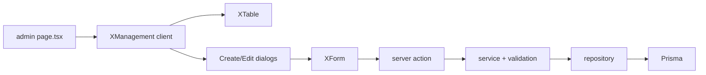

# Organization CRUD Modules

## Scope

Implement two feature modules plus shared organization navigation, wire existing route pages, add seed data, and extend access-management seeds. Prisma models already exist in [`prisma/schema.prisma`](prisma/schema.prisma) (`Company`, `OrganizationalUnit`).

**Reference implementations:**

- Companies → [`features/permission-modules/`](features/permission-modules/) (simple CRUD, no join tables)
- Organizational Units → [`features/menus/`](features/menus/) (parent hierarchy + options loading)
- List page wiring → [`app/(protected)/dashboard/admin-page/user-management/roles/page.tsx`](<app/(protected)/dashboard/admin-page/user-management/roles/page.tsx>)
- Section nav → [`features/email/components/EmailNav.tsx`](features/email/components/EmailNav.tsx)



---

## 1. `features/companies/` (mirror permission-modules)

Create ~27 files following the standard feature layout:

| Layer           | Files                                                                                                             |
| --------------- | ----------------------------------------------------------------------------------------------------------------- |
| `schemas/`      | `company-filter.schema.ts`, `company-create.schema.ts` (create/update/delete/toggle)                              |
| `types/`        | `company.type.ts` — `CompanyTableRow`, `CompanyListResult`, `CompanyDetail`, `CompanyFormValues`, `CompanyOption` |
| `repositories/` | list, create, get-by-id, update, delete, toggle-status                                                            |
| `services/`     | get-list, get-by-id, create, update, delete, toggle-status, **options**                                           |
| `actions/`      | create, update, delete (+ toggle-status, get-by-id) — all use `requireSessionUserId()` + `runAction()`            |
| `lib/`          | `company-filter-url.ts`, `company-form-defaults.ts`, `company-form-mapper.ts`                                     |
| `components/`   | `CompanyManagement`, `CompanyForm`, `CompanyCreateDialog`, `CompanyEditDialog`                                    |
| `table/`        | `CompanyTable`, `columns.tsx`, `CompanyTableToolbar`, `CompanyRowActions`                                         |
| `index.ts`      | public exports                                                                                                    |

**Field/schema conventions** (match [`features/roles/schemas/role-create.schema.ts`](features/roles/schemas/role-create.schema.ts)):

- `code`: lowercase `[a-z0-9_]+`, max 100, globally unique
- `name`: required, max 150
- `description`: optional, max 500
- `isActive`: boolean

**List filters** (`company-filter.schema.ts`):

- `search`, `page`, `pageSize`, `sortBy` (`code` | `name` | `createdAt` | `updatedAt`), `sortOrder`, `isActive`

**Business rules in services:**

- Create/update: reject duplicate `code` (scoped exclude on update)
- Delete: **block** if company has organizational units (`_count.organizationalUnits > 0`) with message like `"Cannot delete company with organizational units"`
- Toggle status: flip `isActive`

**Table columns:** code, name, description (truncated), status badge, unit count, createdAt, row actions (edit / toggle / delete with confirm + `toast.promise`).

---

## 2. `features/organizational-units/` (menus-style hierarchy)

Create ~30 files with the same layered structure, plus company/parent option support.

**Additional form fields:**

- `companyId` (required UUID select)
- `parentId` (nullable UUID select, filtered by selected company)
- `sortOrder` (number, min 0)

**List filters** — extend company pattern with:

- `companyId` (`all` | UUID) for server-side filter
- `sortBy` includes `sortOrder`, `companyId`

**Table columns:** code, name, company name, parent name, sortOrder, status, createdAt, row actions.

### Service-layer parent validation (required)

Add `assertValidParent()` in create/update services (pattern from [`features/menus/services/menu-update.service.ts`](features/menus/services/menu-update.service.ts)):

```typescript
// organizational-unit-create.service.ts / update.service.ts
async function assertValidParent(
  parentId: string | null,
  companyId: string,
  unitId?: string,
) {
  if (!parentId) return;

  if (unitId && parentId === unitId) {
    throw new Error("An organizational unit cannot be its own parent");
  }

  const parent = await organizationalUnitGetByIdRepository(parentId);
  if (!parent) throw new Error("Parent organizational unit not found");
  if (parent.companyId !== companyId) {
    throw new Error("Parent must belong to the same company");
  }

  if (unitId) {
    const descendantIds =
      await organizationalUnitGetDescendantIdsRepository(unitId);
    if (descendantIds.includes(parentId)) {
      throw new Error(
        "An organizational unit cannot be nested under its own descendant",
      );
    }
  }
}
```

Also validate `companyId` exists and is active on create/update.

**Repositories to add:**

- `organizational-unit-parent-options.repository.ts` — `findMany` where `companyId = ?`, select `id/code/name/parentId`, order by `sortOrder`
- `organizational-unit-get-descendant-ids.repository.ts` — recursive/BFS walk like menus

**Options loading:**

- `companyOptionsService` — import from `@/features/companies` (active companies only)
- `organizationalUnitGetParentOptionsAction(companyId, excludeUnitId?)` — loaded when company changes in form (client) and on edit open

**Form UX** (`OrganizationalUnitForm`):

- `SelectField` for company
- `SelectField` for parent (disabled until company selected; options refresh on company change)
- Reset `parentId` to `null` when company changes if parent no longer valid

**Delete rule:** block delete when unit has children (`_count.children > 0`), message `"Cannot delete organizational unit with child units"`.

---

## 3. Shared organization navigation

Add thin nav-only feature (like email):

- [`features/organization/components/OrganizationNav.tsx`](features/organization/components/OrganizationNav.tsx)
- [`features/organization/index.ts`](features/organization/index.ts)

Nav items:

- `/dashboard/admin-page/organization/companies` → "Companies"
- `/dashboard/admin-page/organization/organizational_units` → "Organizational Units"

Render `OrganizationNav` at top of both `CompanyManagement` and `OrganizationalUnitManagement`.

Add redirect page:

- [`app/(protected)/dashboard/admin-page/organization/page.tsx`](<app/(protected)/dashboard/admin-page/organization/page.tsx>) → redirect to `companies`

---

## 4. Wire route pages

Replace stubs in:

- [`app/(protected)/dashboard/admin-page/organization/companies/page.tsx`](<app/(protected)/dashboard/admin-page/organization/companies/page.tsx>)
- [`app/(protected)/dashboard/admin-page/organization/organizational_units/page.tsx`](<app/(protected)/dashboard/admin-page/organization/organizational_units/page.tsx>)

Pattern (same as roles page):

```tsx
export default async function CompaniesPage({ searchParams }) {
  const filters = parseCompanyFilter(await searchParams);
  const initialData = await companyGetListService(filters);
  return (
    <CompanyManagement initialData={initialData} initialFilters={filters} />
  );
}
```

Organizational units page additionally fetches `companyOptionsService()` for toolbar company filter + form defaults.

---

## 5. Seed data

### New files

- [`prisma/seeders/data/organization.ts`](prisma/seeders/data/organization.ts)

```typescript
export type CompanySeed = { code: string; name: string; description?: string };
export type OrganizationalUnitSeed = {
  companyCode: string;
  code: string;
  name: string;
  description?: string;
  parentCode: string | null;
  sortOrder: number;
};
```

**Initial data (example):**

| Entity  | Code          | Details                       |
| ------- | ------------- | ----------------------------- |
| Company | `albayyinah`  | "Albayyinah"                  |
| Unit    | `head_office` | parent: null, sort 1          |
| Unit    | `hr`          | parent: `head_office`, sort 1 |
| Unit    | `finance`     | parent: `head_office`, sort 2 |
| Unit    | `operations`  | parent: `head_office`, sort 3 |

- [`prisma/seeders/seeds/organization.seed.ts`](prisma/seeders/seeds/organization.seed.ts)
  - Upsert company by `code`
  - Upsert units by `companyId + code`, resolve `parentCode` → `parentId` in two passes (parents first, then children) or ordered array

### Register seeder

Update [`prisma/seeders/index.ts`](prisma/seeders/index.ts):

```typescript
await seedAccessManagement();
await seedOrganization(); // after access management, before or after email
await seedEmail();
```

---

## 6. Menu and permission entries

Extend [`prisma/seeders/data/access-management.ts`](prisma/seeders/data/access-management.ts):

### Permission module

```typescript
{
  code: "organization_management",
  name: "Organization Management",
  description: "Manage companies and organizational units",
  sortOrder: 9,
}
```

### Permissions

| Code                         | Name                       |
| ---------------------------- | -------------------------- |
| `manage_company`             | Manage Company             |
| `manage_organizational_unit` | Manage Organizational Unit |

Both under `organization_management`. `rolePermissions` auto-includes via `allPermissionCodes`.

### Menus (under `admin`)

| Code                   | Label                | Path                                                      | Parent         | Sort |
| ---------------------- | -------------------- | --------------------------------------------------------- | -------------- | ---- |
| `organization`         | Organization         | `null`                                                    | `admin`        | 6    |
| `companies`            | Companies            | `/dashboard/admin-page/organization/companies`            | `organization` | 1    |
| `organizational_units` | Organizational Units | `/dashboard/admin-page/organization/organizational_units` | `organization` | 2    |

Icons: `Building2` (group), `Building` (companies), `Network` (units) — Lucide names matching existing seed style.

### Role-menu wiring

Add `"organization"` to `menuGroupCodes` set (line ~398) so group nodes don't get CRUD flags. Leaf menus (`companies`, `organizational_units`) automatically receive full CRUD via existing `adminFullCrudMenuCodes` logic.

Re-run `pnpm db:seed` after implementation to apply menu/permission/org data.

---

## 7. Implementation order

1. **Companies feature** end-to-end (can be tested independently)
2. **Organizational units feature** (depends on company options + parent validation)
3. **OrganizationNav** + page wiring + organization redirect
4. **Seeders** (organization data + access-management menu/permission updates)
5. **Smoke test**: run seed, verify sidebar entries, CRUD flows, parent-company validation errors

---

## 8. Validation scenarios to verify

| Action                                         | Expected service error                               |
| ---------------------------------------------- | ---------------------------------------------------- |
| Create unit with parent from different company | "Parent must belong to the same company"             |
| Set parent to self                             | "cannot be its own parent"                           |
| Nest parent under descendant                   | "cannot be nested under its own descendant"          |
| Delete company with units                      | "Cannot delete company with organizational units"    |
| Delete unit with children                      | "Cannot delete organizational unit with child units" |
| Duplicate code within company                  | Prisma/service duplicate error                       |

---

## Files changed summary

| Area     | New/updated                                                                                                               |
| -------- | ------------------------------------------------------------------------------------------------------------------------- |
| Features | `features/companies/**` (~27 files), `features/organizational-units/**` (~30 files), `features/organization/**` (2 files) |
| Routes   | 3 pages under `app/(protected)/dashboard/admin-page/organization/`                                                        |
| Seeders  | `data/organization.ts`, `seeds/organization.seed.ts`, update `data/access-management.ts`, `index.ts`                      |

No Prisma schema changes required.
