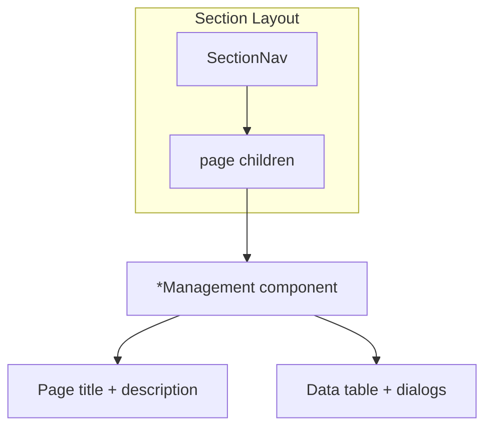

# Admin Section Header Nav via Layouts

## Current State

- **Organization** is the only section with working header nav: [`OrganizationNav`](features/organization/components/OrganizationNav.tsx) is rendered inside [`CompanyManagement`](features/companies/components/CompanyManagement.tsx) and [`OrganizationalUnitManagement`](features/organizational-units/components/OrganizationalUnitManagement.tsx).
- **The other four sections already have identical nav components** — they just are not rendered anywhere:
  - [`UserManagementNav`](features/user-management/components/UserManagementNav.tsx) — 5 tabs
  - [`EmailNav`](features/email/components/EmailNav.tsx) — 3 tabs (short labels: Settings, Templates, Logs)
  - [`SecurityNav`](features/security/components/SecurityNav.tsx) — 4 tabs
  - [`IntegrationNav`](features/integration/components/IntegrationNav.tsx) — 4 tabs
- No section-level `layout.tsx` files exist under `app/(protected)/dashboard/admin-page/`.

## Recommended Approach: Section Layouts

Use a **Next.js layout per admin group** rather than importing nav into each `*Management` component.

**Why layouts are better here:**

- Single place to render nav for all sub-pages in a section (16 management components across 4 sections)
- Nav persists consistently without repeating imports
- Matches Next.js App Router conventions
- Allows refactoring Organization to the same pattern for consistency



## Implementation

### 1. Create 5 section layouts

Add thin server layouts that wrap children with nav + spacing:

| Layout file                                                                                                                            | Nav component       |
| -------------------------------------------------------------------------------------------------------------------------------------- | ------------------- |
| [`app/(protected)/dashboard/admin-page/organization/layout.tsx`](<app/(protected)/dashboard/admin-page/organization/layout.tsx>)       | `OrganizationNav`   |
| [`app/(protected)/dashboard/admin-page/user-management/layout.tsx`](<app/(protected)/dashboard/admin-page/user-management/layout.tsx>) | `UserManagementNav` |
| [`app/(protected)/dashboard/admin-page/email/layout.tsx`](<app/(protected)/dashboard/admin-page/email/layout.tsx>)                     | `EmailNav`          |
| [`app/(protected)/dashboard/admin-page/security/layout.tsx`](<app/(protected)/dashboard/admin-page/security/layout.tsx>)               | `SecurityNav`       |
| [`app/(protected)/dashboard/admin-page/integration/layout.tsx`](<app/(protected)/dashboard/admin-page/integration/layout.tsx>)         | `IntegrationNav`    |

Shared layout shape (same for all 5):

```tsx
import { OrganizationNav } from "@/features/organization";

export default function OrganizationLayout({
  children,
}: {
  children: React.ReactNode;
}) {
  return (
    <div className="flex flex-col gap-6">
      <OrganizationNav />
      {children}
    </div>
  );
}
```

Nav components are client components (`"use client"` + `usePathname`); importing them from a server layout is valid in Next.js.

### 2. Refactor Organization management components

Remove duplicated nav from the two components that currently embed it:

- [`features/companies/components/CompanyManagement.tsx`](features/companies/components/CompanyManagement.tsx) — remove `OrganizationNav` import and JSX
- [`features/organizational-units/components/OrganizationalUnitManagement.tsx`](features/organizational-units/components/OrganizationalUnitManagement.tsx) — same

No changes needed to the other 16 `*Management` components — they already render only page title + table.

### 3. No nav component changes required

Existing nav items already match sidebar routes and labels (email keeps short labels per your preference):

| Section         | Nav tabs                                                     |
| --------------- | ------------------------------------------------------------ |
| User Management | Users, Roles, Permissions, Permission Modules, Login History |
| Email           | Settings, Templates, Logs                                    |
| Security        | Sessions, Two Factor, API Keys, Audit Logs                   |
| Integration     | Webhooks, Webhook Logs, SSO Providers, SSO Users             |

Section index redirects (`page.tsx` → default sub-route) remain unchanged.

## Files Touched

**Create (5):**

- `app/(protected)/dashboard/admin-page/organization/layout.tsx`
- `app/(protected)/dashboard/admin-page/user-management/layout.tsx`
- `app/(protected)/dashboard/admin-page/email/layout.tsx`
- `app/(protected)/dashboard/admin-page/security/layout.tsx`
- `app/(protected)/dashboard/admin-page/integration/layout.tsx`

**Modify (2):**

- `features/companies/components/CompanyManagement.tsx`
- `features/organizational-units/components/OrganizationalUnitManagement.tsx`

## Out of Scope (optional follow-up)

- Extracting a shared `AdminSectionNav` primitive to deduplicate the 5 nearly identical nav files — not needed for this task since components already exist
- Changing email nav labels — keeping short labels as requested

## Verification

Manually check each section in the browser:

1. Nav tabs appear below breadcrumbs on every sub-page
2. Active tab highlights correctly per route
3. Tab links navigate between sub-pages
4. Organization pages still look identical after layout refactor
