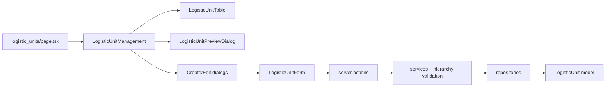

# Logistic Unit Under Organization

## Architecture

Mirror [`features/organizational-units/`](features/organizational-units/) as an independent, company-scoped hierarchy. No link to organizational units.



**Reference implementation:** copy/adapt all 34 files from [`features/organizational-units/`](features/organizational-units/) with consistent renaming (`OrganizationalUnit` → `LogisticUnit`, `organizational-unit` → `logistic-unit`, route `logistic_units`).

---

## 1. Prisma schema

Update [`prisma/schema.prisma`](prisma/schema.prisma):

**Add relation on `Company`:**

```prisma
logisticUnits LogisticUnit[]
```

**Add model (parallel to `OrganizationalUnit`):**

```prisma
model LogisticUnit {
  id          String   @id @default(dbgenerated("gen_random_uuid()")) @db.Uuid
  companyId   String   @db.Uuid
  code        String
  name        String
  description String?
  parentId    String?  @db.Uuid
  sortOrder   Int      @default(0)
  isActive    Boolean  @default(true)
  createdAt   DateTime @default(now())
  updatedAt   DateTime @updatedAt

  company  Company        @relation(fields: [companyId], references: [id], onDelete: Cascade)
  parent   LogisticUnit?    @relation("LogisticUnitToLogisticUnit", fields: [parentId], references: [id], onDelete: SetNull)
  children LogisticUnit[]   @relation("LogisticUnitToLogisticUnit")

  @@unique([companyId, code])
  @@index([companyId])
  @@index([parentId])
  @@index([isActive])
  @@map("os_logistic_units")
}
```

Run migration: `prisma migrate dev --name add_logistic_units`.

---

## 2. Feature module `features/logistic-units/`

Scaffold the same layered structure as organizational units (~34 files):

| Layer           | Key files                                                                                        |
| --------------- | ------------------------------------------------------------------------------------------------ |
| `schemas/`      | `logistic-unit-create.schema.ts`, `logistic-unit-filter.schema.ts`                               |
| `types/`        | `logistic-unit.type.ts` — table row, detail, form values, parent option, preview/tree types      |
| `repositories/` | create, list, update, delete, toggle-status, get-descendant-ids, parent-options, preview-list    |
| `services/`     | get-list, get-by-id, get-preview-list, create, update, delete, toggle-status, get-parent-options |
| `actions/`      | create, update, delete (+ toggle-status, get-by-id, get-parent-options)                          |
| `lib/`          | form-defaults, form-mapper, filter-url, tree builder                                             |
| `components/`   | Management, Form, CreateDialog, EditDialog, PreviewDialog, PreviewTree                           |
| `table/`        | Table, Toolbar, columns, RowActions                                                              |
| `index.ts`      | public exports                                                                                   |

### Business rules (same as org units)

- **Create/update:** active company exists; unique `code` per company; parent belongs to same company; no self-parent; no descendant cycle on update
- **Delete:** blocked when `childCount > 0`
- **List:** server-side pagination/filter/sort with `companyId` filter
- **Preview:** flat fetch → client tree grouped by company
- **Form UX:** company select drives parent options; reset invalid parent on company change
- **Toasts:** all mutations via `toast.promise` per project rules

### Cross-feature updates in companies

Update [`features/companies/services/company-delete.service.ts`](features/companies/services/company-delete.service.ts) and [`features/companies/repositories/company-create.repository.ts`](features/companies/repositories/company-create.repository.ts):

- Add `companyCountLogisticUnitsRepository`
- Block company delete when logistic units exist (message: `"Cannot delete company with logistic units"`)

---

## 3. Route page

Add thin server page at [`app/(protected)/dashboard/admin-page/organization/logistic_units/page.tsx`](<app/(protected)/dashboard/admin-page/organization/logistic_units/page.tsx>) — same pattern as [`organizational_units/page.tsx`](<app/(protected)/dashboard/admin-page/organization/organizational_units/page.tsx>):

```tsx
const [initialData, companyOptions, previewItems] = await Promise.all([
  logisticUnitGetListService(filters),
  companyOptionsService(),
  logisticUnitGetPreviewListService(),
]);
return (
  <LogisticUnitManagement
    initialData={initialData}
    initialFilters={filters}
    companyOptions={companyOptions}
    previewItems={previewItems}
  />
);
```

Metadata title: `Logistic Units | ${appConfig.appName}`.

Existing [`organization/layout.tsx`](<app/(protected)/dashboard/admin-page/organization/layout.tsx>) already renders `OrganizationNav` — no layout change needed.

---

## 4. Organization nav (menu)

Update [`features/organization/components/OrganizationNav.tsx`](features/organization/components/OrganizationNav.tsx):

```ts
{
  href: "/dashboard/admin-page/organization/logistic_units",
  label: "Logistic Units",
}
```

Sort after Organizational Units.

---

## 5. Seed data

### [`prisma/seeders/data/organization.ts`](prisma/seeders/data/organization.ts)

Add type + sample hierarchy for `albayyinah`:

| Code           | Name         | Parent      | Sort |
| -------------- | ------------ | ----------- | ---- |
| `logistics`    | Logistics    | null        | 1    |
| `warehouse`    | Warehouse    | `logistics` | 1    |
| `fleet`        | Fleet        | `logistics` | 2    |
| `distribution` | Distribution | `logistics` | 3    |

### [`prisma/seeders/seeds/organization.seed.ts`](prisma/seeders/seeds/organization.seed.ts)

- Reuse existing company upsert pass
- Add second upsert loop for logistic units (same `companyCode:code` key map pattern as org units)
- Log count in seed summary

### [`prisma/seeders/data/access-management.ts`](prisma/seeders/data/access-management.ts)

| Item               | Value                                                                                                                         |
| ------------------ | ----------------------------------------------------------------------------------------------------------------------------- |
| Module description | Update `organization_management` to mention logistic units                                                                    |
| Permission         | `manage_logistic_unit` — "Manage Logistic Unit" under `organization_management`                                               |
| Menu               | `logistic_units` — path `/dashboard/admin-page/organization/logistic_units`, icon `Truck`, parent `organization`, sortOrder 3 |

`super_admin` / `admin` role permissions auto-include via `allPermissionCodes`. Menu auto-included via `adminFullCrudMenuCodes` filter (same as org units).

---

## 6. Implementation order

1. Prisma model + migration
2. Seed data types and access-management entries
3. Feature scaffold (schemas → repos → services → actions → lib → table → components)
4. Route page + OrganizationNav
5. Company delete guard
6. Run `prisma db seed` and verify CRUD in dev

---

## Files touched (summary)

| Area             | Files                                                                                 |
| ---------------- | ------------------------------------------------------------------------------------- |
| Schema/migration | `prisma/schema.prisma`, new migration SQL                                             |
| New feature      | ~34 files under `features/logistic-units/`                                            |
| Route            | `app/.../organization/logistic_units/page.tsx`                                        |
| Nav              | `features/organization/components/OrganizationNav.tsx`                                |
| Seed             | `prisma/seeders/data/organization.ts`, `organization.seed.ts`, `access-management.ts` |
| Companies guard  | `company-delete.service.ts`, `company-create.repository.ts`                           |
