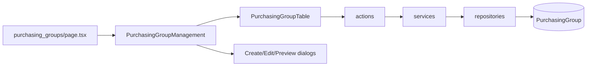

# Purchasing Group Feature Plan

Mirror the proven **Organizational Unit** / **Logistic Unit** architecture. The fastest, lowest-risk path is to clone [`features/logistic-units/`](features/logistic-units/) (34 files, already aligned with current conventions) and adapt naming, routes, and seeds.



---

## 1. Prisma schema and migration

Add `PurchasingGroup` to [`prisma/schema.prisma`](prisma/schema.prisma) after `LogisticUnit`, identical shape:

| Field                    | Notes                               |
| ------------------------ | ----------------------------------- |
| `id`                     | UUID, `gen_random_uuid()`           |
| `companyId`              | FK → `Company`, `onDelete: Cascade` |
| `code`, `name`           | Required                            |
| `description`            | Optional                            |
| `parentId`               | Self-relation, `onDelete: SetNull`  |
| `sortOrder`              | Default `0`                         |
| `isActive`               | Default `true`                      |
| `createdAt`, `updatedAt` | Standard timestamps                 |

Constraints/indexes (same as org/logistic units):

- `@@unique([companyId, code])`
- `@@index([companyId, parentId, isActive])`
- `@@map("os_purchasing_groups")`

Update `Company` model to add:

```prisma
purchasingGroups PurchasingGroup[]
```

Run `prisma migrate dev` to create migration `add_purchasing_groups`, then `prisma generate`.

---

## 2. Feature module: `features/purchasing-groups/`

Create ~34 files by adapting [`features/logistic-units/`](features/logistic-units/) with consistent renames:

| Layer            | Files (pattern)                                                                  |
| ---------------- | -------------------------------------------------------------------------------- |
| **actions**      | `purchasing-group-create/update/delete.action.ts`                                |
| **services**     | create, update, delete, get-list, get-by-id, get-preview-list                    |
| **repositories** | create, update, delete, list, preview-list, parent-options, get-descendant-ids   |
| **schemas**      | `purchasing-group-create.schema.ts`, `purchasing-group-filter.schema.ts`         |
| **types**        | `purchasing-group.type.ts` (TableRow, Detail, FormValues, PreviewItem, TreeNode) |
| **lib**          | filter-url, form-defaults, form-mapper, tree builder                             |
| **components**   | Management, Form, CreateDialog, EditDialog, PreviewDialog, PreviewTree           |
| **table**        | Table, Toolbar, columns, RowActions                                              |
| **index.ts**     | Public exports (same surface as logistic-units)                                  |

### Business rules (inherited from org/logistic units)

- Code unique per company
- Parent must belong to same company
- Update: cannot set self or descendant as parent (BFS in `get-descendant-ids` repo)
- Delete: blocked when `childCount > 0`
- Toggle status via row action + `toast.promise`

### UI behavior

- **Table**: flat paginated list with search, company filter, status filter, sort, URL sync
- **Form**: TanStack Form — company, code, name, description, parent (async options), sortOrder, isActive
- **Preview**: dialog with collapsible tree grouped by company (`buildPurchasingGroupTree`)
- **Toasts**: all mutations use `toast.promise` per project rules

---

## 3. Route (thin server page)

Create [`app/(protected)/dashboard/admin-page/organization/purchasing_groups/page.tsx`](<app/(protected)/dashboard/admin-page/organization/purchasing_groups/page.tsx>) — copy [`logistic_units/page.tsx`](<app/(protected)/dashboard/admin-page/organization/logistic_units/page.tsx>):

- `parsePurchasingGroupFilter(searchParams)`
- Parallel fetch: list, `companyOptionsService()`, preview list
- Render `<PurchasingGroupManagement />`
- Metadata: `Purchasing Groups | ${appConfig.appName}`

URL: `/dashboard/admin-page/organization/purchasing_groups`

---

## 4. Navigation registration (two layers)

### Section tabs — [`features/organization/components/OrganizationNav.tsx`](features/organization/components/OrganizationNav.tsx)

Add after Logistic Units:

```ts
{
  href: "/dashboard/admin-page/organization/purchasing_groups",
  label: "Purchasing Groups",
}
```

### Sidebar menu + permission — [`prisma/seeders/data/access-management.ts`](prisma/seeders/data/access-management.ts)

**Permission** (under `organization_management`):

```ts
{
  code: "manage_purchasing_group",
  name: "Manage Purchasing Group",
  description: "Create, update, and remove purchasing groups",
  moduleCode: "organization_management",
}
```

**Menu** (under `organization`, `sortOrder: 4`):

```ts
{
  code: "purchasing_groups",
  label: "Purchasing Groups",
  path: "/dashboard/admin-page/organization/purchasing_groups",
  icon: "ShoppingCart",
  parentCode: "organization",
  sortOrder: 4,
}
```

Update `organization_management` module description to mention purchasing groups.

Re-run access-management seed (or upsert via Menus admin UI) so `RoleMenu` grants `admin`/`super_admin` access.

---

## 5. Domain seed data

### [`prisma/seeders/data/organization.ts`](prisma/seeders/data/organization.ts)

Add `PurchasingGroupSeed` type and sample hierarchy for `albayyinah`:

```
procurement (root)
├── direct_materials
├── indirect_materials
└── services
```

### [`prisma/seeders/seeds/organization.seed.ts`](prisma/seeders/seeds/organization.seed.ts)

Add third upsert loop (same pattern as logistic units):

- `purchasingGroupIdByKey` map keyed by `"companyCode:code"`
- Resolve `parentCode` → `parentId`
- Log count in summary

---

## 6. Implementation order

1. Prisma model + migration + generate
2. Feature module (repositories → services → actions → lib → schemas → types → components → table → index)
3. Route page
4. OrganizationNav tab
5. Seed data + access-management entries
6. Run seeds and verify in browser

---

## 7. Verification checklist

- Sidebar shows **Purchasing Groups** under Administration → Organization
- Section tab navigates correctly; URL filters persist (`?search=`, `?companyId=`, `?page=`)
- Create / edit / toggle status / delete (with child guard) work with toasts
- Preview dialog shows correct company-grouped tree
- Seed creates 4 sample groups with hierarchy
- `pnpm` / build passes with no type errors

---

## Files touched (summary)

| Area    | Key paths                                                                                                                                                              |
| ------- | ---------------------------------------------------------------------------------------------------------------------------------------------------------------------- |
| Schema  | [`prisma/schema.prisma`](prisma/schema.prisma) + new migration                                                                                                         |
| Feature | `features/purchasing-groups/**` (~34 new files)                                                                                                                        |
| Route   | `app/(protected)/dashboard/admin-page/organization/purchasing_groups/page.tsx`                                                                                         |
| Nav     | [`features/organization/components/OrganizationNav.tsx`](features/organization/components/OrganizationNav.tsx)                                                         |
| Seeds   | [`prisma/seeders/data/organization.ts`](prisma/seeders/data/organization.ts), [`prisma/seeders/seeds/organization.seed.ts`](prisma/seeders/seeds/organization.seed.ts) |
| Access  | [`prisma/seeders/data/access-management.ts`](prisma/seeders/data/access-management.ts)                                                                                 |

No changes to shared `components/data-table/` or `components/form/` — feature reuses existing primitives.
