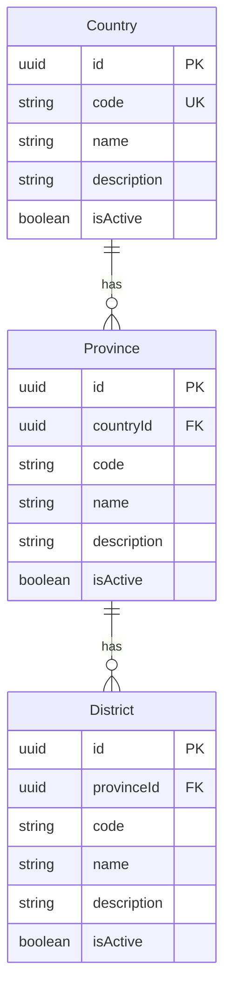
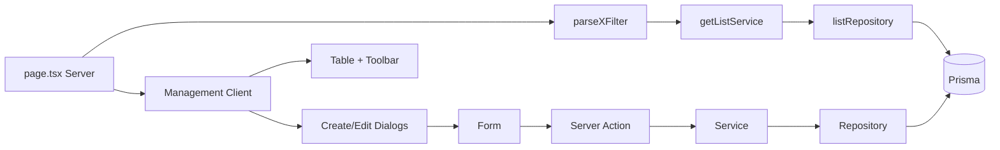

# Address Management: Countries, Provinces, Districts

## Current state

- Stub pages only at [`app/(protected)/dashboard/admin-page/address/*/page.tsx`](<app/(protected)/dashboard/admin-page/address/countries/page.tsx>) (placeholder `<h1>`)
- No Prisma models, features, layout, menu seeds, or seed data for address
- Best templates:
  - **Countries** → [`features/companies/`](features/companies/) (flat CRUD)
  - **Provinces / Districts** → [`features/companies/`](features/companies/) + parent FK/filter from [`features/purchasing-groups/`](features/purchasing-groups/)

## Architecture





## 1. Prisma schema

Add a new `ADDRESS` section to [`prisma/schema.prisma`](prisma/schema.prisma) after Organization (table prefix `addr_`, matching `os_` convention):

**Country** (`addr_countries`)

- `id`, `code` (unique globally), `name`, `description?`, `isActive`, `createdAt`, `updatedAt`
- Relation: `provinces Province[]`
- Index: `isActive`

**Province** (`addr_provinces`)

- `id`, `countryId`, `code`, `name`, `description?`, `isActive`, timestamps
- `@@unique([countryId, code])`, indexes on `countryId`, `isActive`
- Relations: `country Country`, `districts District[]`

**District** (`addr_districts`)

- `id`, `provinceId`, `code`, `name`, `description?`, `isActive`, timestamps
- `@@unique([provinceId, code])`, indexes on `provinceId`, `isActive`
- Relation: `province Province`

**Delete guards** (in services):

- Country → blocked if `provinces` count > 0
- Province → blocked if `districts` count > 0

Run `prisma migrate dev` to create migration.

## 2. Feature modules (3 entities + shared nav)

Mirror organization structure: one nav feature + one CRUD feature per entity.

### `features/address/` (nav only, like [`features/organization/`](features/organization/))

- [`features/address/components/AddressNav.tsx`](features/address/components/AddressNav.tsx) — tabs: Countries, Provinces, Districts
- [`features/address/index.ts`](features/address/index.ts)

### `features/countries/` (~28 files, clone companies)

| Layer        | Files                                                                          |
| ------------ | ------------------------------------------------------------------------------ |
| actions      | `country-create`, `country-update`, `country-delete` (+ toggle status)         |
| services     | create, update, delete, get-by-id, get-list, options                           |
| repositories | create, update, delete, list                                                   |
| schemas      | `country-create.schema`, `country-filter.schema`                               |
| lib          | `country-filter-url`, `country-form-defaults`, `country-form-mapper`           |
| components   | `CountryManagement`, `CountryForm`, `CountryCreateDialog`, `CountryEditDialog` |
| table        | `CountryTable`, `CountryTableToolbar`, `columns`, `CountryRowActions`          |
| types        | `country.type.ts`                                                              |

**Table columns:** Code, Name, Description, Status, Provinces (count), Created, Actions

**Form fields:** `code`, `name`, `description`, `isActive`

### `features/provinces/` (~30 files, companies + country FK)

Same stack as countries, plus:

- Filter schema: `countryId: "all" | uuid` (from [`purchasing-group-filter.schema.ts`](features/purchasing-groups/schemas/purchasing-group-filter.schema.ts))
- Form: `countryId` SelectField using `countryOptionsService()`
- List repo: join `country.name`, filter by `countryId`, `_count.districts`
- Delete guard: child district count

**Table columns:** Code, Name, Country, Description, Status, Districts (count), Created, Actions

### `features/districts/` (~32 files, provinces pattern + cascade UX)

Same stack, plus:

- Filter schema: `countryId` + `provinceId` (both `"all" | uuid`)
- Toolbar: country select resets `provinceId` to `"all"`; province options filtered by selected country
- Form: client-side country selector to filter province dropdown; persisted field is `provinceId` only
- List repo: join `province.name` and `province.country.name`
- `provinceOptionsService(countryId?)` for filtered selects

**Table columns:** Code, Name, Province, Country, Description, Status, Created, Actions

### Shared conventions (all three)

- TanStack Form + shared field primitives (`TextField`, `TextareaField`, `SwitchField`, `SelectField`)
- `toast.promise` on all mutations
- URL-synced filters via `buildXListUrl` + `router.push`
- Server pages: parse `searchParams` → fetch list (+ parent options) → render `*Management`
- Actions: `"use server"` → Zod parse → service → throw on failure

## 3. Routes

| File                                                                                                                   | Change                                                                     |
| ---------------------------------------------------------------------------------------------------------------------- | -------------------------------------------------------------------------- |
| [`app/(protected)/dashboard/admin-page/address/layout.tsx`](<app/(protected)/dashboard/admin-page/address/layout.tsx>) | **Create** — render `<AddressNav />` + children (copy organization layout) |
| [`countries/page.tsx`](<app/(protected)/dashboard/admin-page/address/countries/page.tsx>)                              | Wire `CountryManagement` + `countryGetListService` + `parseCountryFilter`  |
| [`provinces/page.tsx`](<app/(protected)/dashboard/admin-page/address/provinces/page.tsx>)                              | Wire `ProvinceManagement` + fetch `countryOptions`                         |
| [`districts/page.tsx`](<app/(protected)/dashboard/admin-page/address/districts/page.tsx>)                              | Wire `DistrictManagement` + fetch `countryOptions` + `provinceOptions`     |

Example page pattern (countries):

```tsx
const filters = parseCountryFilter(await searchParams);
const initialData = await countryGetListService(filters);
return <CountryManagement initialData={initialData} initialFilters={filters} />;
```

## 4. Seed data (Indonesia)

### New files

- [`prisma/seeders/data/address.ts`](prisma/seeders/data/address.ts) — typed seed arrays
- [`prisma/seeders/seeds/address.seed.ts`](prisma/seeders/seeds/address.seed.ts) — upsert logic (same pattern as [`organization.seed.ts`](prisma/seeders/seeds/organization.seed.ts))

### Sample hierarchy

- **Country:** `id` → Indonesia
- **Provinces:** DKI Jakarta, Jawa Barat, Jawa Tengah, Jawa Timur, Banten (5)
- **Districts:** 2–3 per province (e.g. Jakarta Pusat, Jakarta Selatan; Bandung, Bogor; etc.)

Upsert keys:

- Country: `code`
- Province: `countryId + code`
- District: `provinceId + code`

Register in [`prisma/seeders/index.ts`](prisma/seeders/index.ts): `await seedAddress()` after organization seed.

## 5. Menu, permissions, and navigation

Update [`prisma/seeders/data/access-management.ts`](prisma/seeders/data/access-management.ts):

**Module** (sortOrder 10):

```ts
{ code: "address_management", name: "Address Management", ... }
```

**Permissions:**

- `manage_country`
- `manage_province`
- `manage_district`

**Menus** (under `admin`, sortOrder 7):

```ts
{ code: "address", label: "Address", icon: "MapPin", parentCode: "admin" }
{ code: "countries", path: "/dashboard/admin-page/address/countries", parentCode: "address" }
{ code: "provinces", path: "/dashboard/admin-page/address/provinces", parentCode: "address" }
{ code: "districts", path: "/dashboard/admin-page/address/districts", parentCode: "address" }
```

Add `"address"` to `menuGroupCodes` so leaf menus get full CRUD role assignments automatically.

Re-run seed (`npx prisma db seed`) to apply menus/permissions.

## 6. Implementation order

Work in dependency order to keep each step testable:

1. Prisma models + migration + `prisma generate`
2. `features/countries/` full CRUD + countries page
3. `features/address/` nav + address layout
4. Access management seeds (menus/permissions)
5. `features/provinces/` + page (depends on countries options)
6. `features/districts/` + page (depends on province/country options)
7. Address seed data + register in seeder index
8. Build verification (`npm run build`) and manual smoke test of all three CRUD flows

## 7. Verification checklist

- Create / edit / toggle status / delete on each entity
- Search, status filter, pagination, sorting via URL params
- Province list filters by country; district list filters by country + province
- Delete blocked when children exist (country→provinces, province→districts)
- Sidebar shows Address group with 3 sub-items after re-seed
- Indonesia seed data visible on first load

## Scope note

This is ~90 files of mostly mechanical cloning from existing features. No CSV import/export unless you want that added later.
