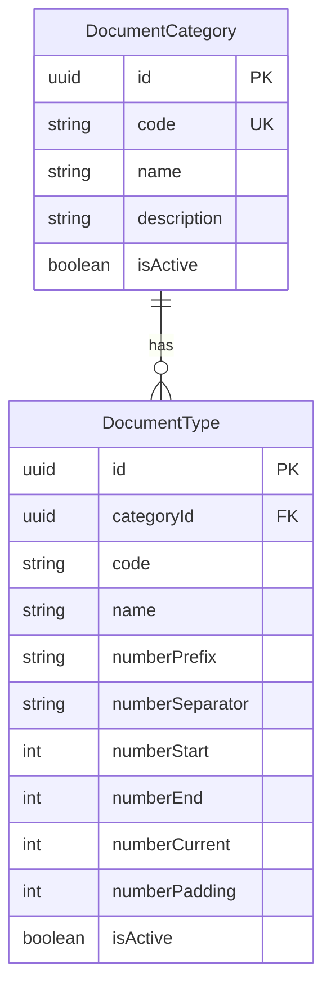

# Document Configuration: Categories and Types

## Number range format

You chose **prefix + year (automatic) + number**.

Generated document numbers will follow:

```
{numberPrefix}{numberSeparator}{year}{numberSeparator}{paddedNumber}
```

Example: prefix `INV`, separator `/`, year `2026` (auto), padding `5`, current `1` → **`INV/2026/00001`**

| Field             | Stored in DB? | Purpose                                  | Example                                   |
| ----------------- | ------------- | ---------------------------------------- | ----------------------------------------- |
| `numberPrefix`    | Yes           | Static code before year                  | `INV`, `PO`, `GR`                         |
| `numberSeparator` | Yes           | Separator between segments (default `/`) | `/` or `-`                                |
| `year`            | **No**        | Resolved at runtime from current date    | `2026`                                    |
| `numberStart`     | Yes           | First allowed number in range            | `1`                                       |
| `numberEnd`       | Yes           | Last allowed number in range             | `99999`                                   |
| `numberCurrent`   | Yes           | Next number to issue                     | `1` (defaults to `numberStart` on create) |
| `numberPadding`   | Yes           | Zero-pad width for numeric part          | `5` → `00001`                             |

**Formatter** (`features/document-types/lib/document-number-formatter.ts`):

```ts
formatDocumentNumber({
  prefix: "INV",
  separator: "/",
  number: 1,
  padding: 5,
  year: new Date().getFullYear(), // automatic; overridable in tests
});
// → "INV/2026/00001"
```

**Year behavior (configuration CRUD scope):**

- Form preview and table preview use the **current calendar year** dynamically
- Year is **not** a user-editable field
- Year rollover / per-year sequence reset when issuing real documents is **out of scope** for this CRUD task (noted for future document issuance feature)

---

## Architecture




**Primary templates to clone:**

- [`features/countries/`](features/countries/) → `features/document-categories/`
- [`features/provinces/`](features/provinces/) → `features/document-types/`
- [`features/address/components/AddressNav.tsx`](features/address/components/AddressNav.tsx) → section nav
- [`prisma/seeders/data/address.ts`](prisma/seeders/data/address.ts) + [`address.seed.ts`](prisma/seeders/seeds/address.seed.ts) → document seeds

---

## 1. Prisma schema

Add to [`prisma/schema.prisma`](prisma/schema.prisma) under a new `DOCUMENT CONFIGURATION` section:

```prisma
model DocumentCategory {
  id          String   @id @default(dbgenerated("gen_random_uuid()")) @db.Uuid
  code        String   @unique
  name        String
  description String?
  isActive    Boolean  @default(true) @map("is_active")
  createdAt   DateTime @default(now()) @map("created_at")
  updatedAt   DateTime @updatedAt @map("updated_at")

  documentTypes DocumentType[]

  @@index([isActive])
  @@map("doc_categories")
}

model DocumentType {
  id            String   @id @default(dbgenerated("gen_random_uuid()")) @db.Uuid
  categoryId    String   @db.Uuid @map("category_id")
  code          String
  name          String
  description   String?
  numberPrefix     String  @map("number_prefix")
  numberSeparator  String  @default("/") @map("number_separator")
  numberStart      Int     @map("number_start")
  numberEnd     Int      @map("number_end")
  numberCurrent Int      @map("number_current")
  numberPadding Int      @default(5) @map("number_padding")
  isActive      Boolean  @default(true) @map("is_active")
  createdAt     DateTime @default(now()) @map("created_at")
  updatedAt     DateTime @updatedAt @map("updated_at")

  category DocumentCategory @relation(fields: [categoryId], references: [id], onDelete: Cascade)

  @@unique([categoryId, code])
  @@index([categoryId])
  @@index([isActive])
  @@map("doc_types")
}
```

Run `prisma migrate dev` to create the migration.

**Delete guards:**

- Category: block delete when child types exist (mirror [`country-delete.service.ts`](features/countries/services/country-delete.service.ts))
- Type: allow delete (no grandchildren in this model)

---

## 2. Feature: `document-categories`

Create `features/document-categories/` (~28 files) by adapting `features/countries/`:

| Layer        | Key files                                                                                         |
| ------------ | ------------------------------------------------------------------------------------------------- |
| schemas      | `document-category-create.schema.ts`, `document-category-filter.schema.ts`                        |
| repositories | create, update, delete, list (include `_count.documentTypes`)                                     |
| services     | create, update, delete (child guard), get-by-id, get-list, options                                |
| actions      | create, update, delete server actions                                                             |
| components   | `DocumentCategoryManagement`, `DocumentCategoryForm`, create/edit dialogs                         |
| table        | columns (code, name, description, status, **type count**, created, actions), toolbar, row actions |
| lib          | filter-url, form-defaults, form-mapper                                                            |
| types        | table row, form values, list result                                                               |

**Form fields:** code, name, description, isActive

---

## 3. Feature: `document-types`

Create `features/document-types/` (~30 files) by adapting `features/provinces/`:

| Layer    | Key additions beyond provinces                                                             |
| -------- | ------------------------------------------------------------------------------------------ |
| schemas  | `categoryId` FK + number range fields with `superRefine` validation                        |
| lib      | `document-number-formatter.ts` for preview                                                 |
| form     | category select + number range section with live preview                                   |
| table    | category name column + **number preview** column                                           |
| services | validate `numberEnd >= numberStart`, `numberStart <= numberCurrent <= numberEnd` on update |

**Form fields:**

- `categoryId` (required select)
- `code`, `name`, `description`, `isActive`
- **Number range section:**
  - `numberPrefix` (required text, e.g. `INV`, `PO`)
  - `numberSeparator` (text, default `/`, e.g. `/` or `-`)
  - `numberStart`, `numberEnd`, `numberCurrent` (integer inputs)
  - `numberPadding` (integer, default 5)
  - Read-only year hint: "Year is added automatically (e.g. 2026)"
  - Live preview: `formatDocumentNumber({ prefix, separator, number: numberCurrent, padding })` using current year

**Zod validation rules:**

- `numberPrefix` required, trimmed, max 20 chars (letters, numbers, limited symbols)
- `numberSeparator` required, max 3 chars (e.g. `/`, `-`)
- `numberStart >= 1`
- `numberEnd >= numberStart`
- `numberPadding` between 1 and 10
- `numberCurrent` between `numberStart` and `numberEnd`
- On create: default `numberCurrent` to `numberStart` if not provided

**Filter:** support `categoryId` filter in list (like province `countryId` filter).

---

## 4. Routes and section nav

**Thin pages** (replace stubs):

- [`app/(protected)/dashboard/admin-page/document-configuration/document-categories/page.tsx`](<app/(protected)/dashboard/admin-page/document-configuration/document-categories/page.tsx>) — fetch list + render `DocumentCategoryManagement`
- [`app/(protected)/dashboard/admin-page/document-configuration/document-types/page.tsx`](<app/(protected)/dashboard/admin-page/document-configuration/document-types/page.tsx>) — fetch list + category options + render `DocumentTypeManagement`

**New layout + nav:**

- `app/(protected)/dashboard/admin-page/document-configuration/layout.tsx`
- `features/document-configuration/components/DocumentConfigurationNav.tsx` — tabs: Document Categories, Document Types
- `features/document-configuration/index.ts`

---

## 5. Seeds

**New data file:** `prisma/seeders/data/document-configuration.ts`

Sample data:

| Category     | Type              | Prefix | Range   |
| ------------ | ----------------- | ------ | ------- |
| `purchasing` | `purchase_order`  | `PO`   | 1–99999 |
| `purchasing` | `goods_receipt`   | `GR`   | 1–99999 |
| `sales`      | `sales_order`     | `SO`   | 1–99999 |
| `sales`      | `invoice`         | `INV`  | 1–99999 |
| `finance`    | `payment_voucher` | `PV`   | 1–99999 |

Seeds store only `numberPrefix` (not year). Preview at runtime produces e.g. `PO/2026/00001`.

**New seed:** `prisma/seeders/seeds/document-configuration.seed.ts`

- Upsert categories by `code` → build `categoryIdByCode` map
- Upsert types by `categoryId_code` composite key

**Register in** [`prisma/seeders/index.ts`](prisma/seeders/index.ts):

```ts
await seedDocumentConfiguration();
```

---

## 6. Menu and permissions

Update [`prisma/seeders/data/access-management.ts`](prisma/seeders/data/access-management.ts):

**Module** (sortOrder 11):

```ts
{ code: "document_configuration_management", name: "Document Configuration Management", ... }
```

**Permissions:**

- `manage_document_category`
- `manage_document_type`

**Menu group** under `admin` (sortOrder 8):

```ts
{ code: "document_configuration", label: "Document Configuration", path: null, icon: "FileText", parentCode: "admin" }
```

**Leaf menus:**

- `document_categories` → `/dashboard/admin-page/document-configuration/document-categories`
- `document_types` → `/dashboard/admin-page/document-configuration/document-types`

Add `"document_configuration"` to `menuGroupCodes` set so leaf menus get full CRUD role assignments.

Re-run seed after migration: `npx prisma db seed`

---

## 7. File count estimate

| Area                          | Files |
| ----------------------------- | ----- |
| `document-categories` feature | ~28   |
| `document-types` feature      | ~30   |
| `document-configuration` nav  | ~2    |
| Routes + layout               | ~3    |
| Prisma migration              | 1     |
| Seed data + seed              | 2     |
| Access management updates     | 1     |

**Total: ~67 files touched/created**

---

## 8. Verification checklist

- Migration applies cleanly
- Seed creates categories and types with correct parent links
- Admin sidebar shows Document Configuration group with both pages
- Section tabs switch between Categories and Types
- Category CRUD: create, edit, delete (blocked if types exist)
- Type CRUD: category select, number range validation, live number preview
- Table sorting, search, pagination, URL filter sync work
- Toast notifications on all user actions
- `prisma generate` + `npm run build` pass
