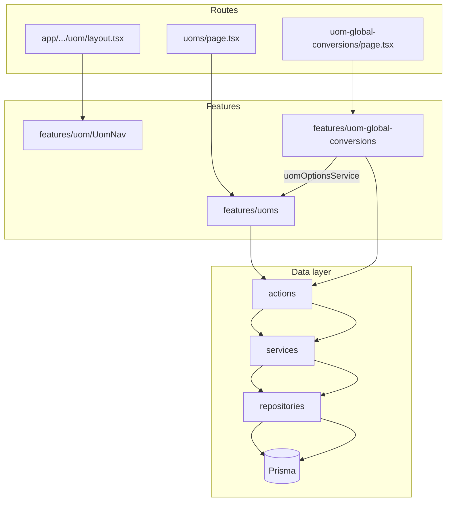

# UOM and UOM Global Conversions Implementation Plan

## Current state

- Stub pages only: [`app/(protected)/dashboard/admin-page/uom/uoms/page.tsx`](<app/(protected)/dashboard/admin-page/uom/uoms/page.tsx>), [`app/(protected)/dashboard/admin-page/uom/uom-global-conversions/page.tsx`](<app/(protected)/dashboard/admin-page/uom/uom-global-conversions/page.tsx>)
- No UOM models in [`prisma/schema.prisma`](prisma/schema.prisma)
- No `features/uom*`, no UOM seeders, no sidebar menu entries
- Reference patterns: **Countries** for simple master CRUD, **Document Types** for FK-based child entity CRUD

## Architecture



Data flow per project standard: **Component → Action → Service → Repository → Prisma**

---

## 1. Prisma schema

Add a new section at end of [`prisma/schema.prisma`](prisma/schema.prisma):

```prisma
enum UomType {
  WEIGHT
  VOLUME
  LENGTH
  COUNT
  OTHER
}

model Uom {
  id            String   @id @default(dbgenerated("gen_random_uuid()")) @db.Uuid
  code          String   @unique
  name          String
  symbol        String?
  description   String?
  uomType       UomType  @default(OTHER) @map("uom_type")
  decimalPlaces Int      @default(0) @map("decimal_places")
  isActive      Boolean  @default(true) @map("is_active")
  createdAt     DateTime @default(now()) @map("created_at")
  updatedAt     DateTime @updatedAt @map("updated_at")

  conversionsFrom UomGlobalConversion[] @relation("UomConversionFrom")
  conversionsTo   UomGlobalConversion[] @relation("UomConversionTo")

  @@index([isActive])
  @@index([uomType])
  @@map("md_uoms")
}

model UomGlobalConversion {
  id               String   @id @default(dbgenerated("gen_random_uuid()")) @db.Uuid
  fromUomId        String   @db.Uuid @map("from_uom_id")
  toUomId          String   @db.Uuid @map("to_uom_id")
  conversionFactor Decimal  @db.Decimal(18, 6) @map("conversion_factor")
  description      String?
  isActive         Boolean  @default(true) @map("is_active")
  createdAt        DateTime @default(now()) @map("created_at")
  updatedAt        DateTime @updatedAt @map("updated_at")

  fromUom Uom @relation("UomConversionFrom", fields: [fromUomId], references: [id], onDelete: Restrict)
  toUom   Uom @relation("UomConversionTo", fields: [toUomId], references: [id], onDelete: Restrict)

  @@unique([fromUomId, toUomId])
  @@index([fromUomId])
  @@index([toUomId])
  @@index([isActive])
  @@map("md_uom_global_conversions")
}
```

**Conversion semantics (confirmed):** `toQuantity = fromQuantity × conversionFactor` (e.g. 1 kg × 1000 = 1000 g).

Run `prisma migrate dev` to generate migration.

---

## 2. Feature: `features/uoms` (~28 files)

Mirror [`features/countries`](features/countries) structure:

| Layer           | Files                                                                                                                                                   |
| --------------- | ------------------------------------------------------------------------------------------------------------------------------------------------------- |
| `schemas/`      | `uom-create.schema.ts` (form + create/update/delete), `uom-filter.schema.ts` (URL params: search, page, pageSize, sortBy, sortOrder, isActive, uomType) |
| `types/`        | `uom.type.ts` (TableRow, ListResult, Detail, FormValues, Option)                                                                                        |
| `repositories/` | create, update, delete, list (+ getByCode, getById, countConversions helpers in create repo)                                                            |
| `services/`     | create, update, delete, get-list, get-by-id, toggle-status, options                                                                                     |
| `actions/`      | create, update (includes get-by-id), delete (includes toggle-status)                                                                                    |
| `lib/`          | filter-url builder, form-defaults, form-mapper                                                                                                          |
| `table/`        | columns, table, toolbar, row-actions                                                                                                                    |
| `components/`   | Management, Form, CreateDialog, EditDialog                                                                                                              |
| `index.ts`      | public exports                                                                                                                                          |

**UOM form fields:** code, name, symbol (optional), description, uomType (SelectField), decimalPlaces (NumberField 0–6), isActive.

**Business rules (services):**

- Unique code on create/update
- Delete blocked if UOM is referenced in any global conversion (count both `conversionsFrom` + `conversionsTo`)
- Toggle status via existing row-action pattern + `toast.promise`

**Table columns:** code, name, symbol, uomType badge, decimalPlaces, status, conversion count, updatedAt, actions.

---

## 3. Feature: `features/uom-global-conversions` (~28 files)

Mirror [`features/document-types`](features/document-types) (FK entity with options on page):

| Layer         | Key differences from UOMs                                                                                    |
| ------------- | ------------------------------------------------------------------------------------------------------------ |
| `schemas/`    | `fromUomId`, `toUomId` (uuid), `conversionFactor` (positive Decimal), cross-field `superRefine`: from ≠ to   |
| `types/`      | TableRow includes `fromUomCode/Name`, `toUomCode/Name`                                                       |
| `services/`   | Validate both UOMs exist; reject duplicate `[fromUomId, toUomId]` pair                                       |
| `components/` | Form uses `SelectField` for from/to UOM (active options from `uomOptionsService`) + `NumberField` for factor |
| `table/`      | Filters: search, fromUomId, toUomId, isActive; columns: From, To, Factor, Status, Updated, Actions           |

**Page wiring** (both UOM options fetched server-side):

```tsx
const [initialData, uomOptions] = await Promise.all([
  uomGlobalConversionGetListService(filters),
  uomOptionsService(),
]);
return (
  <UomGlobalConversionManagement
    initialData={initialData}
    initialFilters={filters}
    uomOptions={uomOptions}
  />
);
```

Import `uomOptionsService` from `@/features/uoms` (public export).

---

## 4. Section nav: `features/uom`

Minimal feature folder (same pattern as [`features/address`](features/address)):

- [`features/uom/components/UomNav.tsx`](features/uom/components/UomNav.tsx) — tabs: **UOMs**, **Global Conversions**
- [`features/uom/index.ts`](features/uom/index.ts) — export `UomNav`

**Routes to add/update:**

- [`app/(protected)/dashboard/admin-page/uom/layout.tsx`](<app/(protected)/dashboard/admin-page/uom/layout.tsx>) — wrap with `<UomNav />`
- [`app/(protected)/dashboard/admin-page/uom/page.tsx`](<app/(protected)/dashboard/admin-page/uom/page.tsx>) — redirect to `/uoms`
- Replace stub pages with thin server components (metadata + parse filters + fetch + render Management)

---

## 5. Seed data

### Domain seed — new files

- [`prisma/seeders/data/uom.ts`](prisma/seeders/data/uom.ts)
  - **UOMs:** kg, g, mg, ton, l, ml, m, cm, mm, pcs (with uomType, symbol, decimalPlaces)
  - **Conversions:** e.g. kg→g (1000), g→mg (1000), l→ml (1000), m→cm (1000), cm→mm (10), ton→kg (1000)
- [`prisma/seeders/seeds/uom.seed.ts`](prisma/seeders/seeds/uom.seed.ts) — upsert UOMs by code, then conversions by `[fromCode, toCode]` pair
- Register in [`prisma/seeders/index.ts`](prisma/seeders/index.ts) after access management (conversions depend on UOM IDs)

### Access management — update [`prisma/seeders/data/access-management.ts`](prisma/seeders/data/access-management.ts)

**Module:**

- `uom_management` — "Manage units of measure and global conversions"

**Permissions:**

- `manage_uom`
- `manage_uom_global_conversion`

**Sidebar menus** (under `admin`, `sortOrder: 9`):

- Parent: `uom` (icon: `Ruler`, path: null)
- Child: `uoms` → `/dashboard/admin-page/uom/uoms` (icon: `Scale`)
- Child: `uom_global_conversions` → `/dashboard/admin-page/uom/uom-global-conversions` (icon: `ArrowLeftRight`)

Add `"uom"` to `menuGroupCodes` set so role-menu CRUD flags apply.

---

## 6. UI / UX conventions (inherited from existing features)

- TanStack Table with server-side pagination, sorting, URL-synced filters
- TanStack Form in create/edit dialogs
- `toast.promise` on all submit/row/bulk actions
- Shared form fields: `TextField`, `TextareaField`, `SelectField`, `NumberField`, `SwitchField`
- Row actions: edit, toggle status, delete (with `AlertDialog` confirm)
- Pagination defaults from [`config/app.config.ts`](config/app.config.ts) (`defaultLimit: 25`, `maxLimit: 100`)

---

## 7. Implementation order

1. Prisma enum + models + migration + `prisma generate`
2. `features/uoms` full stack
3. `features/uom` nav + route layout/redirect/pages for UOMs
4. `features/uom-global-conversions` full stack + conversions page
5. Seeders (domain + access management menus)
6. Run seed + manual smoke test both admin pages

---

## 8. Verification checklist

- Create/edit/delete/toggle UOM with validation (code uniqueness, uomType, decimalPlaces bounds)
- Create conversion with from/to selects; reject same UOM pair and duplicate pairs
- Delete UOM blocked when referenced by conversion
- Sidebar shows **UOM** group with both child links for admin role
- URL filters persist across refresh (search, pagination, sort, status, uomType / from-to filters)
- Seed populates sample UOMs and conversions idempotently on re-run
