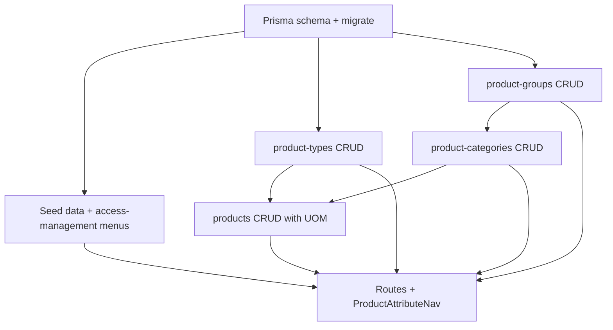

# Product Attribute Master Data

## Current state

- Four route stubs exist with placeholder headings only:
  - [`app/(protected)/dashboard/admin-page/product-attribute/product-types/page.tsx`](<app/(protected)/dashboard/admin-page/product-attribute/product-types/page.tsx>)
  - Same pattern for `product-groups`, `product-categories`, `products`
- No Prisma models, feature modules, seeds, or menu entries for products yet
- Reference patterns to copy:
  - Simple master data: [`features/uoms/`](features/uoms/) (~29 files per entity)
  - Parent FK child entity: [`features/document-types/`](features/document-types/) (`categoryId` select)
  - Section nav: [`features/uom/components/UomNav.tsx`](features/uom/components/UomNav.tsx) + [`app/(protected)/dashboard/admin-page/uom/layout.tsx`](<app/(protected)/dashboard/admin-page/uom/layout.tsx>)

## Data model

Add a new **PRODUCT ATTRIBUTE** section at the end of [`prisma/schema.prisma`](prisma/schema.prisma) using the `md_` master-data prefix (consistent with `md_uoms`).

```mermaid
erDiagram
  ProductType ||--o{ Product : has
  ProductGroup ||--o{ ProductCategory : parent
  ProductGroup ||--o{ Product : has
  ProductCategory ||--o{ Product : has
  Uom ||--o{ Product : baseUom

  ProductType {
    uuid id PK
    string code UK
    string name
    boolean isActive
  }
  ProductGroup {
    uuid id PK
    string code UK
    string name
    boolean isActive
  }
  ProductCategory {
    uuid id PK
    uuid groupId FK
    string code
    boolean isActive
  }
  Product {
    uuid id PK
    string code UK
    uuid productTypeId FK
    uuid productGroupId FK
    uuid productCategoryId FK
    uuid baseUomId FK_nullable
    boolean isActive
  }
```

### Model definitions

| Model             | Key fields                                                                                                       | Constraints                                                                                                     |
| ----------------- | ---------------------------------------------------------------------------------------------------------------- | --------------------------------------------------------------------------------------------------------------- |
| `ProductType`     | `code`, `name`, `description?`, `isActive`                                                                       | `code` globally unique                                                                                          |
| `ProductGroup`    | same shape as `ProductType`                                                                                      | `code` globally unique                                                                                          |
| `ProductCategory` | `groupId`, `code`, `name`, `description?`, `isActive`                                                            | `@@unique([groupId, code])`; FK to `ProductGroup` with `onDelete: Restrict`                                     |
| `Product`         | `code`, `name`, `description?`, `productTypeId`, `productGroupId`, `productCategoryId`, `baseUomId?`, `isActive` | `code` globally unique; FKs `onDelete: Restrict`; optional `baseUomId` → existing [`Uom`](prisma/schema.prisma) |

### Business rules (service layer)

- **Product create/update**: selected `productCategoryId` must belong to `productGroupId` (load category, compare `groupId`)
- **Delete guards**:
  - `ProductType` → block if products exist
  - `ProductGroup` → block if categories or products exist
  - `ProductCategory` → block if products exist
  - `Product` → hard delete allowed (no children)
- **Duplicate codes**: reject on create/update (same pattern as [`uom-create.service.ts`](features/uoms/services/uom-create.service.ts))
- **Toggle status**: activate/deactivate via row action (same as UOM [`uomToggleStatusAction`](features/uoms/actions/uom-delete.action.ts))

Run `prisma migrate dev` after schema change.

---

## Feature modules

Create five feature folders following project architecture:

```
features/
  product-attribute/          # section nav only
  product-types/              # copy features/uoms
  product-groups/             # copy features/uoms
  product-categories/         # copy features/document-types (groupId FK)
  products/                   # document-types + 3 FKs + optional baseUomId
```

Each entity gets the standard stack:

- `actions/` — create, update, delete (+ toggle status)
- `services/` — validation, duplicate checks, relation guards, list/get-by-id/options
- `repositories/` — Prisma only
- `schemas/` — Zod create/update/delete/filter + `parse*Filter`
- `table/` — `*Table`, `columns`, `*TableToolbar`, `*RowActions`
- `components/` — `*Management`, `*Form`, `*CreateDialog`, `*EditDialog`
- `lib/` — filter-url, form-defaults, form-mapper
- `types/`, `index.ts`

### Entity-specific notes

**Product Types / Product Groups** — mirror [`features/uoms/`](features/uoms/) exactly (code, name, description, isActive).

**Product Categories** — mirror [`features/document-types/`](features/document-types/):

- Form field: `groupId` via `productGroupOptionsService()`
- Table column: group name
- Filter: optional `groupId` filter in toolbar
- List repo: `include: { group: { select: { id, code, name } } }`

**Products** — most complex form:

- Fields: `code`, `name`, `description`, `productTypeId`, `productGroupId`, `productCategoryId`, `baseUomId` (nullable), `isActive`
- Page fetches in parallel (like [`document-types/page.tsx`](<app/(protected)/dashboard/admin-page/document-configuration/document-types/page.tsx>)):

```ts
const [initialData, typeOptions, groupOptions, categoryOptions, uomOptions] =
  await Promise.all([
    productGetListService(filters),
    productTypeOptionsService(),
    productGroupOptionsService(),
    productCategoryOptionsService(), // includes groupId for client filtering
    uomOptionsService(), // from @/features/uoms
  ]);
```

- **Dependent category UX** in `ProductForm`:
  - Category select options filtered by selected `productGroupId`
  - On group change, clear `productCategoryId` if it no longer matches
- Table columns: code, name, type, group, category, base UOM symbol/code, status, actions
- Filters: search, type, group, category (category filtered by group in toolbar)

**Section nav** — [`features/product-attribute/components/ProductAttributeNav.tsx`](features/product-attribute/components/ProductAttributeNav.tsx):

| Tab                | Path                                                         |
| ------------------ | ------------------------------------------------------------ |
| Product Types      | `/dashboard/admin-page/product-attribute/product-types`      |
| Product Groups     | `/dashboard/admin-page/product-attribute/product-groups`     |
| Product Categories | `/dashboard/admin-page/product-attribute/product-categories` |
| Products           | `/dashboard/admin-page/product-attribute/products`           |

---

## Routes

Add missing route shell:

- [`app/(protected)/dashboard/admin-page/product-attribute/layout.tsx`](<app/(protected)/dashboard/admin-page/product-attribute/layout.tsx>) — renders `<ProductAttributeNav />`
- [`app/(protected)/dashboard/admin-page/product-attribute/page.tsx`](<app/(protected)/dashboard/admin-page/product-attribute/page.tsx>) — redirect to `product-types`

Replace each stub page with thin server components (metadata + `parseFilter` + `getListService` + options where needed), matching [`uom/uoms/page.tsx`](<app/(protected)/dashboard/admin-page/uom/uoms/page.tsx>) and [`document-configuration/document-types/page.tsx`](<app/(protected)/dashboard/admin-page/document-configuration/document-types/page.tsx>).

---

## Seeds

### Data file: `prisma/seeders/data/product-attribute.ts`

Seed in dependency order using `code` / `groupCode` / `categoryCode` references:

**Product types** (6): `stock_item`, `consumable`, `service`, `asset`, `digital`, `physical`

**Product groups** (combined industrial + dept store + IT):

- Industrial: `electrical`, `mechanical`, `instrument`, `civil`, `spare_part`, `plumbing`, `fastener`, `chemical`, `lubricant`
- Dept store / IT: `electronic`, `furniture`, `atk`, `networking`, `office_equipment`, `software`, `it_service`

**Product categories** (examples from your spec):

- `electrical` → cable, mccb, mcb, lamp, switch
- `mechanical` → bearing, valve, pump, gearbox, motor
- `spare_part` → bearing
- `plumbing` → pipe
- `fastener` → bolt
- `chemical` → paint
- `lubricant` → engine_oil
- `electronic` → laptop, mouse, printer
- `software` → office_suite
- `it_service` → installation

**Sample products** (from your tables):

| code              | name               | type       | group      | category     | baseUom |
| ----------------- | ------------------ | ---------- | ---------- | ------------ | ------- |
| bearing_skf       | Bearing SKF        | stock_item | spare_part | bearing      | pcs     |
| pipa_pvc          | Pipa PVC           | stock_item | plumbing   | pipe         | m       |
| baut_m12          | Baut M12           | stock_item | fastener   | bolt         | pcs     |
| cat_nippon        | Cat Nippon         | stock_item | chemical   | paint        | l       |
| oli_shell         | Oli Shell          | consumable | lubricant  | engine_oil   | l       |
| asus_vivobook     | ASUS Vivobook      | physical   | electronic | laptop       | pcs     |
| logitech_g102     | Logitech G102      | physical   | electronic | mouse        | pcs     |
| canon_g3770       | Canon G3770        | physical   | electronic | printer      | pcs     |
| office_365        | Office 365 License | digital    | software   | office_suite | null    |
| instalasi_windows | Instalasi Windows  | service    | it_service | installation | null    |

### Runner: `prisma/seeders/seeds/product-attribute.seed.ts`

- Upsert types and groups by `code`
- Build `Map<code, id>` for FK resolution
- Upsert categories by composite `(groupId, code)`
- Upsert products by `code`, resolving all FKs + optional `baseUomCode`
- Register in [`prisma/seeders/index.ts`](prisma/seeders/index.ts) after `seedUom()` (products depend on UOM seed)

---

## Menu and permissions

Update [`prisma/seeders/data/access-management.ts`](prisma/seeders/data/access-management.ts):

**Permission module** (sortOrder 13):

```ts
{ code: "product_attribute_management", name: "Product Attribute Management", ... }
```

**Permissions**:

- `manage_product_type`
- `manage_product_group`
- `manage_product_category`
- `manage_product`

**Sidebar menus** (parent under `admin`, sortOrder 10 — after UOM):

```ts
{ code: "product_attribute", label: "Product Attribute", path: null, icon: "Package", parentCode: "admin" }
{ code: "product_types", path: "/dashboard/admin-page/product-attribute/product-types", parentCode: "product_attribute", icon: "Tags" }
{ code: "product_groups", ... icon: "Layers" }
{ code: "product_categories", ... icon: "FolderTree" }
{ code: "products", ... icon: "Box" }
```

Add `"product_attribute"` to `menuGroupCodes` so child menus get full CRUD role assignments via existing `buildRoleMenuAssignments()`.

Re-run `pnpm db:seed` after migration.

---

## Implementation order



Recommended build sequence to keep each step testable:

1. Schema + migration
2. Access-management seed entries (menus visible after re-seed)
3. `product-types` + `product-groups` (independent)
4. `product-categories` (needs group options)
5. `product-attribute` nav + layout + redirect
6. `products` (needs all parent options + UOM)
7. Product-attribute seed data + orchestrator
8. Wire all four pages

---

## Files touched (summary)

| Area     | New/updated files                                                                                               |
| -------- | --------------------------------------------------------------------------------------------------------------- |
| Prisma   | `schema.prisma`, new migration                                                                                  |
| Seeds    | `data/product-attribute.ts`, `seeds/product-attribute.seed.ts`, `seeders/index.ts`, `data/access-management.ts` |
| Features | ~120 files across 5 feature folders                                                                             |
| Routes   | `layout.tsx`, `page.tsx`, 4 updated list pages                                                                  |

No changes to shared `components/data-table` or `components/form` primitives — only feature-owned composition.

## Verification

After implementation:

1. `pnpm db:migrate` (or `prisma migrate dev`)
2. `pnpm db:seed`
3. Log in as admin → sidebar shows **Product Attribute** with 4 children
4. CRUD each entity; confirm toasts on all actions
5. Create product with mismatched group/category → validation error
6. Delete group with categories → blocked with clear message
7. Seed products with/without base UOM display correctly in table
