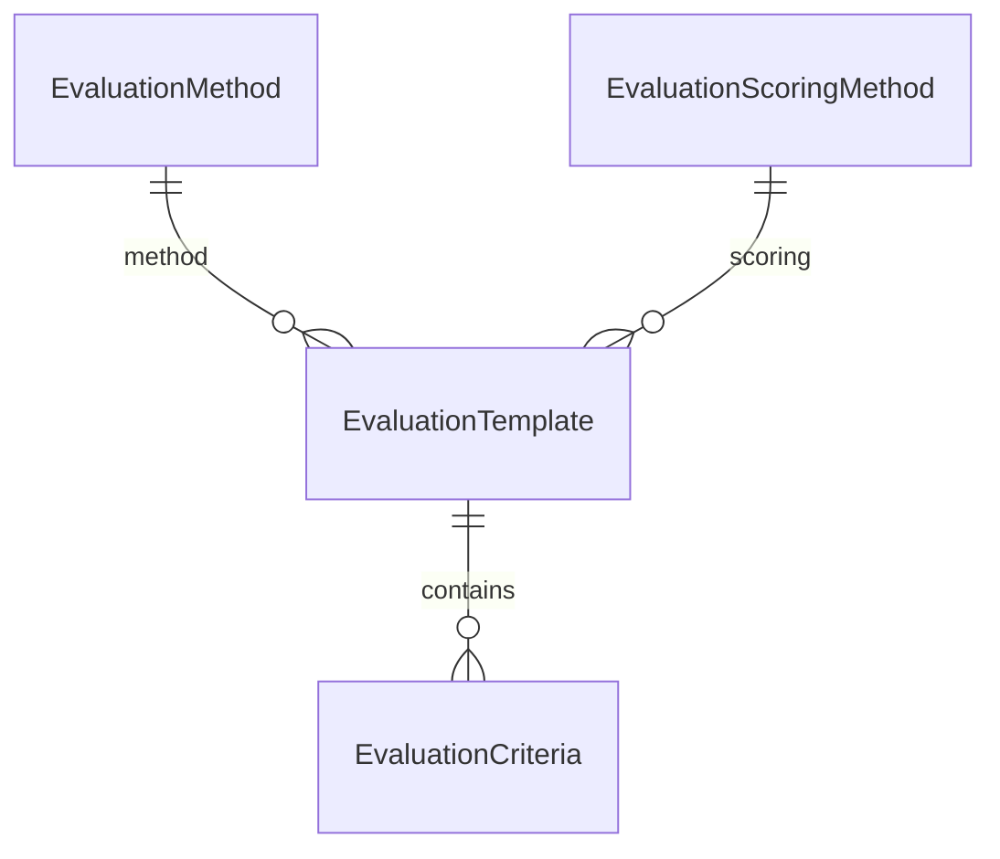

# Evaluation Master Data (Admin Page)

## Analysis and Corrections

Your four entities are valid e-procurement master data, but need these corrections to match project conventions:

| Your name                 | Corrected Prisma model    | Corrected table (`@@map`)       | CRUD pattern                               |
| ------------------------- | ------------------------- | ------------------------------- | ------------------------------------------ |
| evaluation method         | `EvaluationMethod`        | `md_evaluation_methods`         | Flat (like `ProductType`)                  |
| evaluation scoring method | `EvaluationScoringMethod` | `md_evaluation_scoring_methods` | Flat (like `ProductType`)                  |
| evaluation template       | `EvaluationTemplate`      | `md_evaluation_templates`       | Composite FK (like `Product`)              |
| evaluation criteria       | `EvaluationCriteria`      | `md_evaluation_criteria`        | Child of template (like `ProductCategory`) |

**Relationship model** (confirmed by domain logic + your scoring-field choice):



**Nav order** (dependency-first, same as product-attribute):
Methods → Scoring Methods → Templates → Criteria

**Route base:** `/dashboard/admin-page/evaluation/`

---

## 1. Prisma Schema

Add a new section after PRODUCT ATTRIBUTE in [`prisma/schema.prisma`](prisma/schema.prisma).

### Flat entities (Method, ScoringMethod)

Same base shape as `ProductType`:

- `id` UUID, `code` unique, `name`, `description?`, `isActive`, `createdAt`, `updatedAt`
- `@@index([isActive])`

### EvaluationTemplate

- Base fields + required FKs:
  - `evaluationMethodId` → `EvaluationMethod` (`onDelete: Restrict`)
  - `evaluationScoringMethodId` → `EvaluationScoringMethod` (`onDelete: Restrict`)
- Relations: `criteria EvaluationCriteria[]`
- Indexes on both FKs + `isActive`

### EvaluationCriteria (child)

- `templateId` → `EvaluationTemplate` (`onDelete: Restrict`)
- `code`, `name`, `description?`, `isActive`, timestamps
- **Scoring fields** (per your choice):
  - `weight` — `Decimal(5,2)` default `0`
  - `maxScore` — `Decimal(8,2)?` optional
  - `sortOrder` — `Int` default `0`
- `@@unique([templateId, code])` (scoped code, like `ProductCategory`)
- Indexes on `templateId`, `isActive`, `sortOrder`

### Migration

Run `prisma migrate dev` to create migration `add_evaluation_models` and regenerate client.

---

## 2. Feature Modules (4 × full CRUD)

Mirror [`features/product-types/`](features/product-types/) structure for each entity. Each module gets ~27–28 files:

```
features/evaluation-methods/
features/evaluation-scoring-methods/
features/evaluation-templates/
features/evaluation-criteria/
features/evaluation/          # shared nav only
```

### Per-entity layers (same as product-attribute)

| Layer           | Files                                                     |
| --------------- | --------------------------------------------------------- |
| `types/`        | Table row, detail, form values, list result, option types |
| `schemas/`      | create/update/delete + filter schemas (Zod)               |
| `repositories/` | create, update, delete, list, get-by-id, count-children   |
| `services/`     | create, update, delete, get-by-id, get-list, options      |
| `actions/`      | create, update, delete server actions via `runAction`     |
| `lib/`          | filter-url parser, form-defaults, form-mapper             |
| `components/`   | Form, CreateDialog, EditDialog, Management                |
| `table/`        | columns, Table, Toolbar, RowActions                       |
| `index.ts`      | public exports                                            |

### Entity-specific form/table differences

**EvaluationMethod / EvaluationScoringMethod** — identical to `ProductType`:

- Columns: code, name, description, status, usage count, updatedAt, actions
- Delete guard: block if referenced by templates

**EvaluationTemplate** — like `Product`:

- Form selects: `evaluationMethodId`, `evaluationScoringMethodId`
- Table shows method name + scoring method name (joined in list repository)
- Page fetches options from sibling `*OptionsService()`
- Delete guard: block if has criteria

**EvaluationCriteria** — like `ProductCategory` + scoring fields:

- Form: `templateId` select, code, name, description, `weight`, `maxScore`, `sortOrder`, `isActive`
- Schema validation: `weight >= 0`, `maxScore > 0` when provided, `sortOrder >= 0`
- Table columns: template name, code, name, weight, maxScore, sortOrder, status, actions
- Delete: no child guard (leaf entity)

### Shared nav

[`features/evaluation/components/EvaluationNav.tsx`](features/evaluation/components/EvaluationNav.tsx) — copy [`ProductAttributeNav.tsx`](features/product-attribute/components/ProductAttributeNav.tsx) with 4 tabs:

1. Evaluation Methods
2. Scoring Methods
3. Evaluation Templates
4. Evaluation Criteria

---

## 3. Admin Routes

Create under [`app/(protected)/dashboard/admin-page/evaluation/`](<app/(protected)/dashboard/admin-page/evaluation/>):

| File                                  | Behavior                                               |
| ------------------------------------- | ------------------------------------------------------ |
| `layout.tsx`                          | Renders `<EvaluationNav />` + children                 |
| `page.tsx`                            | Redirect to `evaluation-methods`                       |
| `evaluation-methods/page.tsx`         | Thin server page → `EvaluationMethodManagement`        |
| `evaluation-scoring-methods/page.tsx` | Thin server page → `EvaluationScoringMethodManagement` |
| `evaluation-templates/page.tsx`       | Fetches method + scoring options + list                |
| `evaluation-criteria/page.tsx`        | Fetches template options + list                        |

Each page follows the thin pattern from [`product-types/page.tsx`](<app/(protected)/dashboard/admin-page/product-attribute/product-types/page.tsx>): metadata, `parse*Filter`, `*GetListService`, pass `initialData` + `initialFilters`.

---

## 4. Seed Data

### Data file: [`prisma/seeders/data/evaluation.ts`](prisma/seeders/data/evaluation.ts)

**Evaluation methods** (6):

- `lowest_price`, `technical_commercial`, `two_envelope`, `quality_cost_based`, `direct_award`, `negotiation`

**Scoring methods** (5):

- `weighted_sum`, `pass_fail`, `point_scale`, `percentage`, `ranking`

**Templates** (4) — reference method + scoring by code:

- `goods_standard` — technical_commercial + weighted_sum
- `services_simple` — lowest_price + ranking
- `construction_qcbs` — quality_cost_based + weighted_sum
- `consulting_pass_fail` — two_envelope + pass_fail

**Criteria** (~12) — scoped to template, with weight/maxScore/sortOrder:

- Example for `goods_standard`: technical_compliance (weight 40), commercial_price (weight 60), delivery_time (weight 10, optional)

### Seed runner: [`prisma/seeders/seeds/evaluation.seed.ts`](prisma/seeders/seeds/evaluation.seed.ts)

Upsert order:

1. Methods by `code`
2. Scoring methods by `code`
3. Templates by `code` (resolve FK codes)
4. Criteria by `templateId_code` composite (resolve template codes)

### Wire into [`prisma/seeders/index.ts`](prisma/seeders/index.ts)

```ts
await seedProductAttribute();
await seedEvaluation(); // new
await seedEmail();
```

---

## 5. Menu and Permissions

Extend [`prisma/seeders/data/access-management.ts`](prisma/seeders/data/access-management.ts):

### Permission module

```ts
{ code: "evaluation_management", name: "Evaluation Management", sortOrder: 14 }
```

### Permissions (4)

- `manage_evaluation_method`
- `manage_evaluation_scoring_method`
- `manage_evaluation_template`
- `manage_evaluation_criteria`

Granted to `super_admin` (all) and `admin` (same exclusions as product-attribute).

### Sidebar menus

| Code                         | Label                | Path                             | Parent       | Icon             |
| ---------------------------- | -------------------- | -------------------------------- | ------------ | ---------------- |
| `evaluation`                 | Evaluation           | `null`                           | `admin`      | `ClipboardCheck` |
| `evaluation_methods`         | Evaluation Methods   | `.../evaluation-methods`         | `evaluation` | `GitCompare`     |
| `evaluation_scoring_methods` | Scoring Methods      | `.../evaluation-scoring-methods` | `evaluation` | `Calculator`     |
| `evaluation_templates`       | Evaluation Templates | `.../evaluation-templates`       | `evaluation` | `LayoutTemplate` |
| `evaluation_criteria`        | Evaluation Criteria  | `.../evaluation-criteria`        | `evaluation` | `ListChecks`     |

Add `evaluation` to `menuGroupCodes` set.

---

## 6. Delete Guards (business rules in services)

| Entity                  | Guard                                   |
| ----------------------- | --------------------------------------- |
| EvaluationMethod        | Cannot delete if templates reference it |
| EvaluationScoringMethod | Cannot delete if templates reference it |
| EvaluationTemplate      | Cannot delete if criteria exist         |
| EvaluationCriteria      | Free delete                             |

---

## 7. Implementation Scope Estimate

| Area                      | New files (approx.) |
| ------------------------- | ------------------- |
| Prisma + migration        | 2                   |
| 4 feature modules         | ~110                |
| Shared evaluation nav     | 2                   |
| Admin routes              | 6                   |
| Seed data + runner        | 2                   |
| Access management updates | 1 (edit)            |
| Seeder index              | 1 (edit)            |
| **Total**                 | **~124 files**      |

Primary reference to clone: [`features/product-types/`](features/product-types/) for flat entities, [`features/product-categories/`](features/product-categories/) for criteria child, [`features/products/`](features/products/) for template composite FK.

---

## 8. Verification Checklist

After implementation:

1. `npx prisma migrate dev` — migration applies cleanly
2. `npx prisma db seed` — evaluation data upserts without FK errors
3. Navigate `/dashboard/admin-page/evaluation/evaluation-methods` — table loads
4. Create/edit/delete each entity — toast feedback works
5. Delete guards — method with templates shows human-readable error
6. Template form — method + scoring dropdowns populated
7. Criteria form — template dropdown + weight/maxScore/sortOrder validation
8. Sidebar — Evaluation menu group visible for admin/super_admin roles
