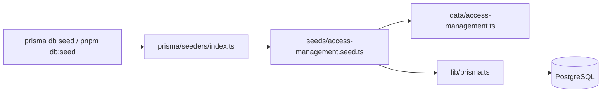

# Access Management Seed Data

## Context

- Models already exist in [prisma/schema.prisma](prisma/schema.prisma): `Role`, `PermissionModule`, `Permission`, `RolePermission` (all keyed by a unique `code`, with `isSystem`/`isActive` flags).
- Generated client lives at `generated/prisma/client.ts` (confirmed). The existing runtime client [lib/prisma.ts](lib/prisma.ts) uses `PrismaPg` adapter + `dotenv/config`.
- The seeder files referenced by [package.json](package.json) (`prisma/seeders/index.ts`, `prisma/seeders/run-md-uom.ts`) do NOT actually exist yet. `package.json` and `prisma.config.ts` are currently unmodified on disk.
- A prior draft plan exists at `.cursor/plans/014_access_management_seed_51cdca86.plan.md` but nothing was implemented.

## Data flow



Seeding stays Prisma-layer only. All writes use `upsert` keyed on unique `code` (and composite `roleId_permissionId`) so re-runs are safe and idempotent.

## Files to create

### 1. prisma/seeders/lib/prisma.ts

Dedicated seed client mirroring [lib/prisma.ts](lib/prisma.ts). IMPORTANT: from `prisma/seeders/lib/` the correct relative import is `../../../generated/prisma/client` (three levels up to repo root).

```typescript
import "dotenv/config";
import { PrismaPg } from "@prisma/adapter-pg";
import { PrismaClient } from "../../../generated/prisma/client";

const adapter = new PrismaPg({
  connectionString: `${process.env.DATABASE_URL}`,
});
export const prisma = new PrismaClient({ adapter });
```

### 2. prisma/seeders/data/access-management.ts

Static, DB-free definitions exported as typed const arrays:

- Roles (`isSystem: true`, `isActive: true`): `super_admin` (Super Admin), `admin` (Admin), `user` (User).
- Modules (`isSystem: true`, `sortOrder` 1-6): `user_management`, `role_management`, `email_management`, `api_management`, `webhook_management`, `system_management`.
- Permissions (`isSystem: true`, each linked to a module by module code):
  - `manage_user` -> user_management
  - `manage_role`, `manage_permission`, `manage_menu` -> role_management
  - `manage_email` -> email_management
  - `manage_api` -> api_management
  - `manage_webhook` -> webhook_management
  - `manage_system_setting` -> system_management
- Role-permission tiers (per confirmation):
  - `super_admin` -> all 8 permissions
  - `admin` -> all except `manage_permission` and `manage_system_setting` (6)
  - `user` -> none
  - Total: 14 `role_permission` rows.

### 3. prisma/seeders/seeds/access-management.seed.ts

`export async function seedAccessManagement()` with ordered idempotent steps:

1. Upsert roles by `code` (`update: {}` so admin-customized names are not overwritten; defaults only on `create`).
2. Upsert modules by `code`.
3. Upsert permissions by `code`, resolving `moduleId` from the upserted modules.
4. Upsert role-permissions: look up role + permission IDs by code, `upsert` on composite `roleId_permissionId` with `granted: true`.
5. Log a concise summary (counts of roles, modules, permissions, role-permission rows).

### 4. prisma/seeders/index.ts

Orchestrator entry point:

```typescript
import { prisma } from "./lib/prisma";
import { seedAccessManagement } from "./seeds/access-management.seed";

async function main() {
  await seedAccessManagement();
}

main()
  .then(() => prisma.$disconnect())
  .catch(async (e) => {
    console.error(e);
    await prisma.$disconnect();
    process.exit(1);
  });
```

## Config changes

### prisma.config.ts

Add `seed` under `migrations`:

```typescript
migrations: {
  path: "prisma/migrations",
  seed: "pnpm dlx tsx prisma/seeders/index.ts",
},
```

### package.json

- Keep `db:seed` but repoint it to: `"db:seed": "prisma db seed"`.
- Remove the stale `db:seed:md_uom` script (its target file does not exist).

## Verification (after implementation)

1. Ensure migrations applied (`pnpm prisma migrate deploy` / `migrate dev`).
2. Run `pnpm prisma db seed` (and `pnpm db:seed`).
3. Confirm: 3 roles, 6 modules, 8 permissions, 14 role_permission rows.
4. Re-run seed -> succeeds with no duplicates (idempotent).

## Out of scope

- Default admin user / Better Auth account seeding.
- `Menu` / `RoleMenu` seeding.
- Feature-layer seed services under `features/`.
