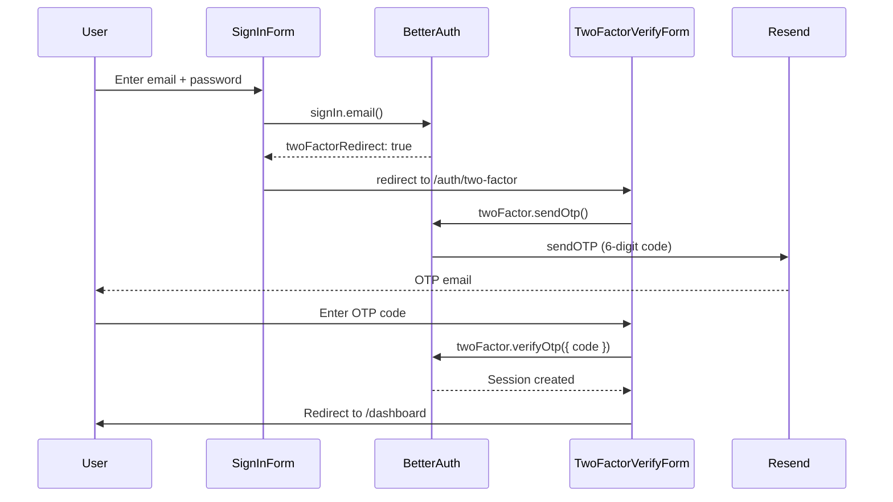

# Add Two-Factor Authentication (2FA) via Email OTP

## Current State

- Auth server: [lib/auth.ts](lib/auth.ts) -- uses `betterAuth` with Prisma adapter, `emailAndPassword`, `emailVerification`, Google social login, and `nextCookies` plugin.
- Auth client: [lib/auth-client.ts](lib/auth-client.ts) -- `createAuthClient` with no plugins.
- Email utility: [lib/email.ts](lib/email.ts) -- uses Resend (`sendEmail({ to, subject, html })`).
- OTP Input UI: [components/ui/input-otp.tsx](components/ui/input-otp.tsx) -- already exists (shadcn `InputOTP`).
- No 2FA code exists yet. Prisma schema has no `twoFactorEnabled` or `twoFactor` table.

## Architecture



## 1. Server Plugin Setup

**File:** [lib/auth.ts](lib/auth.ts)

Add `twoFactor` from `better-auth/plugins` to the `plugins` array with OTP config:

```ts
import { twoFactor } from "better-auth/plugins";

plugins: [
  nextCookies(),
  twoFactor({
    otpOptions: {
      async sendOTP({ user, otp }) {
        await sendEmail({
          to: user.email,
          subject: "Your verification code",
          html: `
            <h2>Two-Factor Authentication</h2>
            <p>Hi ${user.name},</p>
            <p>Your verification code is: <strong>${otp}</strong></p>
            <p>This code will expire in 5 minutes.</p>
            <p>If you didn't request this code, please ignore this email.</p>
          `,
        });
      },
      period: 5, // code valid for 5 minutes
      digits: 6,
      allowedAttempts: 5,
      storeOTP: "encrypted",
    },
    backupCodeOptions: {
      amount: 10,
      length: 10,
      storeBackupCodes: "encrypted",
    },
    skipVerificationOnEnable: true,
  }),
];
```

Key: `skipVerificationOnEnable: true` is used because we're doing OTP (email) only, not TOTP -- there's no authenticator app to verify against during setup.

## 2. Client Plugin Setup

**File:** [lib/auth-client.ts](lib/auth-client.ts)

Add `twoFactorClient` plugin. Since `onTwoFactorRedirect` runs outside of React component context (it's a plugin-level callback), we cannot use `useRouter` here. Instead, we'll handle the redirect directly in the `SignInForm` component's `onSuccess` callback using `router.push`, and leave the client plugin without a redirect callback:

```ts
import { twoFactorClient } from "better-auth/client/plugins";

export const authClient = createAuthClient({
  plugins: [twoFactorClient()],
});
```

Also export the new `twoFactor` namespace from `authClient`.

## 2b. Sign-In Flow: Handle 2FA Redirect

**File:** [features/auth/components/SignInForm.tsx](features/auth/components/SignInForm.tsx)

Instead of relying on `onTwoFactorRedirect` (which uses `window.location.href` and causes a full reload), handle the redirect in the `SignInForm` using the existing `router` instance:

```ts
const { error: authError } = await signIn.email(
  {
    email: result.data.email,
    password: result.data.password,
    rememberMe: result.data.rememberMe,
  },
  {
    onSuccess(context) {
      if (context.data.twoFactorRedirect) {
        router.push("/auth/two-factor");
        return;
      }
      router.push("/dashboard");
    },
  },
);
```

This replaces the current `router.push("/dashboard")` call after `signIn.email`, moving the redirect into the `onSuccess` callback where we can check for `twoFactorRedirect`.

## 3. Database Schema + Migration

**File:** [prisma/schema.prisma](prisma/schema.prisma)

Add to `User` model:

```prisma
twoFactorEnabled Boolean? @map("two_factor_enabled")
```

Add new `TwoFactor` model:

```prisma
model TwoFactor {
  id          String  @id
  userId      String
  secret      String
  backupCodes String
  verified    Boolean
  user        User    @relation(fields: [userId], references: [id], onDelete: Cascade)

  @@index([userId])
  @@map("two_factor")
}
```

Update `User` to add the `twoFactor` relation. Then run `npx prisma migrate dev` to apply.

## 4. Sign-In Flow Modification

Handled in section 2b above. The `SignInForm` is modified to use `router.push("/auth/two-factor")` inside the `onSuccess` callback when `twoFactorRedirect` is true.

## 5. New: 2FA Verification Page (Sign-In)

**New file:** `app/auth/two-factor/page.tsx` -- thin route page.

**New file:** `features/auth/components/TwoFactorVerifyForm.tsx`

This is the page users see during sign-in when 2FA is required. Flow:

1. On mount, call `authClient.twoFactor.sendOtp()` to trigger email delivery.
2. Show a 6-digit OTP input using the existing `InputOTP` component.
3. On submit, call `authClient.twoFactor.verifyOtp({ code, trustDevice: true })`.
4. On success, redirect to `/dashboard`.
5. Include a "Resend code" button with cooldown timer.
6. Include a link/tab to use a backup code instead.

## 6. New: 2FA Settings Page

**New file:** `app/(protected)/settings/two-factor/page.tsx` -- thin route page.

**New file:** `features/auth/components/TwoFactorSettings.tsx`

Allows authenticated users to manage their 2FA:

- **Enable 2FA**: Requires password confirmation, calls `authClient.twoFactor.enable({ password })`. Displays backup codes on success.
- **Disable 2FA**: Requires password confirmation, calls `authClient.twoFactor.disable({ password })`.
- **Regenerate backup codes**: Calls `authClient.twoFactor.generateBackupCodes({ password })`.
- Shows current 2FA status (`twoFactorEnabled` from session).

## 7. New: Backup Codes Display Component

**New file:** `features/auth/components/BackupCodesDisplay.tsx`

A reusable component that receives `codes: string[]` and displays them in a grid. Includes a "Copy all" button. Used in both the enable flow and the regenerate flow.

## 8. New: Validation Schema

**New file:** `features/auth/schemas/two-factor.schema.ts`

```ts
import { z } from "zod";

export const otpSchema = z.object({
  code: z.string().length(6, "Code must be 6 digits"),
});

export const backupCodeSchema = z.object({
  code: z.string().min(1, "Backup code is required"),
});

export const twoFactorPasswordSchema = z.object({
  password: z.string().min(1, "Password is required"),
});
```

## 9. Update Exports

**File:** [features/auth/index.ts](features/auth/index.ts)

Add exports for `TwoFactorVerifyForm`, `TwoFactorSettings`, `BackupCodesDisplay`, and the new schemas.

## 10. Update UserMenu

**File:** [components/navbar/UserMenu.tsx](components/navbar/UserMenu.tsx)

Add a "Two-Factor Auth" menu item linking to `/settings/two-factor` (with a `ShieldCheck` icon from Lucide).

## Files Summary

| Action | File                                                                                     |
| ------ | ---------------------------------------------------------------------------------------- |
| Modify | `lib/auth.ts`                                                                            |
| Modify | `lib/auth-client.ts`                                                                     |
| Modify | `prisma/schema.prisma`                                                                   |
| Modify | `features/auth/components/SignInForm.tsx` (handle `twoFactorRedirect` via `router.push`) |
| Modify | `features/auth/index.ts`                                                                 |
| Modify | `components/navbar/UserMenu.tsx`                                                         |
| Create | `app/auth/two-factor/page.tsx`                                                           |
| Create | `app/(protected)/settings/two-factor/page.tsx`                                           |
| Create | `features/auth/components/TwoFactorVerifyForm.tsx`                                       |
| Create | `features/auth/components/TwoFactorSettings.tsx`                                         |
| Create | `features/auth/components/BackupCodesDisplay.tsx`                                        |
| Create | `features/auth/schemas/two-factor.schema.ts`                                             |
| Run    | `npx prisma migrate dev --name add-two-factor`                                           |
