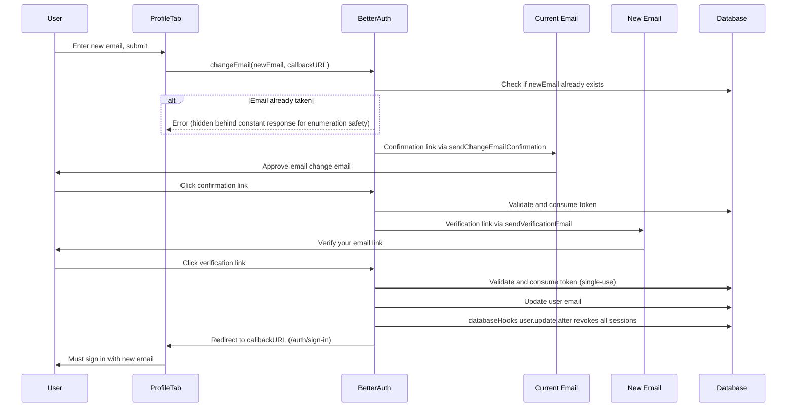

# Change Email Feature with Better Auth

## Current State

- **Client-side** is already wired: `ProfileTab.tsx` has the change email form and calls `changeEmail` from `auth-client.ts`
- **Server-side** is missing the `changeEmail` configuration -- [lib/auth.ts](lib/auth.ts) only has `user: { deleteUser: { enabled: true } }`, so the endpoint returns an error

## Security Requirements

1. **Duplicate email prevention** -- the new email must not already belong to another user
2. **Session invalidation** -- all sessions must be revoked after email change (force re-login)
3. **Replay attack prevention** -- the verification token must be invalidated after use

## What Better Auth Handles Natively

| Requirement                           | Built-in? | Details                                                                                                                                                                                                                                             |
| ------------------------------------- | --------- | --------------------------------------------------------------------------------------------------------------------------------------------------------------------------------------------------------------------------------------------------- |
| Duplicate email check                 | Yes       | Better Auth checks for existing emails before updating. Additionally, Prisma schema has `@@unique([email])` on User as a DB-level safety net. The `/change-email` endpoint also returns `{ status: true }` regardless to prevent email enumeration. |
| Token single-use invalidation         | Yes       | Verification tokens are stored in the `Verification` model and deleted immediately after successful use -- same pattern as password reset tokens.                                                                                                   |
| Session revocation after email change | **No**    | Must be implemented manually via `databaseHooks`.                                                                                                                                                                                                   |

## Flow (Two-Step with Session Revocation)



## Changes Required

### 1. Enable `changeEmail` in server config

In [lib/auth.ts](lib/auth.ts), add `changeEmail` to the existing `user` config:

```typescript
user: {
  deleteUser: {
    enabled: true,
  },
  changeEmail: {
    enabled: true,
    sendChangeEmailConfirmation: async ({ user, newEmail, url, token }) => {
      await sendEmail({
        to: user.email, // sent to CURRENT email
        subject: "Confirm your email change",
        html: `...approve changing to ${newEmail}...link: ${url}`,
      });
    },
  },
},
```

- `sendChangeEmailConfirmation` sends to the **current** email asking user to approve
- After approval, `emailVerification.sendVerificationEmail` (already configured) sends the verification to the **new** email automatically
- Duplicate email check and token single-use are handled natively by Better Auth

### 2. Add session revocation via databaseHooks

In [lib/auth.ts](lib/auth.ts), add a `databaseHooks.user.update.after` hook that detects when the user's email field changes and deletes all sessions for that user via Prisma:

```typescript
databaseHooks: {
  user: {
    update: {
      after: async (user) => {
        // When Better Auth updates user.email, revoke all sessions to force re-login
        // The hook fires on any user update, so we revoke sessions
        // specifically when the email field was part of the update.
        // Better Auth passes the updated user object here.
        await prisma.session.deleteMany({
          where: { userId: user.id },
        });
      },
    },
  },
},
```

**Important consideration**: The `user.update.after` hook fires for ALL user updates (name change, image change, etc.), not just email changes. We need to scope this to email changes only. Two approaches:

- **Option A**: Track the previous email by querying the user before update in a `before` hook, store it, then compare in `after`. This is more precise but adds a DB query.
- **Option B**: Accept that any user profile update revokes sessions. This is simpler but overly aggressive.
- **Recommended (Option A)**: Use the `before` hook to capture the current email, then compare in `after` to only revoke when email actually changed.

```typescript
databaseHooks: {
  user: {
    update: {
      before: async (userData, ctx) => {
        if (userData.email) {
          const existingUser = await prisma.user.findUnique({
            where: { id: ctx.context.session?.userId ?? "" },
            select: { email: true },
          });
          // Store on context for the after hook
          (ctx as Record<string, unknown>)._previousEmail = existingUser?.email;
        }
        return { data: userData };
      },
      after: async (user, ctx) => {
        const previousEmail = (ctx as Record<string, unknown>)?._previousEmail as string | undefined;
        if (previousEmail && previousEmail !== user.email) {
          await prisma.session.deleteMany({
            where: { userId: user.id },
          });
        }
      },
    },
  },
},
```

### 3. Refine ProfileTab UI messaging

In [features/auth/components/ProfileTab.tsx](features/auth/components/ProfileTab.tsx):

- Change success toast from `"Verification email sent to your new address"` to `"Confirmation email sent to your current address"` since the first email goes to the current email, not the new one
- Update `CardDescription` to explain the two-step process and that the user will need to re-login after completing the change
- Set `callbackURL` to `/auth/sign-in` since sessions are revoked after the email update completes

## Files to Modify

- [lib/auth.ts](lib/auth.ts) -- add `changeEmail` config with `sendChangeEmailConfirmation`, add `databaseHooks` for session revocation on email change
- [features/auth/components/ProfileTab.tsx](features/auth/components/ProfileTab.tsx) -- update toast message, description, and callbackURL
