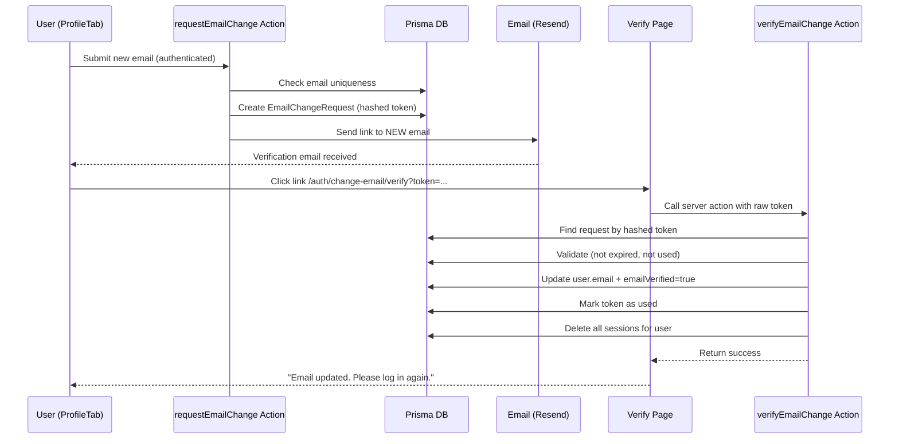

# Custom Token-Based Email Change Flow

## Problem

Better Auth's built-in `changeEmail` requires an active session when the user clicks the verification link. If the user is logged in, verification silently fails. This makes email change unreliable.

## Solution

Build a custom email change flow that stores a hashed verification token in the database and verifies it independently of any session.

## Architecture



## Data Flow

```
ProfileTab -> requestEmailChange action -> Prisma (create token + send email)
VerifyEmailChange component -> verifyEmailChange action -> Prisma (verify + update + cleanup)
```

## Files to Create/Modify

### 1. Prisma Schema -- add `EmailChangeRequest` model

Add to [prisma/schema.prisma](prisma/schema.prisma):

```prisma
model EmailChangeRequest {
  id        String    @id @default(dbgenerated("gen_random_uuid()")) @db.Uuid
  userId    String
  newEmail  String
  token     String    @unique
  expiresAt DateTime
  usedAt    DateTime?
  createdAt DateTime  @default(now())

  user User @relation(fields: [userId], references: [id], onDelete: Cascade)

  @@index([userId])
  @@map("email_change_request")
}
```

Also add `emailChangeRequests EmailChangeRequest[]` relation to the `User` model. Run `prisma migrate dev` after.

### 2. Security Config -- add token expiry

Add `emailChangeTokenExpiresInSec: 60 * 60` (1 hour) to [config/security.config.ts](config/security.config.ts) duration block and update the type.

### 3. Token Utility -- `features/auth/lib/email-change-token.ts`

New file with two functions:

- `generateEmailChangeToken()` -- returns `{ raw, hashed }` using `crypto.randomBytes(32)` and `crypto.createHash('sha256')`
- `hashEmailChangeToken(raw: string)` -- hashes a raw token for DB lookup

### 4. Schema -- `features/auth/schemas/request-email-change.schema.ts`

New Zod schema validating `{ newEmail: z.string().email() }`. Can reuse or replace existing `newEmailForChangeSchema`.

### 5. Server Action -- `features/auth/actions/request-email-change.action.ts`

New `"use server"` action:

- Validates input with schema
- Gets session via `auth.api.getSession` (user must be authenticated to request)
- Checks new email is not the same as current
- Checks new email is not taken by another user
- Generates token pair (raw + hashed)
- Creates `EmailChangeRequest` in DB (with hashed token, expiry from security config)
- Sends verification email to the **new email** with link: `/auth/change-email/verify?token={raw}`
- Returns `{ ok: true }` or `{ ok: false, message }`

### 6. Server Action -- `features/auth/actions/verify-email-change.action.ts`

New `"use server"` action:

- Takes `{ token: string }` (the raw token from URL)
- Hashes it, looks up `EmailChangeRequest` in DB
- Validates: exists, not expired, not used (`usedAt === null`)
- Checks the new email is still available (race condition guard)
- In a transaction:
  - Updates `user.email` to `newEmail`, sets `emailVerified = true`
  - Sets `usedAt = now()` on the request
  - Deletes all sessions for that user (`prisma.session.deleteMany`)
- Returns `{ ok: true }` or `{ ok: false, message }`
- **No session check** -- this is the key fix

### 7. Verification Page -- `app/auth/change-email/verify/page.tsx`

Thin server page that reads `searchParams.token` and renders `<VerifyEmailChange token={token} />`.

### 8. Feature Component -- `features/auth/components/VerifyEmailChange.tsx`

Client component (`"use client"`):

- On mount, calls `verifyEmailChange({ token })` server action
- Shows loading state while verifying
- On success: "Your email has been updated. Please log in again." with link to `/auth/sign-in`
- On error: appropriate error message (expired, invalid, already used)

### 9. Update ProfileTab -- [features/auth/components/ProfileTab.tsx](features/auth/components/ProfileTab.tsx)

- Replace `changeEmail` import from `@/lib/auth-client` with the new `requestEmailChange` server action
- Update `handleUpdateEmail` to call the new action instead
- Keep `assertNewEmailAvailableForChange` as the pre-check (for instant feedback)
- Update success toast message: "Verification email sent to your new address"

### 10. Cleanup Better Auth config

- [lib/auth.ts](lib/auth.ts): Remove `user.changeEmail` block (lines 20-36) since we bypass it entirely. Keep `databaseHooks` for safety (session cleanup on email change is now handled in our action but the hook provides a fallback).
- [lib/auth-client.ts](lib/auth-client.ts): Remove `changeEmail` from the destructured exports (no longer used).

### 11. Update exports -- [features/auth/index.ts](features/auth/index.ts)

Export new `VerifyEmailChange` component and new schemas/types.

## Security Considerations

- Token stored **hashed** (SHA-256) in DB; raw token only in URL
- Single-use enforcement via `usedAt` column
- Expiry enforced (configurable, default 1 hour)
- Email uniqueness re-checked at verification time (prevents race conditions)
- All sessions deleted on email change (forces re-login)
- No session required for verification (the core fix)
