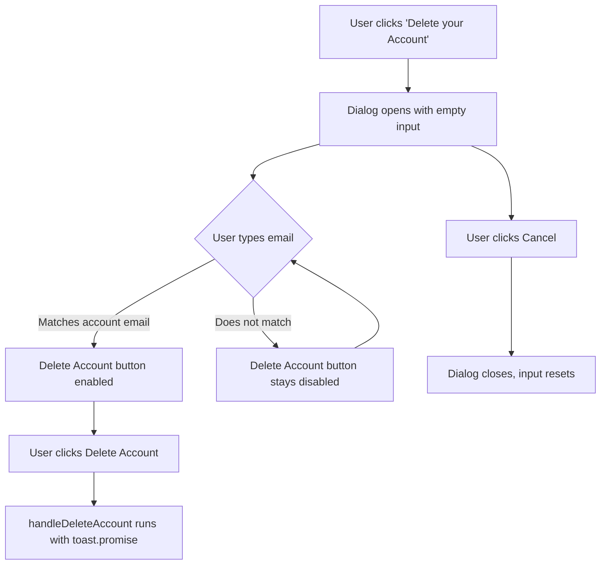

# Delete Account Confirmation Input

## Current Behavior

In [ProfileTab.tsx](features/auth/components/ProfileTab.tsx), the Danger Zone section renders an `AlertDialog` with a title, description, Cancel button, and Delete Account button. Clicking "Delete Account" immediately calls `handleDeleteAccount` with no extra confirmation beyond the dialog itself.

## Approach

Add a **controlled `AlertDialog`** with a confirmation text input inside the dialog body. The user must type their account email exactly to enable the Delete Account button.

### Key decisions

- **Controlled dialog state**: add a `deleteDialogOpen` boolean state so we can reset the confirmation input whenever the dialog opens or closes (via `onOpenChange`)
- **Confirmation state**: add a `confirmEmail` string state to track the typed value
- **Match logic**: compare `confirmEmail.trim()` against `session?.user?.email` (case-sensitive, exact match) -- the user's email is already available from `useSession()`
- **Disabled button**: pass `disabled` to `AlertDialogAction` when the emails do not match or while deletion is in progress. Radix's underlying `<button disabled>` prevents both click and auto-close behavior.
- **Reset on close**: clear `confirmEmail` to `""` inside `onOpenChange` so the input is always empty when the dialog reopens

### Changes in `ProfileTab.tsx`

**1. Add new state variables** (around line 44):

```typescript
const [deleteDialogOpen, setDeleteDialogOpen] = useState(false);
const [confirmEmail, setConfirmEmail] = useState("");
```

**2. Derive match flag**:

```typescript
const isEmailMatch = confirmEmail.trim() === (session?.user?.email ?? "");
```

**3. Handle dialog open/close** -- reset `confirmEmail` on any close:

```typescript
const handleDeleteDialogChange = (open: boolean) => {
  setDeleteDialogOpen(open);
  if (!open) setConfirmEmail("");
};
```

**4. Update the AlertDialog JSX** (lines 196-220):

- Make it controlled: `<AlertDialog open={deleteDialogOpen} onOpenChange={handleDeleteDialogChange}>`
- Add a confirmation section between `AlertDialogHeader` and `AlertDialogFooter`:

```tsx
<div className="flex flex-col gap-1.5">
  <Label htmlFor="confirmAccountEmail">
    Type <span className="font-semibold">{session?.user?.email}</span> to
    confirm
  </Label>
  <Input
    id="confirmAccountEmail"
    value={confirmEmail}
    onChange={(e) => setConfirmEmail(e.target.value)}
    placeholder="Type your email account"
    autoComplete="off"
  />
</div>
```

- Disable the action button when input does not match or deletion is in progress:

```tsx
<AlertDialogAction
  onClick={handleDeleteAccount}
  disabled={!isEmailMatch || isDeleting}
  className="bg-destructive text-destructive-foreground hover:bg-destructive/90"
>
  Delete Account
</AlertDialogAction>
```

## What stays the same

- [AccountSettings.tsx](features/auth/components/AccountSettings.tsx) -- no changes needed
- [alert-dialog.tsx](components/ui/alert-dialog.tsx) -- no changes needed (the `disabled` prop flows through `...props` correctly)
- `handleDeleteAccount` logic -- unchanged
- Toast messages -- unchanged

## UX summary


