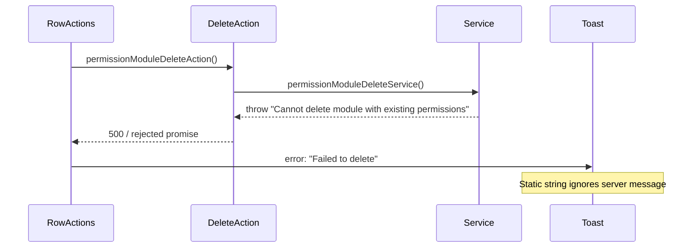
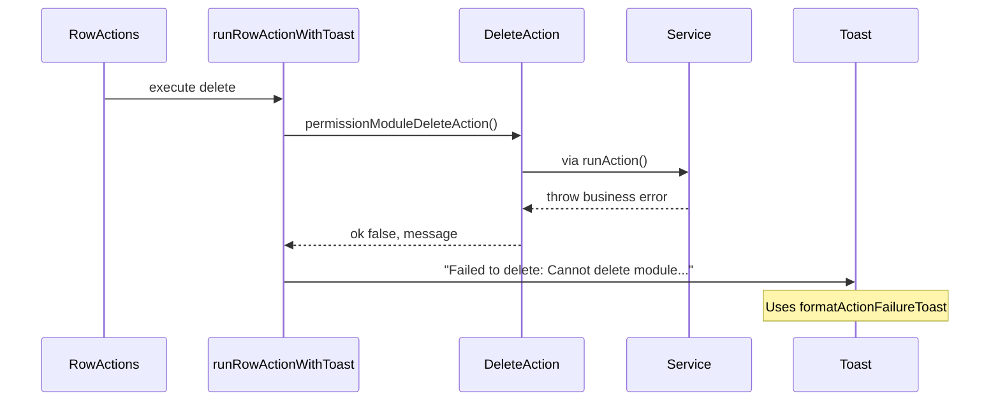

# Delete Row Action Error Feedback (Option B)

## Problem

Delete flows throw business errors in services, but row actions hardcode `error: "Failed to delete"` in `toast.promise`, so users never see messages like `"Cannot delete module with existing permissions"`.

Create/update forms were already fixed with `ActionResult` + `[lib/use-form-action-submit.ts](lib/use-form-action-submit.ts)`. Delete row actions were left on the old throw + static toast pattern.



## Target flow



## Architecture

### 1. Shared client helper (new)

Add `[lib/run-row-action-with-toast.ts](lib/run-row-action-with-toast.ts)`:

- Import `ActionResult`, `formatActionFailureToast`, `getActionErrorMessage` from `[lib/action-result.ts](lib/action-result.ts)`
- Export `runRowActionWithToast<T>(config)` with:
  - `action: () => Promise<ActionResult<T>>`
  - `onSuccess: () => void | Promise<void>`
  - `toast: { loading; success; errorFallback }`
  - optional `setPending?: (pending: boolean) => void` (for delete dialog disabled state)
- Behavior:
  1. Set pending true
  2. `toast.promise` wraps async work
  3. Await action; if `!result.ok`, throw `new Error(formatActionFailureToast(errorFallback, result.message))`
  4. On success, call `onSuccess`
  5. Toast config: `error: (err) => getActionErrorMessage(err, errorFallback)`
  6. `finally` set pending false

This mirrors the form path in `[lib/use-form-action-submit.ts](lib/use-form-action-submit.ts)` (lines 60–64) but keeps `toast.promise` for loading/success per project toast rules.

**Toast message format:** `"Failed to delete: {server message}"` for business errors; plain `"Failed to delete"` when message is generic (`Something went wrong`).

### 2. Server actions — convert 11 delete actions

Follow the existing create/update template from `[features/permission-modules/actions/permission-module-create.action.ts](features/permission-modules/actions/permission-module-create.action.ts)`:

```ts
export async function permissionModuleDeleteAction(
  input: unknown,
): Promise<
  ActionResult<Awaited<ReturnType<typeof permissionModuleDeleteService>>>
> {
  await requireSessionUserId();

  const parsed = permissionModuleDeleteSchema.safeParse(input);
  if (!parsed.success) {
    return { ok: false, message: "Invalid module id" };
  }

  return runAction(() => permissionModuleDeleteService(parsed.data.id));
}
```

**Files to update (delete action only — leave toggle/revoke/setStatus unchanged):**

| Feature            | Action file                                                                                                    | Delete function                |
| ------------------ | -------------------------------------------------------------------------------------------------------------- | ------------------------------ |
| permission-modules | `[permission-module-delete.action.ts](features/permission-modules/actions/permission-module-delete.action.ts)` | `permissionModuleDeleteAction` |
| permissions        | `[permission-delete.action.ts](features/permissions/actions/permission-delete.action.ts)`                      | `permissionDeleteAction`       |
| roles              | `[role-delete.action.ts](features/roles/actions/role-delete.action.ts)`                                        | `roleDeleteAction`             |
| users              | `[user-delete.action.ts](features/users/actions/user-delete.action.ts)`                                        | `userDeleteAction`             |
| menus              | `[menu-delete.action.ts](features/menus/actions/menu-delete.action.ts)`                                        | `menuDeleteAction`             |
| email-templates    | `[email-template-delete.action.ts](features/email-templates/actions/email-template-delete.action.ts)`          | `emailTemplateDeleteAction`    |
| email-settings     | `[email-setting-delete.action.ts](features/email-settings/actions/email-setting-delete.action.ts)`             | `emailSettingDeleteAction`     |
| webhooks           | `[webhook-delete.action.ts](features/webhooks/actions/webhook-delete.action.ts)`                               | `webhookDeleteAction`          |
| sso-providers      | `[sso-provider-delete.action.ts](features/sso-providers/actions/sso-provider-delete.action.ts)`                | `ssoProviderDeleteAction`      |
| sso-users          | `[sso-user-delete.action.ts](features/sso-users/actions/sso-user-delete.action.ts)`                            | `ssoUserDeleteAction`          |
| api-keys           | `[api-key.action.ts](features/api-keys/actions/api-key.action.ts)`                                             | `apiKeyDeleteAction`           |

**No service changes needed** — services keep throwing; `runAction` catches and maps to `{ ok: false, message }`.

**Notable business messages that will surface:**

- permission-modules: `"Cannot delete module with existing permissions"`, `"System modules cannot be deleted"`
- email-templates: `"Cannot delete template with existing email logs"`, `"System templates cannot be deleted"`
- email-settings: `"Cannot delete the default email setting..."`, `"Cannot delete the only email setting"`
- api-keys: `"Revoke the API key before deleting it"`
- roles/permissions: `"System roles/permissions cannot be deleted"`

### 3. Row actions — wire 11 delete handlers

Replace inline `toast.promise(deleteAction(...))` with `runRowActionWithToast` in:

- `[PermissionModuleRowActions.tsx](features/permission-modules/table/PermissionModuleRowActions.tsx)`
- `[PermissionRowActions.tsx](features/permissions/table/PermissionRowActions.tsx)`
- `[RoleRowActions.tsx](features/roles/table/RoleRowActions.tsx)`
- `[UserRowActions.tsx](features/users/table/UserRowActions.tsx)`
- `[MenuRowActions.tsx](features/menus/table/MenuRowActions.tsx)`
- `[EmailTemplateRowActions.tsx](features/email-templates/table/EmailTemplateRowActions.tsx)`
- `[EmailSettingRowActions.tsx](features/email-settings/table/EmailSettingRowActions.tsx)`
- `[WebhookRowActions.tsx](features/webhooks/table/WebhookRowActions.tsx)`
- `[SsoProviderRowActions.tsx](features/sso-providers/table/SsoProviderRowActions.tsx)`
- `[SsoUserRowActions.tsx](features/sso-users/table/SsoUserRowActions.tsx)`
- `[ApiKeyRowActions.tsx](features/api-keys/table/ApiKeyRowActions.tsx)`

Example replacement in `[PermissionModuleRowActions.tsx](features/permission-modules/table/PermissionModuleRowActions.tsx)` (lines 56–67):

```ts
const handleDelete = () => {
  runRowActionWithToast({
    action: () => permissionModuleDeleteAction({ id: module.id }),
    onSuccess: onRefresh,
    toast: {
      loading: "Deleting...",
      success: "Deleted successfully",
      errorFallback: "Failed to delete",
    },
    setPending: setIsDeleting,
  });
};
```

Toggle/status handlers in the same files stay unchanged (out of scope).

## Verification

_Manual tests for high-value business rules:_

1. **Permission modules** — delete module with permissions → toast shows `"Failed to delete: Cannot delete module with existing permissions"`
2. **Email settings** — delete default setting → specific message about setting another default
3. **API keys** — delete active key without revoke → `"Revoke the API key before deleting it"`
4. **Email templates** — delete template with logs → logs constraint message
5. **Happy path** — delete allowed row → `"Deleted successfully"` + table refresh
6. **Regression** — successful delete still disables button during pending via `setPending`

## Out of scope

- Toggle/revoke/setStatus row actions (same problem, separate follow-up)
- Bulk delete (none exist today)
- Updating `[.cursor/rules/toast-integration-system.mdc](.cursor/rules/toast-integration-system.mdc)` (optional doc follow-up)

## File count

| Area              | Files |
| ----------------- | ----- |
| New shared helper | 1     |
| Delete actions    | 11    |
| Row actions       | 11    |
| **Total**         | ~23   |
