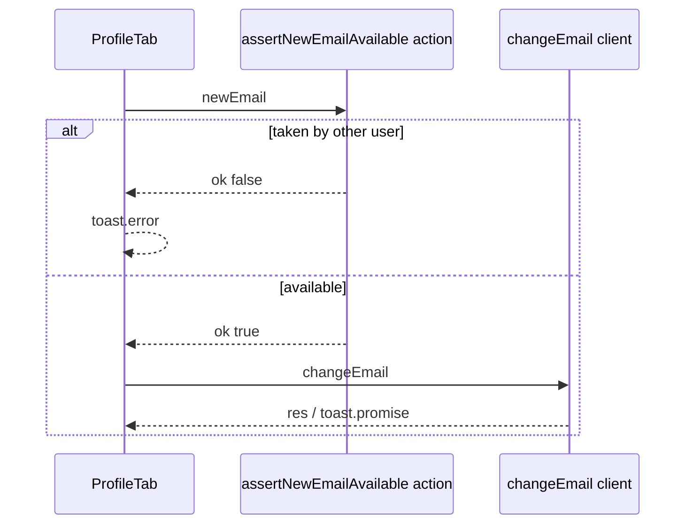

# Fix duplicate new-email change (toast + no mail)

## Root cause

- In [node_modules/better-auth/dist/api/routes/update-user.mjs](d:\apps\albayyinah\node_modules\better-auth\dist\api\routes\update-user.mjs) (see block above), if `findUserByEmail(newEmail)` is truthy, the handler **does not** run `sendChangeEmailConfirmation`; it only creates a token and returns `{ status: true }` to avoid leaking whether an email is registered to anonymous callers.
- [features/auth/components/ProfileTab.tsx](d:\apps\albayyinah\features\auth\components\ProfileTab.tsx) uses `changeEmail` and only checks `res.error`, so a duplicate new email still resolves “success” and shows **"Confirmation email sent to your current address"**.

## Approach

1. **Server action** in `features/auth/actions/` (per feature-based architecture) that:
   - Uses `auth.api.getSession({ headers: await headers() })` from [lib/auth.ts](d:\apps\albayyinah\lib\auth.ts) to ensure the user is authenticated.
   - Normalizes the candidate email the same way Better Auth does (`trim().toLowerCase()`; see the same `update-user.mjs` `changeEmail` handler).
   - Rejects if new email equals current email (optional; Better Auth also rejects, but this gives a clear message without a round trip if desired).
   - Uses Prisma: `prisma.user.findUnique({ where: { email: newEmail }, select: { id: true } })` against the `User` model in [prisma/schema.prisma](d:\apps\albayyinah\prisma\schema.prisma) (`@@unique([email])`).
   - If a row exists and `id !== session.user.id`, return `{ ok: false, message: "…" }` (e.g. _This email is already in use_).
   - Otherwise return `{ ok: true }`.

2. **Zod** for the action input in [features/auth/schemas/](d:\apps\albayyinah\features\auth\schemas/) (e.g. `new-email-for-change.schema.ts` with `z.object({ newEmail: z.string().email() })`) to match project validation rules.

3. **ProfileTab** ([features/auth/components/ProfileTab.tsx](d:\apps\albayyinah\features\auth\components\ProfileTab.tsx)):
   - In `handleUpdateEmail`, **await the server action first**.
   - If `!result.ok`, call `toast.error` with the server message and **return** (do not call `changeEmail`).
   - If `ok`, keep the existing `toast.promise(changeEmail({ ... }))` flow.
   - This satisfies the user requirement: **duplicate → failed toast**; real send path unchanged.

## Notes

- This check intentionally tells the **current signed-in user** that a target address is already taken, which is normal for “change my email” UX and is not the same as public enumeration.
- A small race remains (another registration between check and `changeEmail`); the DB unique constraint and Better Auth behavior still apply. No extra change required for this task.

## Optional (out of scope unless you want it)

- Re-export the action from [features/auth/index.ts](d:\apps\albayyinah\features\auth\index.ts) only if you need a stable public import; otherwise a direct import in `ProfileTab` is enough.

