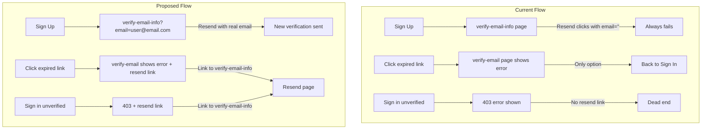

# Fix Expired Email Verification Flow

## Problem

When a sign-up email verification token expires, users have no working way to get a new one:

1. **[VerifyEmail.tsx](features/auth/components/VerifyEmail.tsx)** -- On token expiry, shows only a "Back to Sign In" link. No resend option.
2. **[VerifyEmailInfo.tsx](features/auth/components/VerifyEmailInfo.tsx)** -- The resend button passes `email: ""` (empty string) to `sendVerificationEmail`, so it always fails.
3. **[SignInForm.tsx](features/auth/components/SignInForm.tsx)** -- When an unverified user gets a 403 error, there is no link to resend or navigate to the verify-email-info page.

## Current Flow vs Proposed Flow

## Changes

### 1. Pass email via URL when redirecting to verify-email-info

In [SignUpForm.tsx](features/auth/components/SignUpForm.tsx) (line 66), change the redirect to include the user's email as a query parameter:

- Before: `router.push("/auth/verify-email-info")`
- After: `router.push(\`/auth/verify-email-info?email=\${encodeURIComponent(result.data.email)}\`)`

### 2. Fix VerifyEmailInfo to read email from URL

In [VerifyEmailInfo.tsx](features/auth/components/VerifyEmailInfo.tsx):

- Read `email` from `useSearchParams()`
- Pass the actual email to `sendVerificationEmail({ email, callbackURL: "/auth/verify-email" })`
- Show a message if no email param is present (e.g., prompt user to enter email manually or go back to sign in)
- Wrap in `Suspense` in [the page file](app/auth/verify-email-info/page.tsx) since `useSearchParams()` requires it

### 3. Add "Resend verification" link to VerifyEmail error state

In [VerifyEmail.tsx](features/auth/components/VerifyEmail.tsx) (lines 74-83):

- When the token is invalid/expired, add a link: "Request a new verification email" pointing to `/auth/verify-email-info`
- Keep the existing "Back to Sign In" link as well

### 4. Add "Resend verification" link to SignInForm 403 error

In [SignInForm.tsx](features/auth/components/SignInForm.tsx) (lines 74-76):

- When 403 is returned, also store the email so we can build a resend link
- Show a link alongside the error message: "Resend verification email" pointing to `/auth/verify-email-info?email=...`

### 5. Adjust expiresIn to a sensible production value

In [auth.ts](lib/auth.ts) (line 40), the current value is `60` (1 minute) which appears to be a test value. Consider reverting to the commented-out value of `60 * 60 * 24 * 7` (7 days) or another appropriate duration for production.
