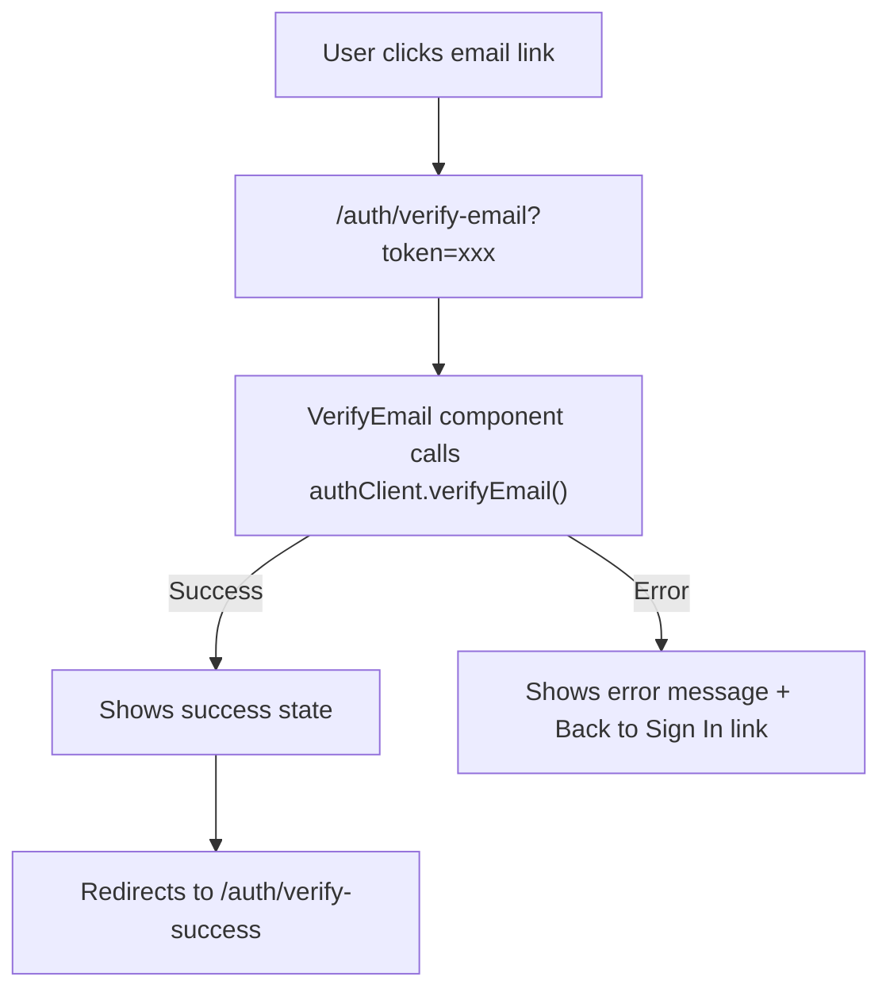

# Robust Email Verification Redirect

## Problem with Current Approach

The current `callbackURL` approach in [`lib/auth.ts`](lib/auth.ts) has a gap:

- **Success**: Better Auth redirects to `/auth/verify-success` -- works
- **Failure** (expired/invalid token): Better Auth redirects to `/api/auth/error?error=xxx` -- this page does **not exist**, user sees a 404

## Better Approach: Client-Side Verification

Your existing [`VerifyEmail`](features/auth/components/VerifyEmail.tsx) component already handles both cases properly:

- Success: shows "Email verified!" then redirects to `/auth/verify-success`
- Error: shows "Verification failed" with a "Back to Sign In" link

The fix is to make the email link point to `/auth/verify-email?token=xxx` (your page) instead of `/api/auth/verify-email?token=xxx` (Better Auth's API route).



## Change

### [`lib/auth.ts`](lib/auth.ts) -- `sendVerificationEmail` (line 38-53)

Replace the current implementation to build a custom URL pointing to the client-side verify page:

```typescript
sendVerificationEmail: async ({ user, url, token }) => {
  const verificationUrl = `${process.env.BETTER_AUTH_URL}/auth/verify-email?token=${token}`;

  await sendEmail({
    to: user.email,
    subject: "Verify your email address",
    html: `
      <h2>Verify Your Email</h2>
      <p>Hi ${user.name},</p>
      <p>Thank you for signing up. Please verify your email address by clicking the link below:</p>
      <p><a href="${verificationUrl}">Verify Email</a></p>
      <p>If you didn't create an account, you can safely ignore this email.</p>
    `,
  });
},
```

Key differences from the previous fix:

- Uses `token` parameter (destructured from the callback) instead of parsing `url`
- Points to `/auth/verify-email` (your page) instead of `/api/auth/verify-email` (Better Auth API)
- The `VerifyEmail` component at that page calls `authClient.verifyEmail({ query: { token } })` and only redirects to `/auth/verify-success` on success

No changes needed to [`VerifyEmail.tsx`](features/auth/components/VerifyEmail.tsx) or [`verify-success/page.tsx`](app/auth/verify-success/page.tsx) -- they already work correctly for this flow.
