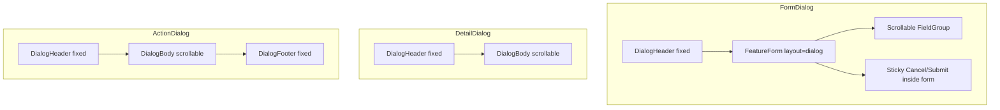

# Standardize Dialog Scroll Layout (Solution 2)

## Analysis

Solution 2 is **valid and worth doing**, but it should be applied **selectively by dialog type**, not as one identical markup block everywhere.

| Dialog type               | Count | Solution 2 shape                                 | Benefit                                                                           |
| ------------------------- | ----: | ------------------------------------------------ | --------------------------------------------------------------------------------- |
| Create/Edit form dialogs  |   ~22 | Header + scrollable fields + sticky form actions | High — fixes your user form issue and similar long forms (roles, email templates) |
| Read-only detail dialogs  |    ~6 | Header + scrollable body only                    | Medium — no footer needed; avoids whole-dialog scroll                             |
| Special (reveal, preview) |    ~2 | Header + scrollable body + `DialogFooter`        | Medium — align with shared primitives                                             |

**Why the current setup breaks on small screens**

[`UserCreateDialog.tsx`](features/users/components/UserCreateDialog.tsx) uses plain `max-w-2xl` with no height cap. Base [`dialog.tsx`](components/ui/dialog.tsx) centers content with `fixed top-1/2 -translate-y-1/2` and default `grid` layout — when content exceeds viewport height, it overflows and cannot scroll.

**Existing inconsistency in the repo**

- ~12 dialogs already use whole-dialog scroll: `max-h-[90vh] overflow-y-auto` (e.g. [`EmailTemplateCreateDialog.tsx`](features/email-templates/components/EmailTemplateCreateDialog.tsx))
- ~10 form dialogs have **no scroll at all** (users, roles, permissions, menus, api-keys, permission-modules)
- [`MenuPreviewDialog.tsx`](features/menus/components/MenuPreviewDialog.tsx) already uses partial Solution 2 (`overflow-hidden` + inner scroll)
- Only [`ApiKeyRevealDialog.tsx`](features/api-keys/components/ApiKeyRevealDialog.tsx) uses `DialogFooter` today

**Can this be applied to all dialogs?**

Yes — via **shared layout primitives**, not by changing base `DialogContent` globally (that would risk breaking [`command.tsx`](components/ui/command.tsx) which customizes dialog positioning).



---

## Recommended architecture

### 1. Add shared primitives in [`components/ui/dialog.tsx`](components/ui/dialog.tsx)

Add two composable wrappers (keep existing exports unchanged):

- **`DialogScrollContent`** — extends `DialogContent` with:
  - `flex max-h-[90vh] flex-col overflow-hidden` (overrides default `grid`)
  - width still passed per dialog via `className` (`sm:max-w-lg`, `sm:max-w-2xl`)

- **`DialogBody`** — scrollable middle section:
  - `min-h-0 flex-1 overflow-y-auto pr-1`

Optionally add `shrink-0` guidance to `DialogHeader` / `DialogFooter` usage docs in code comments only.

### 2. Add shared form scroll helper in [`components/form/form-dialog-layout.tsx`](components/form/form-dialog-layout.tsx)

All 11 feature forms duplicate the same action bar pattern (`flex justify-end gap-2`). Extract a small helper to avoid repeating scroll/sticky classes in every form:

```tsx
// When layout="dialog":
<form className="flex min-h-0 flex-1 flex-col gap-4">
  <FormDialogLayout
    actions={<Cancel/Submit buttons>}
  >
    <FieldGroup>...</FieldGroup>
  </FormDialogLayout>
</form>
```

`FormDialogLayout` renders:

- scroll wrapper around children
- sticky action row with `shrink-0 border-t pt-4`

### 3. Add `layout?: "default" | "dialog"` to all feature forms

Update these 11 forms (same pattern in each):

- [`UserForm.tsx`](features/users/components/UserForm.tsx)
- [`RoleForm.tsx`](features/roles/components/RoleForm.tsx)
- [`PermissionForm.tsx`](features/permissions/components/PermissionForm.tsx)
- [`PermissionModuleForm.tsx`](features/permission-modules/components/PermissionModuleForm.tsx)
- [`MenuForm.tsx`](features/menus/components/MenuForm.tsx)
- [`ApiKeyForm.tsx`](features/api-keys/components/ApiKeyForm.tsx)
- [`EmailTemplateForm.tsx`](features/email-templates/components/EmailTemplateForm.tsx)
- [`EmailSettingForm.tsx`](features/email-settings/components/EmailSettingForm.tsx)
- [`WebhookForm.tsx`](features/webhooks/components/WebhookForm.tsx)
- [`SsoProviderForm.tsx`](features/sso-providers/components/SsoProviderForm.tsx)
- [`SsoUserForm.tsx`](features/sso-users/components/SsoUserForm.tsx)

**Important:** keep submit buttons **inside** `<form>` (TanStack Form + `form.Subscribe` stay unchanged). Do **not** move submit logic to `DialogFooter` unless using `form="..."` attribute — internal sticky footer is simpler and lower risk.

Dialogs pass `layout="dialog"` to forms.

---

## Migration map

### A. Form dialogs → `DialogScrollContent` + `layout="dialog"`

Replace `DialogContent className="..."` and remove old whole-dialog `overflow-y-auto`.

| Feature            | Files                                                                |
| ------------------ | -------------------------------------------------------------------- |
| users              | `UserCreateDialog.tsx`, `UserEditDialog.tsx`                         |
| roles              | `RoleCreateDialog.tsx`, `RoleEditDialog.tsx`                         |
| permissions        | `PermissionCreateDialog.tsx`, `PermissionEditDialog.tsx`             |
| permission-modules | `PermissionModuleCreateDialog.tsx`, `PermissionModuleEditDialog.tsx` |
| menus              | `MenuCreateDialog.tsx`, `MenuEditDialog.tsx`                         |
| api-keys           | `ApiKeyCreateDialog.tsx`, `ApiKeyEditDialog.tsx`                     |
| email-templates    | `EmailTemplateCreateDialog.tsx`, `EmailTemplateEditDialog.tsx`       |
| email-settings     | `EmailSettingCreateDialog.tsx`, `EmailSettingEditDialog.tsx`         |
| webhooks           | `WebhookCreateDialog.tsx`, `WebhookEditDialog.tsx`                   |
| sso-providers      | `SsoProviderCreateDialog.tsx`, `SsoProviderEditDialog.tsx`           |
| sso-users          | `SsoUserCreateDialog.tsx`, `SsoUserEditDialog.tsx`                   |

Target markup pattern:

```tsx
<DialogScrollContent className="sm:max-w-2xl">
  <DialogHeader>...</DialogHeader>
  <UserForm layout="dialog" ... />
</DialogScrollContent>
```

### B. Detail dialogs → `DialogScrollContent` + `DialogBody`

Replace whole-dialog `overflow-y-auto` with fixed header + scrollable body.

- `AuditLogDetailDialog.tsx`
- `EmailLogDetailDialog.tsx`
- `WebhookLogDetailDialog.tsx`
- `LoginHistoryDetailDialog.tsx`
- `SessionDetailDialog.tsx`
- `TwoFactorDetailDialog.tsx`

### C. Special dialogs

- **`MenuPreviewDialog.tsx`** — refactor inner scroll div to use `DialogBody` (remove duplicate `max-h-[60vh]` magic number)
- **`ApiKeyRevealDialog.tsx`** — wrap content in `DialogScrollContent` + `DialogBody`; keep existing `DialogFooter` as fixed footer

---

## What we intentionally do NOT change

- Base `DialogContent` defaults in [`dialog.tsx`](components/ui/dialog.tsx)
- `AlertDialog` components (delete confirmations in table row actions)
- Auth page forms (`SignInForm`, etc.) — not dialog-based
- [`command.tsx`](components/ui/command.tsx) command palette dialog

---

## Verification checklist

After migration, manually test on a narrow viewport (~375px width):

1. **User create dialog** — all fields reachable; Cancel/Create always visible
2. **Role create dialog** — permission checklist scrolls inside body; actions stay visible
3. **Audit log detail dialog** — long JSON/details scroll in body; title stays visible
4. **ApiKey reveal dialog** — Done button always visible
5. **Short dialog** (e.g. permission create) — no layout regression on desktop

Also confirm:

- Enter key / submit still works
- Pending disabled state on submit buttons unchanged
- Toast behavior unchanged

---

## Rollout order

1. Shared primitives (`DialogScrollContent`, `DialogBody`, `FormDialogLayout`)
2. Users + roles (highest field count / reported issue)
3. Remaining form dialogs
4. Detail + special dialogs
5. Remove leftover per-dialog `max-h-[90vh] overflow-y-auto` on outer `DialogContent`

Estimated touch count: **~45 files** (2 shared + 11 forms + ~32 dialog components), but changes are repetitive and low-risk.
