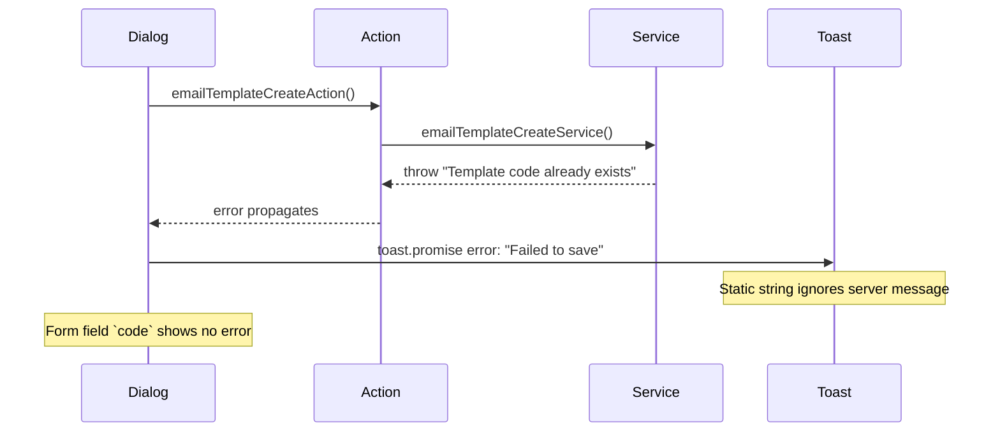
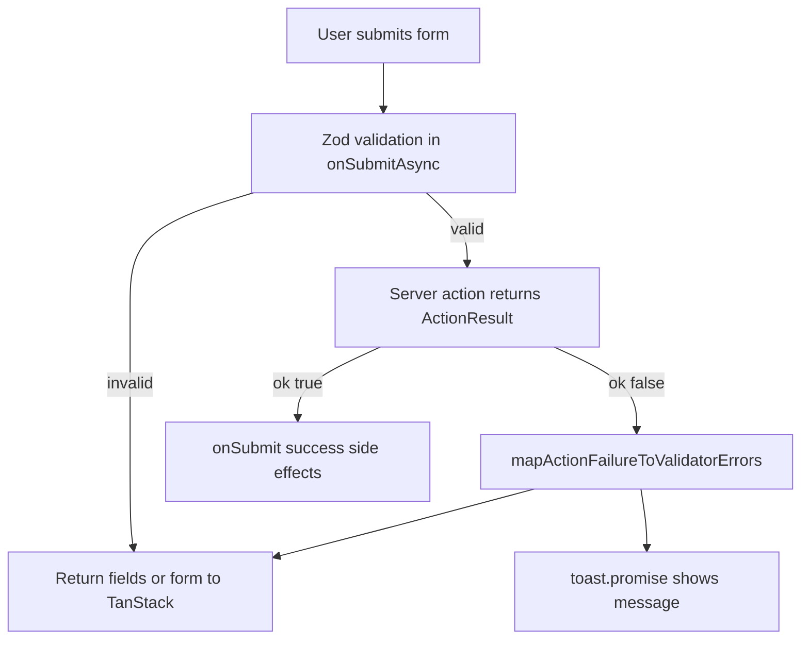

# Form + Toast Server Error Feedback

## Problem



Root causes:

1. Dialogs hardcode `error: "Failed to save"` in [`EmailTemplateCreateDialog.tsx`](features/email-templates/components/EmailTemplateCreateDialog.tsx) and ~21 sibling dialogs.
2. Server actions **throw** errors; dialogs never map them to TanStack Form field state.
3. Forms only use `onSubmitAsync` for **Zod client validation** ([`lib/zod-form-validator.ts`](lib/zod-form-validator.ts)), not server failures.
4. Throwing from server actions is unreliable in production (Next.js may mask messages); the auth feature already avoids this with `{ ok: false, message }` ([`request-email-change.action.ts`](features/auth/actions/request-email-change.action.ts)).

## Target behavior

| Error type                                                               | Toast                                                     | Field label                            |
| ------------------------------------------------------------------------ | --------------------------------------------------------- | -------------------------------------- |
| Duplicate `code`, `email`, etc.                                          | Show server message (e.g. "Template code already exists") | Show same message under mapped field   |
| Form-level business rule (e.g. "System template code cannot be changed") | Show server message                                       | Optional form-level alert under header |
| Unexpected failure                                                       | Generic fallback ("Failed to save")                       | None                                   |

Field errors render via existing [`TextField`](components/form/TextField.tsx) → [`FieldError`](components/ui/field.tsx) pipeline (`field.state.meta.errors`).

## Architecture



## 1. Shared action result layer

Add [`lib/action-result.ts`](lib/action-result.ts):

```ts
export type ActionResult<T = void> =
  | { ok: true; data: T }
  | { ok: false; message: string; field?: string };

export async function runAction<T>(fn: () => Promise<T>): Promise<ActionResult<T>> { ... }

export function getActionErrorMessage(error: unknown, fallback: string): string { ... }

export function createToastErrorHandler(fallback: string): (error: unknown) => string { ... }
```

- `runAction` catches service `throw new Error(...)` and converts to `{ ok: false, message }` **without changing services**.
- Schema parse failures in actions also return `{ ok: false, message }` instead of throwing.

Add [`lib/action-error-field-map.ts`](lib/action-error-field-map.ts) with a central message → field map for known create/update errors, e.g.:

| Server message                                       | Field        |
| ---------------------------------------------------- | ------------ |
| `Template code already exists`                       | `code`       |
| `Role code already exists`                           | `code`       |
| `Email already exists`                               | `email`      |
| `Username already exists`                            | `username`   |
| `This external ID is already linked to the provider` | `externalId` |
| `Parent menu not found` / menu parent cycle errors   | `parentId`   |
| `Permission module not found`                        | `moduleId`   |
| `Invalid expiration date`                            | `expiresAt`  |

Add `resolveFieldForActionError(message: string): string | undefined` used by `runAction` and failure mapper.

Extend [`lib/zod-form-validator.ts`](lib/zod-form-validator.ts):

```ts
export type FormValidatorErrors = {
  form?: string;
  fields?: Record<string, string>;
};

export function mapActionFailureToValidatorErrors(
  failure: Extract<ActionResult, { ok: false }>,
): FormValidatorErrors { ... }
```

## 2. Shared form submit hook

Add [`lib/use-form-action-submit.ts`](lib/use-form-action-submit.ts) (client hook):

```ts
export type FormActionSubmitConfig<TValues, TResult> = {
  schema: ZodType<TValues>;
  action: (input: unknown) => Promise<ActionResult<TResult>>;
  mapInput: (values: TValues) => unknown;
  toast: { loading: string; success: string; errorFallback: string };
  onSuccess: (data: TResult) => void | Promise<void>;
};
```

Hook responsibilities:

1. **`onSubmitAsync`**: run Zod → call action → on failure return `{ fields }` or `{ form }` via `mapActionFailureToValidatorErrors`; on success stash `data` in a ref.
2. **`onSubmit`**: wrap success side effects in `toast.promise` (loading/success only; action already completed).
3. **On action failure inside `onSubmitAsync`**: also call `toast.error(message)` so user gets toast **and** inline field error (matches your request for both).

Add [`components/form/FormSubmitError.tsx`](components/form/FormSubmitError.tsx): small `form.Subscribe` block rendering `errorMap.onSubmit` for form-level errors (system-template restrictions, etc.).

## 3. Update server actions (21 mutation entry points)

Convert create/update actions to return `ActionResult<T>` using `runAction`:

- 10 create actions under `features/*/actions/*-create.action.ts`
- 10 update actions under `features/*/actions/*-update.action.ts`
- [`features/api-keys/actions/api-key.action.ts`](features/api-keys/actions/api-key.action.ts) — `apiKeyCreateAction`, `apiKeyUpdateAction`

Pattern:

```ts
export async function emailTemplateCreateAction(
  input: unknown,
): Promise<ActionResult<EmailTemplate>> {
  await requireSessionUserId();
  const parsed = emailTemplateCreateSchema.safeParse(input);
  if (!parsed.success) {
    return {
      ok: false,
      message: parsed.error.issues[0]?.message ?? "Invalid template data",
    };
  }
  return runAction(() => emailTemplateCreateService(parsed.data));
}
```

**No service changes required** — existing throws stay as-is.

## 4. Update 12 feature forms

Replace `onSubmit: (values) => Promise<void>` prop with `submitConfig: FormActionSubmitConfig<...>` and wire `useFormActionSubmit`.

Forms to update:

- [`EmailTemplateForm.tsx`](features/email-templates/components/EmailTemplateForm.tsx)
- [`UserForm.tsx`](features/users/components/UserForm.tsx)
- [`RoleForm.tsx`](features/roles/components/RoleForm.tsx)
- [`MenuForm.tsx`](features/menus/components/MenuForm.tsx)
- [`PermissionForm.tsx`](features/permissions/components/PermissionForm.tsx)
- [`PermissionModuleForm.tsx`](features/permission-modules/components/PermissionModuleForm.tsx)
- [`SsoProviderForm.tsx`](features/sso-providers/components/SsoProviderForm.tsx)
- [`SsoUserForm.tsx`](features/sso-users/components/SsoUserForm.tsx)
- [`EmailSettingForm.tsx`](features/email-settings/components/EmailSettingForm.tsx)
- [`WebhookForm.tsx`](features/webhooks/components/WebhookForm.tsx)
- [`ApiKeyForm.tsx`](features/api-keys/components/ApiKeyForm.tsx)

Each form adds `<FormSubmitError form={form} />` near the top of field groups.

## 5. Simplify 22 dialogs

Remove per-dialog `toast.promise` + `handleSubmit`; pass `submitConfig` into the form instead.

Create dialogs (11):

- [`EmailTemplateCreateDialog.tsx`](features/email-templates/components/EmailTemplateCreateDialog.tsx)
- [`UserCreateDialog.tsx`](features/users/components/UserCreateDialog.tsx)
- ...all other `*CreateDialog.tsx` files listed above

Edit dialogs (11):

- [`EmailTemplateEditDialog.tsx`](features/email-templates/components/EmailTemplateEditDialog.tsx)
- ...all other `*EditDialog.tsx` files

Special case — [`ApiKeyCreateDialog.tsx`](features/api-keys/components/ApiKeyCreateDialog.tsx): `onSuccess` receives `result.data` (contains `rawKey`) for reveal dialog:

```ts
onSuccess: (data) => {
  onOpenChange(false);
  onSuccess();
  setRevealState({ rawKey: data.rawKey, name: values.name });
};
```

Because action runs before `onSuccess`, pass `name` via closure or include in success handler using form values from ref.

## 6. Verification checklist

Manual tests per feature with duplicate/conflict data:

1. **Email templates** — duplicate `code` → toast + error under Code field
2. **Users** — duplicate `email` / `username`
3. **Menus** — invalid `parentId` / duplicate `code`
4. **Edit system entity** — e.g. change system role code → toast + form-level message
5. **Api keys** — invalid `expiresAt` → field error + toast; successful create still opens reveal dialog

Regression: normal create/update still shows loading/success toasts and closes dialog.

## Files touched (approx.)

| Area                      | Count     |
| ------------------------- | --------- |
| New shared lib/components | 4 files   |
| Actions                   | 21 files  |
| Forms                     | 12 files  |
| Dialogs                   | 22 files  |
| **Total**                 | ~59 files |

## Out of scope

- Row-action toasts (`Failed to delete`, bulk actions) — separate pattern, not form-related
- Auth forms (`SignInForm`, etc.) — already use different error handling
- Updating `.cursor/rules/toast-integration-system.mdc` — optional follow-up to document dynamic `error: (err) => ...` for form submissions
