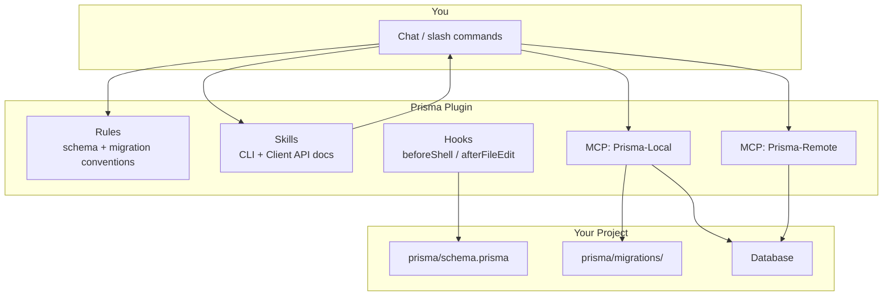

# How the Prisma Plugin Works

The official **Prisma plugin for Cursor** adds four layers that work together: **MCP servers** (tool calls), **skills** (agent knowledge), **rules** (automatic guidance), and **hooks** (automation around edits and shell commands).

---

## 1. MCP Servers (direct tool calls)

Two MCP servers expose Prisma operations the agent can invoke:

### Prisma-Local (ready now)

Runs against your local project. Available tools:

| Tool             | Purpose                                                                            |
| ---------------- | ---------------------------------------------------------------------------------- |
| `migrate-dev`    | Create and apply a migration after schema changes (requires `name` + `projectCWD`) |
| `migrate-status` | Compare local migrations vs database state                                         |
| `migrate-reset`  | Reset the database and re-apply migrations                                         |
| `Prisma-Studio`  | Open Prisma Studio for your project                                                |

These wrap the same CLI commands you would run manually, but the agent can call them with structured arguments (e.g. `projectCWD: "d:/apps/albayyinah"`).

### Prisma-Remote (needs authentication)

This server connects to Prisma’s cloud/remote services. Right now it only exposes `mcp_auth` until you sign in.

**Status:** Authentication is required. To unlock remote tools, the agent (or you) must call `mcp_auth` on server `plugin-prisma-Prisma-Remote` with empty arguments `{}`. That should open a browser sign-in flow.

---

## 2. Skills (reference docs the agent reads automatically)

The plugin ships **40+ skills** — short, authoritative guides the agent loads when relevant. You can also invoke them with `/` in chat.

**Categories:**

- **CLI commands** — `prisma migrate dev`, `generate`, `db push`, `db seed`, `validate`, `studio`, etc.
- **Client API** — queries, filters, relations, transactions, raw SQL
- **Database setup** — PostgreSQL, MySQL, SQLite, MongoDB, SQL Server, CockroachDB, Prisma Postgres
- **Prisma v7 upgrade** — schema changes, env vars, ESM, driver adapters, removed features

Example: if you ask “run migrate dev after I changed the schema,” the agent reads the `prisma-cli-migrate-dev` skill and follows the correct steps, options, and v7 behavior (e.g. `--skip-generate` removed in v7).

---

## 3. Rules (applied automatically)

Two rules guide the agent when working on Prisma files:

| Rule                         | When it applies                                                     |
| ---------------------------- | ------------------------------------------------------------------- |
| **schema-conventions**       | Always on `**/*.prisma` files — relations, IDs, timestamps, indexes |
| **migration-best-practices** | On demand — review SQL, naming, rollback, staging before prod       |

For your project, editing [`prisma/schema.prisma`](d:/apps/albayyinah/prisma/schema.prisma) will automatically get schema convention guidance.

---

## 4. Hooks (background automation)

Two hooks run without you asking:

| Hook                     | When                                                                         |
| ------------------------ | ---------------------------------------------------------------------------- |
| **beforeShellExecution** | Before terminal commands — can validate or adjust Prisma-related shell usage |
| **afterFileEdit**        | After file edits — can react to schema or migration file changes             |

These keep Prisma workflows consistent when the agent edits files or runs commands.

---

## How you use it in practice

### In chat (natural language)

Examples that trigger the plugin automatically:

- “Add a `Role` model to the schema and create a migration”
- “Check if my migrations are in sync with the database”
- “Open Prisma Studio”
- “How do I write a nested relation query with Prisma Client?”

The agent will use **rules** for schema style, **skills** for correct CLI/API usage, and **MCP tools** for migrations and Studio when appropriate.

### With `/` slash commands

You can invoke skills or Prisma-related commands directly via `/` in the Cursor chat input (e.g. migration or generate flows).

---

## How this fits your project

Your repo already has:

- [`prisma/schema.prisma`](d:/apps/albayyinah/prisma/schema.prisma) — schema the plugin’s rules and migrate tools target
- [`lib/prisma.ts`](d:/apps/albayyinah/lib/prisma.ts) — Prisma Client setup

A typical agent-driven flow would be:

1. Edit `schema.prisma` (schema-conventions rule applies)
2. Call `migrate-dev` via MCP with a descriptive name
3. Agent runs `prisma generate` explicitly (v7 no longer skips this inside migrate)
4. Update repositories/services in `features/` as needed

---

## Authentication note

**Prisma-Remote** is not authenticated yet. Local tools (`migrate-dev`, `migrate-status`, `migrate-reset`, `Prisma-Studio`) work without it.

If you want cloud/remote Prisma features, say the word and I can walk you through the `mcp_auth` sign-in step in a follow-up turn (plan mode prevents me from triggering auth flows right now).

---

## Summary

| Component      | Role                                  | You invoke?                     |
| -------------- | ------------------------------------- | ------------------------------- |
| **MCP Local**  | Run migrations, status, reset, Studio | Via agent or indirectly in chat |
| **MCP Remote** | Cloud Prisma services                 | Requires auth first             |
| **Skills**     | Up-to-date CLI/API reference          | Automatic or `/`                |
| **Rules**      | Schema + migration best practices     | Automatic                       |
| **Hooks**      | Guardrails on shell + file edits      | Automatic                       |

The plugin does not replace your Prisma setup — it makes the agent **safer and more accurate** when working with schema, migrations, and client code in projects like yours.
