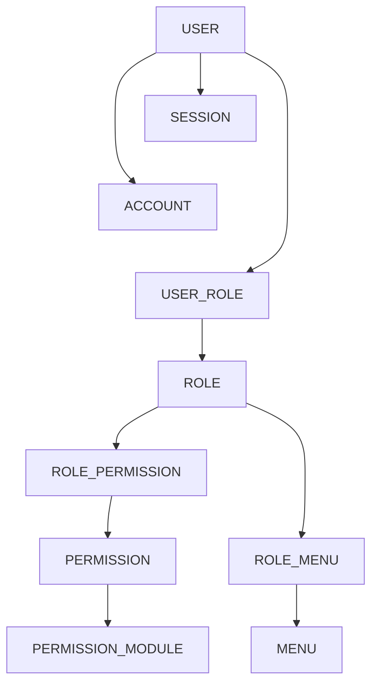
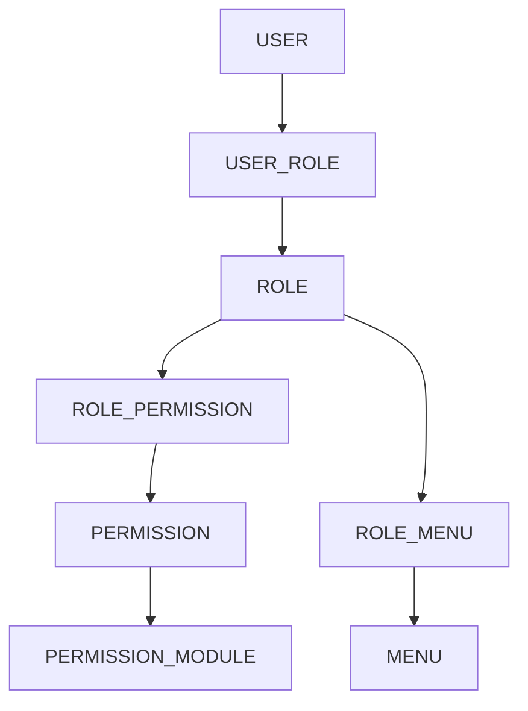

Berikut versi **Markdown (.md)** yang bisa langsung disimpan sebagai `database-design.md`.

# High-Level Database Design:



```text
USER
├── SESSION
├── ACCOUNT
├── TWO_FACTOR
├── EMAIL_CHANGE_REQUEST
├── USER_ROLE ─── ROLE
│                 ├── ROLE_PERMISSION ─── PERMISSION ─── PERMISSION_MODULE
│                 └── ROLE_MENU ─── MENU
│
├── LOGIN_HISTORY
├── API_KEY ─── API_USAGE_LOG
├── WEBHOOK ─── WEBHOOK_LOG
├── SSO_USER_LINK ─── SSO_PROVIDER
└── AUDIT_LOG

EMAIL_SETTING
EMAIL_TEMPLATE ─── EMAIL_LOG

SYSTEM_SETTING
```

# Enterprise Admin Platform Database Design

## Overview

Database ini dibagi menjadi 6 domain utama:

1. User & Access Management
2. Authorization (RBAC)
3. Menu Management
4. Email Management
5. API & Integration
6. Audit & System Configuration

---

# 1. User & Access Management

## User

Menyimpan data pengguna aplikasi.

| Column        | Type     | Description               |
| ------------- | -------- | ------------------------- |
| id            | PK       | User ID                   |
| name          | String   | Full Name                 |
| email         | String   | Email                     |
| username      | String   | Username                  |
| phoneNumber   | String   | Phone Number              |
| emailVerified | Boolean  | Email Verification Status |
| status        | Enum     | ACTIVE, INACTIVE, BANNED  |
| lastLoginAt   | DateTime | Last Login Date           |
| createdAt     | DateTime | Created Date              |
| updatedAt     | DateTime | Updated Date              |

### Relations

```text
User
├── Session
├── Account
├── TwoFactor
├── EmailChangeRequest
├── UserRole
├── LoginHistory
├── ApiKey
├── ApiUsageLog
├── Webhook
├── SsoUserLink
└── AuditLog
```

---

## Session

Menyimpan session login pengguna.

| Column    | Description     |
| --------- | --------------- |
| id        | Session ID      |
| token     | Session Token   |
| userId    | User Reference  |
| expiresAt | Expiration Date |
| revokedAt | Revoked Date    |

---

## Account

Menyimpan akun OAuth / Social Login.

Contoh Provider:

- Google
- GitHub
- Microsoft
- Azure AD

---

## TwoFactor

Menyimpan konfigurasi MFA/2FA.

| Column      | Description         |
| ----------- | ------------------- |
| secret      | Secret Key          |
| backupCodes | Recovery Codes      |
| verified    | Verification Status |

---

## EmailChangeRequest

Menyimpan permintaan perubahan email.

---

# 2. Authorization (RBAC)

Role-Based Access Control (RBAC) adalah model autentikasi yang memungkinkan pengguna untuk memiliki akses berdasarkan peran yang mereka miliki.



## Role

Menyimpan role pengguna.

Contoh:

| Code        | Name                |
| ----------- | ------------------- |
| SUPER_ADMIN | Super Administrator |
| ADMIN       | Administrator       |
| MANAGER     | Manager             |
| USER        | Standard User       |

---

## UserRole

Mapping User dan Role.

```text
User
  │
  ▼
UserRole
  │
  ▼
Role
```

---

## Permission Module

Mengelompokkan permission berdasarkan modul.

Contoh:

| Code   |
| ------ |
| USER   |
| ROLE   |
| MENU   |
| SYSTEM |
| EMAIL  |

---

## Permission

Daftar permission aplikasi.

Contoh:

| Permission  |
| ----------- |
| USER_VIEW   |
| USER_CREATE |
| USER_EDIT   |
| USER_DELETE |
| ROLE_MANAGE |

---

## RolePermission

Mapping Role dan Permission.

```text
Role
 │
 ▼
RolePermission
 │
 ▼
Permission
 │
 ▼
PermissionModule
```

---

# 3. Menu Management

## Menu

Menyimpan struktur menu aplikasi.

| Column    | Description   |
| --------- | ------------- |
| code      | Menu Code     |
| label     | Menu Label    |
| path      | Route         |
| icon      | Icon          |
| parentId  | Parent Menu   |
| sortOrder | Display Order |

### Hierarchy

```text
Dashboard

User Management
├── Users
├── Roles
├── Permissions

System
├── Settings
└── Audit Logs
```

---

## RoleMenu

Mengatur hak akses menu per role.

| Permission |
| ---------- |
| canView    |
| canCreate  |
| canEdit    |
| canDelete  |

---

# 4. Email Management

## EmailSetting

Konfigurasi email provider.

### Supported Provider

- SMTP
- SendGrid
- Mailgun
- SES
- Resend
- Postmark

---

## EmailTemplate

Template email aplikasi.

Contoh:

- Welcome Email
- Forgot Password
- Verify Email
- OTP Verification

---

## EmailLog

Riwayat pengiriman email.

### Status

```text
PENDING
SENT
FAILED
BOUNCED
```

---

# 5. API & Integration

## ApiKey

Menyimpan API Key pengguna.

| Column    | Description     |
| --------- | --------------- |
| name      | API Name        |
| hashedKey | Encrypted Key   |
| scopes    | API Scope       |
| expiresAt | Expiration Date |
| revokedAt | Revocation Date |

---

## ApiUsageLog

Menyimpan aktivitas penggunaan API.

| Column     | Description   |
| ---------- | ------------- |
| endpoint   | API Endpoint  |
| method     | HTTP Method   |
| statusCode | HTTP Status   |
| durationMs | Response Time |

---

## Webhook

Menyimpan konfigurasi webhook.

| Column | Description      |
| ------ | ---------------- |
| name   | Webhook Name     |
| url    | Endpoint URL     |
| events | Event List       |
| secret | Signature Secret |

---

## WebhookLog

Riwayat pengiriman webhook.

### Status

```text
PENDING
SUCCESS
FAILED
RETRYING
```

---

## SSO Provider

Menyimpan konfigurasi Single Sign-On.

### Supported Protocol

- OIDC
- OAuth2
- SAML

### Example Provider

- Azure AD
- Google Workspace
- Keycloak
- Okta

---

## SsoUserLink

Mapping akun user dengan provider SSO.

```text
SsoProvider
     │
     ▼
SsoUserLink
     │
     ▼
User
```

---

# 6. Audit & System

## AuditLog

Menyimpan aktivitas sistem.

### Action

```text
CREATE
UPDATE
DELETE
LOGIN
LOGOUT
EXPORT
IMPORT
ASSIGN
REVOKE
OTHER
```

### Audit Structure

| Column    | Description   |
| --------- | ------------- |
| actorId   | User Action   |
| action    | Activity Type |
| entity    | Table Name    |
| entityId  | Record ID     |
| oldValues | Previous Data |
| newValues | New Data      |
| createdAt | Activity Date |

---

## SystemSetting

Konfigurasi aplikasi.

### Example

| Key               | Value               |
| ----------------- | ------------------- |
| APP_NAME          | Enterprise Platform |
| JWT_EXPIRE        | 24h                 |
| SMTP_HOST         | smtp.example.com    |
| MAX_LOGIN_ATTEMPT | 5                   |

---

# Simplified ERD

```text
USER
├── SESSION
├── ACCOUNT
├── TWO_FACTOR
├── EMAIL_CHANGE_REQUEST
├── USER_ROLE ─── ROLE
│                 ├── ROLE_PERMISSION ─── PERMISSION ─── PERMISSION_MODULE
│                 └── ROLE_MENU ─── MENU
│
├── LOGIN_HISTORY
├── API_KEY ─── API_USAGE_LOG
├── WEBHOOK ─── WEBHOOK_LOG
├── SSO_USER_LINK ─── SSO_PROVIDER
└── AUDIT_LOG

EMAIL_SETTING
EMAIL_TEMPLATE ─── EMAIL_LOG

SYSTEM_SETTING
```

---

# Recommended Application Modules

```text
Dashboard

User Management
├── Users
├── Roles
├── Permissions
├── Permission Modules
└── Login History

Security
├── Sessions
├── Two Factor Authentication
├── API Keys
└── Audit Logs

Email Management
├── Email Settings
├── Email Templates
└── Email Logs

Integration
├── Webhooks
├── SSO Providers
└── SSO Users

System
├── Settings
└── Monitoring
```

---

# Architecture Summary

Features covered:

- User Management
- Authentication
- Two Factor Authentication
- OAuth Login
- RBAC Authorization
- Dynamic Menu Authorization
- API Key Management
- API Usage Monitoring
- Webhook Integration
- Single Sign-On (SSO)
- Email Management
- Audit Logging
- System Configuration
