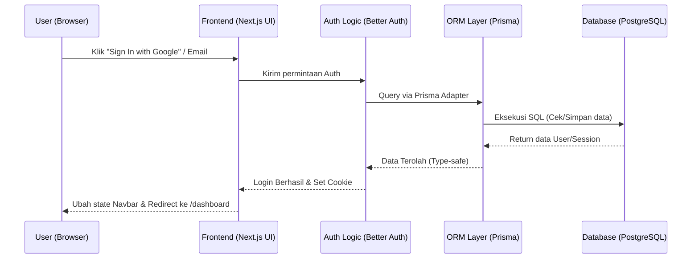
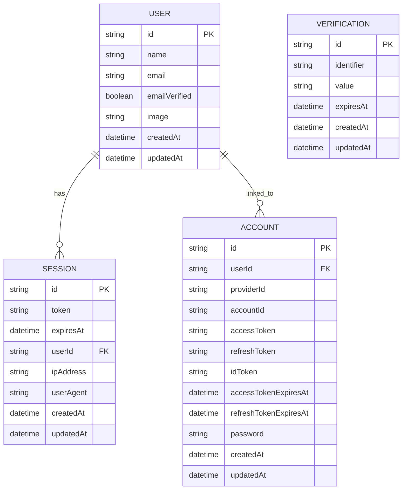

# PRD — Product Requirements Document

## 1. Overview

Aplikasi ini adalah fondasi sistem autentikasi dan antarmuka navigasi (Navbar) modern untuk sebuah platform web. Masalah yang sering terjadi adalah membangun sistem login yang aman dan tampilan navigasi yang dapat menyesuaikan secara otomatis (dinamis) antara pengunjung biasa dan pengguna yang sudah masuk. Tujuan utama dari proyek ini adalah menyediakan komponen Header/Navbar yang responsif dengan integrasi autentikasi lengkap (Email, Google, Lupa Password).

## 2. Requirements

- **Tampilan Responsif:** Wajib responsif untuk semua ukuran layar (Mobile-first). Navigasi pada perangkat seluler (Handphone) harus menggunakan _Hamburger Menu_.
- **Sistem Autentikasi:** Mendukung pendaftaran/masuk menggunakan Email & Password serta integrasi Google Login.
- **Tujuan Redirect:** Pengguna yang berhasil login harus diarahkan secara otomatis ke halaman `/dashboard`.
- **Infrastruktur:** Aplikasi akan dijalankan di atas Virtual Private Server (VPS) pribadi menggunakan basis data PostgreSQL.

## 3. Core Features

- **Navbar Dinamis:**
  - Jika belum login: Menampilkan tombol "Sign Up" dan "Sign In".
  - Jika sudah login: Menampilkan avatar pengguna, nama pengguna, menu pengguna (dropdown) dan tombol "Sign Out".
- **Menu Navigasi Mobile:**
  - Integrasi icon _Hamburger_ yang saat diklik akan memunculkan menu _dropdown_ atau _sidebar_ berisi tombol aksi navigasi.
- **Modul Autentikasi (Better Auth):**
  - **Daftar & Masuk (Sign Up / Sign In):** Menggunakan kombinasi Email dan Kata Sandi.
  - **Social Login (OAuth):** Masuk dengan satu ketukan menggunakan akun Google.
  - **Lupa Kata Sandi (Forgot Password):** Fitur pemulihan akun melalui tautan yang dikirimkan ke email untuk mereset kata sandi.

## 4. User Flow

1. **Alur Pengunjung Baru (Guest):**
   - Pengunjung membuka website dan melihat Navbar.
   - Mengklik tombol "Sign Up" yang ada pada Navbar (atau dari dalam _Hamburger Menu_ jika dari HP).
   - Pengguna memilih metode pendaftaran: Mendaftar dengan Email/Password atau via Google. (Mendaftar dengan Email/Password harus melalui verifikasi email)
   - Setelah pendaftaran atau login berhasil, tampilkan toast notification "Registration successful" dan sistem mengarahkan pengguna ke halaman `/dashboard`.
2. **Alur Pengguna Terdaftar:**
   - Masuk ke aplikasi, mengklik tombol "Sign In"/
   - Pengguna memilih metode login: Login dengan Email/Password sehingga sistem memverifikasi kredensial atau via Google.
   - Setelah login berhasil, tampilkan toast notification "Login successful" dan sistem mengarahkan pengguna ke halaman `/dashboard`.
   - Navbar berubah, tombol "Sign Up" hilang berganti menjadi avatar pengguna, nama pengguna, menu pengguna (dropdown) dan tombol "Sign Out".
   - Jika pengguna mengklik "Sign Out", akses diakhiri, kembali menjadi pengunjung biasa.
3. **Alur Lupa Kata Sandi:**
   - Pengguna di halaman login mengklik "Forgot Password".
   - Memasukkan alamat email yang terdaftar.
   - Setelah di submit, maka berpindah ke halaman page baru berisi pesan "Check your email" dan tombol "Back to Login".
   - Menerima email berisi tautan pemulihan -> Mengklik tautan dari email -> Mengisi kata sandi baru -> Login kembali.
4. **Alur Ganti Kata Sandi Setelah Login**
   - Pengguna setelah login, mengklik menu "Settings"->"Security"->"Change Password".
   - Memasukkan kata sandi lama dan kata sandi baru dan konfirmasi kata sandi baru.
   - Setelah di submit, maka berpindah ke halaman page baru berisi pesan "Password changed successfully" dan tombol "Back to Dashboard".

## 5. Architecture

bagian _Frontend_ dan _Backend_ akan disatukan dalam satu kerangka kerja Next.js (Fullstack). _Better Auth_ akan dikonfigurasi menggunakan **Prisma Adapter**, sehingga semua operasi autentikasi (membaca/menulis user, session, dll) tidak mengakses PostgreSQL secara langsung, melainkan melalui lapisan ORM Prisma. Ini memastikan _type-safety_, keamanan, dan kemudahan manajemen skema database.

## 6. Database Schema

Untuk mendukung sistem autentikasi dari _Better Auth_ melalui Prisma ORM, kita memerlukan struktur tabel yang detail sesuai standar Prisma Schema untuk menyimpan data pengguna, sesi aktif, akun pihak ketiga, dan token verifikasi.

**Tabel Utama:**

- **User (Pengguna):** Menyimpan profil dasar pengguna dan status verifikasi.
  - `id` (String) - ID unik pengguna.
  - `name` (String) - Nama lengkap.
  - `email` (String) - Alamat email pengguna (Unique).
  - `emailVerified` (Boolean) - Status verifikasi email.
  - `image` (String) - URL foto profil (nullable).
  - `createdAt` & `updatedAt` (DateTime) - Waktu pembuatan dan pembaruan data.
- **Session (Sesi):** Menyimpan status login dan metadata perangkat.
  - `id` (String) - ID unik sesi.
  - `token` (String) - Token sesi unik untuk cookie.
  - `userId` (String) - ID pengguna yang bersangkutan.
  - `expiresAt` (DateTime) - Kapan sesi berakhir/kedaluwarsa.
  - `ipAddress` & `userAgent` (String) - Metadata keamanan perangkat (nullable).
  - `createdAt` & `updatedAt` (DateTime) - Waktu pembuatan dan pembaruan sesi.
- **Account (Akun Pihak Ketiga):** Menyimpan data OAuth (Google) dan kredensial terhubung.
  - `id` (String) - ID unik riwayat koneksi.
  - `userId` (String) - ID pengguna pemilik.
  - `providerId` & `accountId` (String) - Identitas penyedia dan akun eksternal.
  - `accessToken`, `refreshToken`, `idToken` (String) - Token otorisasi (nullable).
  - `accessTokenExpiresAt`, `refreshTokenExpiresAt` (DateTime) - Masa berlaku token.
  - `password` (String) - Hash kata sandi jika terhubung via kredensial (nullable).
- **Verification (Verifikasi):** Menyimpan token sementara untuk verifikasi email atau reset password.
  - `id` (String) - ID unik record verifikasi.
  - `identifier` (String) - Identitas target (misal: email).
  - `value` (String) - Token verifikasi rahasia.
  - `expiresAt` (DateTime) - Waktu kedaluwarsa token.

## 7. Tech Stack

Berikut adalah susunan teknologi yang digunakan berdasarkan permintaan dan rekomendasi praktik terbaik (best practices) agar aplikasi aman, memiliki UI menarik, dan stabil:

- **Frontend & Backend Framework:** **Next.js (App Router)** — Digunakan sebagai fondasi Full-stack yang memungkinkan UI dan API menyatu di satu tempat untuk proses pengembangan yang cepat.
- **Styling & UI Component:** **Tailwind CSS** dipadukan dengan **shadcn/ui** — Memungkinkan pembuatan Navbar yang estetik, tombol Sign up, form login, serta responsivitas (Hamburger menu) yang cepat dan mudah dikonfigurasi.
- **Autentikasi:** **Better Auth** — Library autentikasi modern yang diintegrasikan menggunakan **Prisma Adapter** resmi. Ini memastikan semua logika auth (OAuth, Email, Session) terhubung aman ke database melalui ORM.
- **Database:** **PostgreSQL** — Basis data relasional (SQL) yang sangat handal untuk menyimpan data pengguna secara terstruktur.
- **ORM (Penghubung Database):** **Prisma ORM** — Digunakan sebagai adapter wajib untuk Better Auth. Mendefinisikan skema database yang kuat (type-safe) dan menjadi perantara tunggal antara aplikasi dan PostgreSQL.
- **Deployment:** **VPS** (seperti DigitalOcean / Niagahoster) menggunakan Node.js manager (PM2/Nginx) agar sistem berjalan mandiri dengan kontrol teknis secara penuh.
