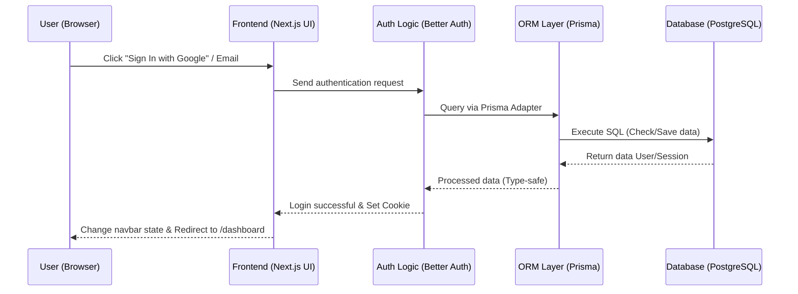

# PRD — Project Requirements Document

## 1. Overview

This application is the foundation of a modern authentication and navigation (Navbar) system for a web platform. The problem that often occurs is building a secure login system and a navigation interface that can automatically (dynamically) adjust between regular visitors and logged-in users. The main goal of this project is to provide a responsive Header/Navbar component with complete authentication integration (Email, Google, Forgot Password, Email Verification), using strict UX standards using _inline message_.

## 2. Requirements

- **Responsive Design:** Must be responsive for all screen sizes (Mobile-first). Navigation on mobile devices (Smartphone) must use _Hamburger Menu_.
- **Authentication System:** Supports registration/login using Email & Password and Google Login integration.
- **Redirect Destination:** Users who successfully login must be automatically redirected to the `/dashboard` page.
- **Infrastructure:** The application will run on a private Virtual Private Server (VPS) using PostgreSQL as the database.
- **UX Messaging:** All success/failure/error messages using _Inline Message_ (without toaster/sonner).

## 3. Core Features

- **Navbar Dinamis:**
  - If not logged in: Display "Sign Up" / "Login" buttons.
  - If logged in: Display user menu and "Sign Out" button.
- **Mobile Navigation Menu:**
  - Integration of _Hamburger_ icon that when clicked will display a _dropdown_ or _sidebar_ menu containing action navigation buttons.
- **Authentication Module (Better Auth):**
  - **Sign Up / Sign In:** Using Email & Password combination.
  - **Social Login (OAuth):** Login with one click using Google account.
  - **Forgot Password:** Feature to recover account via link sent to email.
  - **Email Verification:** Email verification flow after sign-up and _Resend Verification Email_ option.
  - **Change Password:** Feature for logged-in users to change password in the settings page.
  - **Remember Me:** Option to extend login session duration.

## 4. User Flow

### 1. Proses Sign-Up

- **Path:** `/auth/sign-up`
- **Input:** Name, Email, Password, Confirm Password.
- **Action:** Click "Sign Up" button.
- **UX Best Practice:**
  - Disable button when loading.
  - Change button label: "Sign Up" → "Signing up...".
- **Flow:**
  1. User fills the form and submits.
  2. System creates an account with pending verification status.
  3. Redirect to `/auth/verify-email-info`.
  4. User opens email and clicks verification link (`/auth/verify-email?token=xxx`).
  5. Redirect to `/auth/verify-success`.
  6. **CTA:** Button "Go to Sign In" redirects to `/auth/sign-in`.

### 2. Proses Sign-In

- **Path:** `/auth/sign-in`
- **Options:** Email + Password, Google Login, Checkbox "Remember Me".
- **Backend Validation:**
  - Check: user exists? password match? account active?
- **If Success:**
  - Create session.
  - Redirect to `/dashboard`.
  - UX: Disable button, change label: "Sign In" → "Signing in...".
- **⚠️ Inline Error Message:**
  - ❌ Invalid email or password → "Invalid email or password."
  - ❌ Account not yet verified → "Your account is not yet verified, please check your email to activate."
  - ❌ Account not found → "Account not found."

### 3. Forgot Password

- **Path:** `/auth/forgot-password`
- **Input:** Email.
- **Action:** Click "Send Reset Link" button.
- **Backend:**
  - Check email exist.
  - Generate reset token (expiry: 30 minutes).
  - Send email.
- **Redirect to:** `/auth/forgot-password/success`.
- **⚠️ UX & Security:**
  - Do not show if email exists or not for security reasons.
  - Always show message: "Reset password link has been sent to your email."

### 4. Reset Password

- **Path:** `/auth/reset-password?token=xxx`
- **Flow:**
  1. Validate token (valid? not expired?).
  2. Display form: New Password, Confirm Password.
  3. Submit: Hash new password, Update user password, Invalidate token.
  4. Redirect: `/auth/reset-password/success`.
- **⚠️ Error Case:**
  - Token invalid → "Token is invalid or expired."

### 5. Change Password (Authenticated)

- **Path:** `/settings/change-password`
- **Flow:**
  1. User input: Current Password, New Password, Confirm Password.
  2. Submit.
  3. Backend Validation: Validate current password.
  4. Update password.
- **Messaging:**
  - Success: "Your password has been changed successfully."
  - Error: "Invalid current password."
- **Form Behavior:**
  - Disable button when submitting.
  - Show loading state.
  - Inline error (not toaster/sonner).

### 6. Additional Features

- **Resend Verification Email:** Available at `/auth/verify-email-info` if email is not received.
- **Remember Me:** Checkbox on Sign-In page to extend session duration.

## 5. UI/UX & Messaging Standards

- **Inline Messages Only:**
  - Forbidden to use pop-up notification library like `sonner`, `toast`, or `alert`.
  - All success, failure, or error messages must be displayed directly below the form input or in the relevant content area (_inline_).
- **Button Loading States:**
  - When the process is ongoing (loading), the button must be in `disabled` state.
  - Change button label to provide visual feedback:
    - "Sign Up" → "Signing up..."
    - "Sign In" → "Signing in..."
    - "Send Reset Link" → "Sending...".
- **Security Best Practices:**
  - **Enumeration Prevention:** Do not provide hints about whether the email exists or not in the Forgot Password feature. Use generic messages.
  - **Messaging Style:** Messages must be clear, not too technical, and not expose sensitive system information.
  - **Token Expiry:** Verification token and reset password token have a clear expiry time.

## 6. Architecture & Tech Stack

The _Frontend_ and _Backend_ will be combined in a Next.js (Fullstack) framework. _Better Auth_ will be configured using **Prisma Adapter**, so all authentication operations (reading/writing user, session, etc.) do not access PostgreSQL directly, but through the Prisma ORM layer. This ensures _type-safety_, security, and ease of managing database schema.

- **Frontend & Backend Framework:** **Next.js (App Router)** — Full-stack framework for UI and API unification.
- **Styling & UI Component:** **Tailwind CSS** combined with **shadcn/ui** — For aesthetic Navbar, login form, and responsiveness.
- **Authentication:** **Better Auth** — Modern authentication library via **Prisma Adapter**.
- **Database:** **PostgreSQL** — Relational database that is reliable.
- **ORM:** **Prisma ORM** — Required adapter for Better Auth, defining strong database schema.
- **Deployment:** **VPS** (DigitalOcean / Niagahoster) using **Docker** or Node.js manager (PM2/Nginx).



## 7. Database Schema

To support the authentication system from _Better Auth_ through Prisma ORM, we need a detailed table structure according to the Prisma Schema standard to store user data, active session, third-party account, and verification token.

```prisma
model User {
  id            String    @id
  name          String
  email         String
  emailVerified Boolean   @default(false)
  image         String?
  createdAt     DateTime  @default(now())
  updatedAt     DateTime  @updatedAt
  sessions      Session[]
  accounts      Account[]

  @@unique([email])
  @@map("user")
}

model Session {
  id        String   @id
  expiresAt DateTime
  token     String
  createdAt DateTime @default(now())
  updatedAt DateTime @updatedAt
  ipAddress String?
  userAgent String?
  userId    String
  user      User     @relation(fields: [userId], references: [id], onDelete: Cascade)

  @@unique([token])
  @@index([userId])
  @@map("session")
}

model Account {
  id                    String    @id
  accountId             String
  providerId            String
  userId                String
  user                  User      @relation(fields: [userId], references: [id], onDelete: Cascade)
  accessToken           String?
  refreshToken          String?
  idToken               String?
  accessTokenExpiresAt  DateTime?
  refreshTokenExpiresAt DateTime?
  scope                 String?
  password              String?
  createdAt             DateTime  @default(now())
  updatedAt             DateTime  @updatedAt

  @@index([userId])
  @@map("account")
}

model Verification {
  id         String   @id
  identifier String
  value      String
  expiresAt  DateTime
  createdAt  DateTime @default(now())
  updatedAt  DateTime @updatedAt

  @@index([identifier])
  @@map("verification")
}
```

## 8. Application Structure

The Next.js application folder structure is arranged to separate public (authentication) and protected routes.

```text
/app
  /auth/
    sign-in/
    sign-up/
    forgot-password/
    reset-password/
    verify-email/
    verify-success/
  /(protected)/
    dashboard/
    settings/
      change-password/

```
